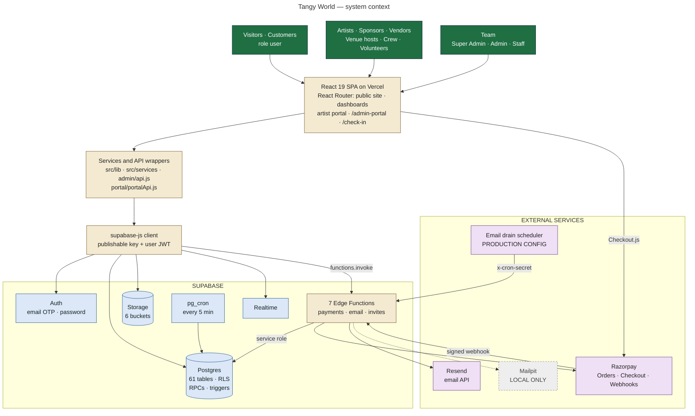
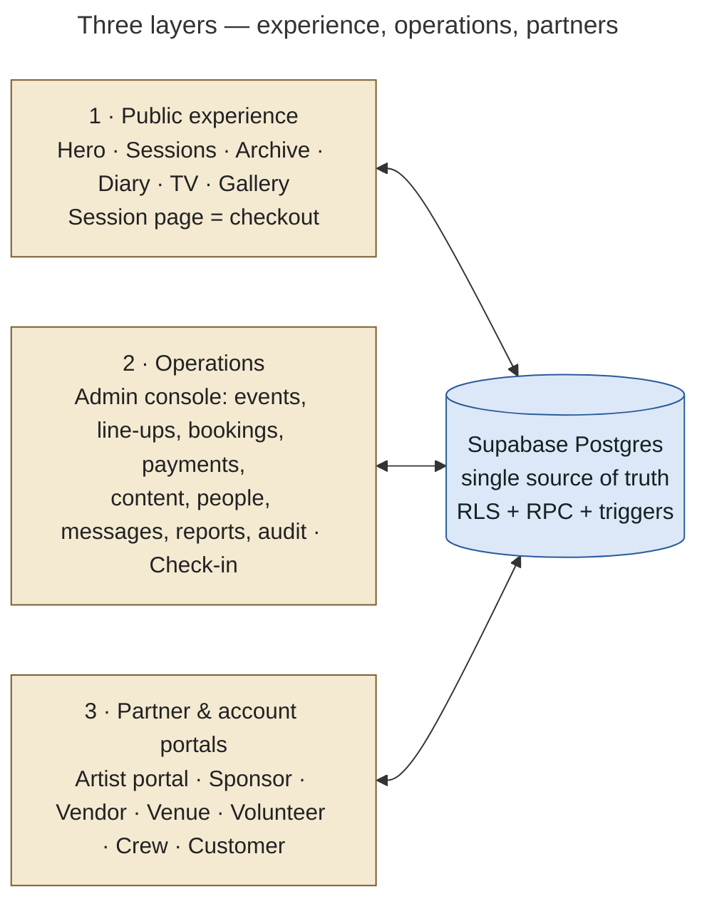

# 01 — System Overview

## What Tangy World is

Tangy World is the web platform for **Tangy Sessions**, an intimate live-music event series in Hyderabad. One React single-page application serves three audiences:

1. **The public website**: a scroll-driven, poster-style "museum" of the brand (Hero, Manifesto, Sessions, Calendar, Archive, Crew, Private Sessions, Diary, Inner Circle, Footer), plus content pages (Tangy TV, Diary, Gallery, Artists, Programmes, FAQ, legal).
2. **Customer and partner accounts**: customers book tickets for sessions, pay with Razorpay, receive a QR booking pass and can join a waitlist. Artists, sponsors, vendors, venue hosts, crew and volunteers apply, get approved, and work in their own portals.
3. **The operations console** (`/admin-portal`) and the **check-in terminal** (`/check-in`): the Tangy team runs events, line-ups, bookings, payments, content, people, messaging, reports and audit.

All business rules live in **Supabase Postgres** (RLS policies, `SECURITY DEFINER` functions, triggers). **Supabase Edge Functions** (Deno) talk to **Razorpay** (payments) and **Resend** (email). The frontend is built with Vite and configured for **Vercel** (`vercel.json`).

> **Status:** **IMPLEMENTED** in code and verified on a local Supabase stack by the repository's tests. Production is **PRODUCTION CONFIGURATION, NOT DONE**: `docs/OPERATIONS.md` §3a says *"Nothing here has been deployed yet: the repository has no `supabase/config.toml`, no linked project ref, no CI and no deploy script"*. The production Supabase project ref named in the runbooks is `ohyjqxbsgdkzytfnlitf`.

## Size of the system (counted from the repository)

| Area | Count | Source |
|---|---|---|
| SQL migrations | 36 (`0001`–`0036`) | `supabase/migrations/` |
| Tables / views | 61 tables (incl. 1 security-audit helper table) / 3 views | migrations |
| Distinct SQL functions | ~228 | migrations |
| RLS policies (final state) | ~240 across 58 tables + `storage.objects` | replayed create/drop policy |
| Edge Functions | 7 (+ 4 shared modules) | `supabase/functions/` |
| Storage buckets | 6 | migrations |
| SPA routes | 134 `<Route>` entries in `App.jsx`; 54 in the admin console | `src/App.jsx`, `src/admin/AdminApp.jsx` |
| SQL test suites | 20 (`supabase/tests/*.test.sql`) | |
| Browser E2E suites | 21 Playwright suites (`e2e/*.mjs` minus `lib.mjs`, `make-cam.mjs`; local stack only) | |

## System context diagram

**Not present in the repository** (and therefore not in the diagram): GitHub Actions / any CI, Azure, Netlify, Cloudflare, analytics, SMS/WhatsApp providers, a real AI model provider (see the Tangy AI note below), a CSP / security-headers configuration.

## The three layers in one picture

## Key design rules found in the code

| Rule | Where it is enforced |
|---|---|
| The browser holds only the **public** Supabase key; a secret in any `VITE_` variable stops `vite` and `vite build`. | `vite.config.js` `assertNoSecretInBrowserEnv` |
| **Authorization is in the database**, never only in the UI. Admin nav and route guards are cosmetic; the DB re-checks every action. | `src/admin/rbac.js` header, `0002_rls.sql` header |
| **Prices and capacity are decided by the database** (`booking_quote`, `create_pending_booking` under an event row lock). | `0026`, `0027` |
| **A booking is confirmed only by `settle_payment()`**, called by the Edge Functions after an HMAC check. | `0026/0027`, `razorpay-*` |
| **Roles change only through audited RPCs / approvals**; nobody changes their own role. | `prevent_role_self_escalation` (0030), `admin_set_user_role` (0034) |
| **Email is queued** (`email_outbox`) and drained server-side; without an email provider nothing is sent and nothing crashes. | `notify()`, `send-notification-emails`, `_shared/email.ts` |
| **No mock data or fake success in production builds.** The build fails without a backend; demo and review logins are compiled out. | `vite.config.js`, commit `fix: never ship a build without a backend…` |

## Tangy AI — what it really is

- **Public assistant** (`/ai`, floating launcher): **PARTIALLY IMPLEMENTED**. `src/services/aiSupportService.js` is labelled *"MOCK AI support engine — a structured knowledge-base lookup, NOT a trained model and NOT connected to any external AI API"*. Answers come from `src/data/mock/aiKnowledge.js`. The chat transcript uses the mock `messageService` (browser-local). "Request an agent" is **real**: it creates a support conversation through `get_or_create_support_conversation` after sign-in.
- **Admin "Tangy AI" page** (`/admin-portal/ai`, `ai.use`): **NOT IMPLEMENTED** as AI. `src/admin/aiService.js` states *"NOT connected to any model yet"*.
