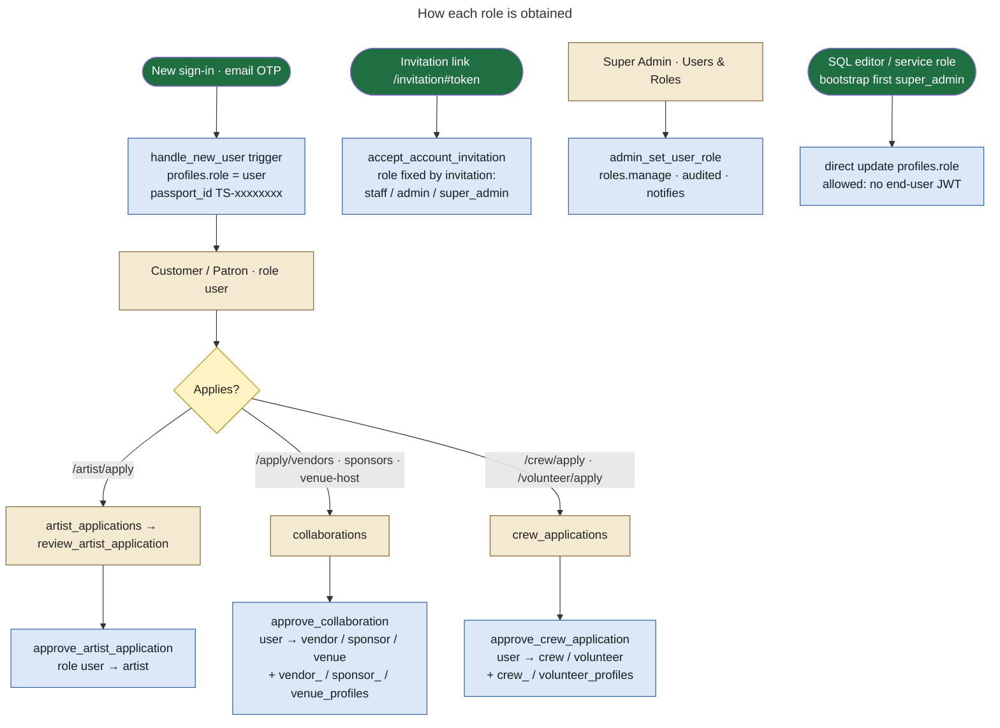
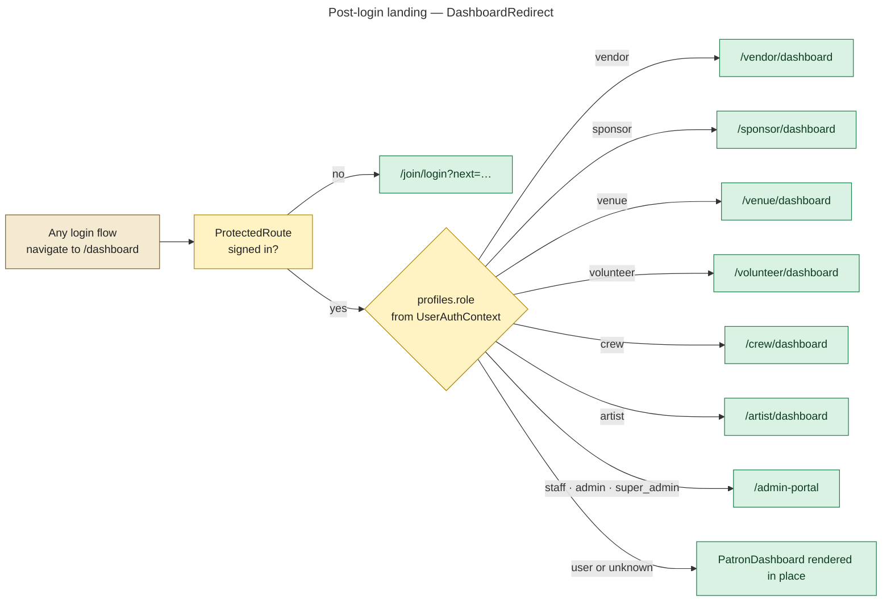
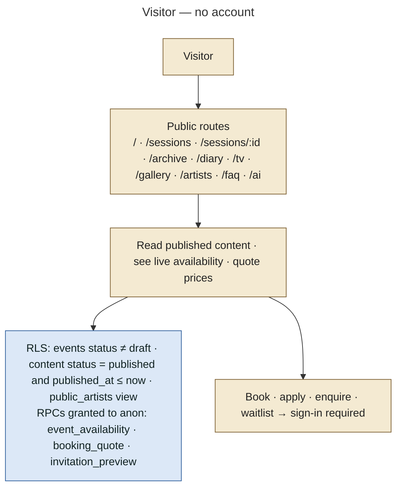
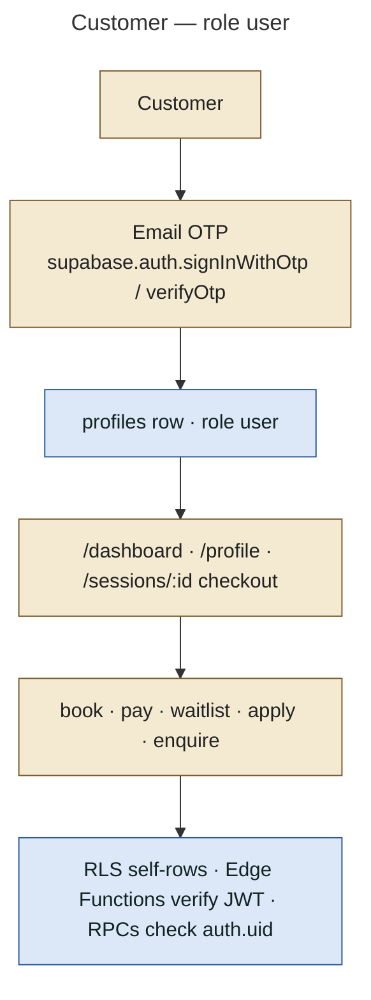
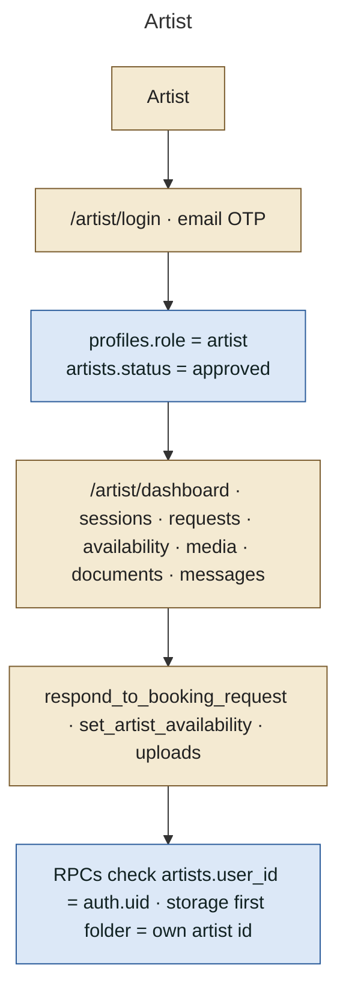
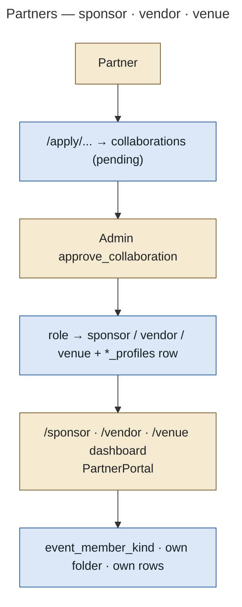
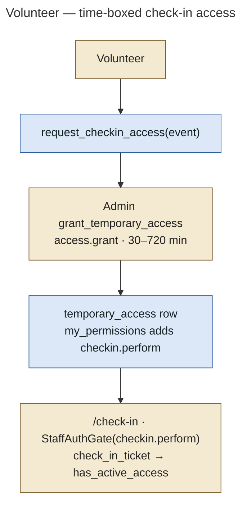
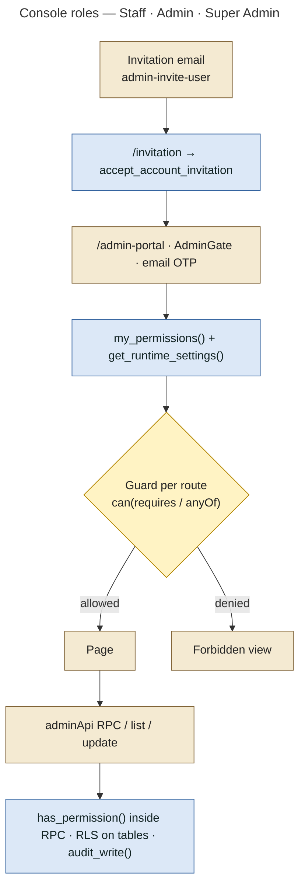

# 02 — User / Role Architecture

## Where roles come from

- **Database enum `user_role`** (0001 + 0005 + 0010): `user`, `artist`, `staff`, `admin`, `super_admin`, `vendor`, `sponsor`, `volunteer`, `crew`, `venue`.
- **`profiles.role`** holds one value per account. It is created as `user` by the `handle_new_user()` trigger on `auth.users` insert (0001).
- **Permissions** are rows in `role_permissions (role, permission)` (0017, 0018, 0028, 0030). `has_permission(p)` checks the caller's role row. `my_permissions()` returns the set to the UI (plus `checkin.perform` while a volunteer has live temporary access).
- **A deactivated account resolves to no role**: `current_role_name()` only returns a role when `profiles.is_active`.
- The UI labels (`src/admin/rbac.js` `ROLE_LABELS`): Super Admin, Admin / Manager, Staff, Patron (`user`), Artist, Vendor, Sponsor, Volunteer, Crew, Venue Partner.
- Review-mode label "Customer" (`src/config/teamReview.js`) is the `user` role. There is **no** separate `customer` enum value.

## How a role is obtained

The guard behind every path is the **`prevent_role_self_escalation`** trigger (latest in 0030). Its rules:

- Nobody changes their **own** role or active flag, except by accepting an invitation addressed to them.
- An approval may move `user` to a partner or artist role, but only for a caller with `applications.review`.
- Every other role change needs `roles.manage`.
- Changes with no end-user JWT (SQL editor, service role) are allowed. This is how the first super admin is created.

## Permission matrix (seeded by migrations)

| Permission | super_admin | admin | staff | Notes |
|---|:-:|:-:|:-:|---|
| dashboard.view | ✓ | ✓ | ✓ | console entry (`AdminGate` default) |
| applications.view / applications.review | ✓ | ✓ | | |
| events.view_all / events.manage | ✓ | ✓ | | |
| events.view_assigned | ✓ | | ✓ | |
| bookings.view_all / bookings.manage / payments.view | ✓ | ✓ | | |
| attendees.view_all | ✓ | ✓ | | |
| attendees.view_assigned | ✓ | | ✓ | |
| checkin.perform / checkin.history | ✓ | ✓ | ✓ | volunteers get `checkin.perform` only while temporary access is live |
| content.manage · announcements.view | ✓ | ✓ | announcements.view | |
| content.view/create/edit/publish/delete + manage_tv/diary/media/sessions | ✓ | ✓ | | 0028 |
| team.manage · entities.manage | ✓ | ✓ | | |
| tasks.view_own | ✓ | | ✓ | |
| users.view | ✓ | ✓ | | |
| users.manage · roles.manage · audit.view · settings.manage · ai.use | ✓ | | | Super Admin only |
| reports.view · operations.manage | ✓ | ✓ | | |
| messages.manage · volunteers.manage · access.grant | ✓ | ✓ | | 0018 |
| staff.invite | ✓ | ✓ | | 0030 |

A Super Admin can change the **admin** and **staff** rows at runtime with `set_role_permission()` (Roles & Permissions page). `roles.manage` itself and the Super Admin row cannot be edited (0018). The 0017 comment *"changed only by migration/SQL (never from the app)"* predates this. The runtime editor is the current behaviour.

## Role → dashboard resolution

## Per-role architecture

Each role follows the same chain: **role → login → authentication → profile → role resolution → permissions → allowed routes → allowed actions → database / RLS enforcement**. The diagrams below show the concrete values for each role.

### Visitor (anonymous)

### Customer / Patron (`user`)

| Item | Value |
|---|---|
| Login | Login modal (`UserLoginModal` → `EmailOtpAuth`), `/join/login`, `/join` |
| Dashboard | `/dashboard` → `PatronDashboard` (tabs: overview, passport, bookings, waitlist, settings, help); `/profile` |
| Main actions | Book and pay (`/sessions/:id`), see tickets and the booking QR, join or leave the waitlist, apply for partner roles, enquire, request an agent, set a password |
| DB restrictions | `bookings`/`tickets`/`checkins`: self read only. **No insert policy on `bookings`**: bookings are created only by `create_pending_booking` (service role, via Edge Function). `waitlist`: self read; joins through `join_waitlist()` |
| Security | Cannot change own `role`/`is_active` (trigger) or own `email`/`passport_id`/`member_since` (`guard_profile_identity`, 0035) |

### Artist (`artist`)

| Item | Value |
|---|---|
| Login | `/artist/login` (`EmailOtpAuth`) |
| Before approval | `/artist/apply` (8-step application, any signed-in person), `/artist/application` (status) |
| Dashboard | `/artist/dashboard` inside `ArtistPortalShell`: sessions, calendar, requests, availability, media, messages, notifications, profile, documents, settings |
| Main actions | Edit profile and avatar, set availability (`set_artist_availability`), accept or decline booking requests (`respond_to_booking_request`), upload media (`artist-media`) and documents (`artist-documents`), message the team, set notification preferences |
| DB restrictions | `artists`: self read/update own row (status changes guarded by `prevent_artist_status_self_escalation`); `assignment_requests`: read own, non-draft only; `artist_availability`: self + team only (0033 removed public read); storage folder must be the caller's own `artists.id` |

### Sponsor / Vendor / Venue host (`sponsor`, `vendor`, `venue`)

| Item | Value |
|---|---|
| Apply | `/apply/sponsors`, `/apply/vendors`, `/apply/venue-host` (sign-in required) → `collaborations` row (`type` sponsor / vendor / venue_host) |
| Login | `/join/login` (approval email links here) |
| Dashboard | `/sponsor/dashboard`, `/vendor/dashboard`, `/venue/dashboard`. Pending applicants see their application status; approved accounts get `PartnerPortal` tabs: overview, events, requirements, messages, documents, sponsor brand assets, payments (invoices), announcements, notifications |
| Main actions | Respond to event assignments, submit requirements (`submit_requirement`), upload documents (`event-documents`) and sponsor assets (`sponsor-assets`), message the team (`start_partner_conversation`, `send_message`), view invoices |
| DB restrictions | Event access through `event_member_kind()` (only events they are assigned to); `sponsor-assets` uploads only by an active `sponsor` into their own `auth.uid()` folder |

### Crew and Volunteer (`crew`, `volunteer`)

| Item | Value |
|---|---|
| Apply | `/crew/apply` (category crew), `/volunteer/apply` (category volunteer; may name a session) → `crew_applications` |
| Dashboard | `/crew/dashboard` (custom `CrewDashboard`: assignments, tasks, schedule, applications, profile, messages); `/volunteer/dashboard` (`PartnerPortal` kind volunteer: tasks, check-in access, announcements, notifications) |
| Main actions | Crew: see assignments and tasks. Volunteer: request check-in access (`request_checkin_access`), use `/check-in` while a grant is live |
| DB restrictions | `approve_crew_application` makes a member a Volunteer and, if a session was named, adds a confirmed `event_assignments` row. Console accounts keep their console role. A volunteer's check-in right is `temporary_access` (30 min – 12 h windows) |

### Staff (`staff`)

| Item | Value |
|---|---|
| Login | `/admin-portal` (`AdminLoginPanel`: email OTP, `allowSignup=false`; password fallback). Accounts are created by invitation |
| Dashboard | `/admin-portal` (`staff_dashboard`), My Events, Event Info, Attendees (assigned), Check-in History, Event Tasks, Announcements, Notifications; `/check-in` |
| DB restrictions | Event-scoped: `is_assigned_to_event()`, `can_view_event_attendees()`, `can_checkin_event()`. 0017 removed staff's global access (`is_staff_or_admin()` now means admin-level only) |

### Admin / Manager (`admin`)

All of Staff's operational areas for **every** event, plus: applications review, events and line-ups, bookings, payments, waitlist, invoices, people (artists and partners), reviews, volunteers and temporary access, team, staff invitations, content CMS, messages, reports, operations (support inbox, enquiries, email delivery, portal preview). **Not:** users.manage, roles.manage, audit.view, settings.manage, ai.use.

### Super Admin (`super_admin`)

Everything above plus Users & Roles (`admin_set_user_role`, `admin_set_user_active`), Roles & Permissions (`set_role_permission`), Audit Logs, System Settings (`update_system_setting`), Tangy AI page, custom notifications (`send_custom_notification`), private artist conversations (`start_private_artist_conversation`). Only a Super Admin grants or removes Super Admin, and the last active Super Admin cannot be demoted (`admin_set_user_role`, 0034).

### Private-session enquirer

Not a role. A signed-in `user` who submitted `private_enquiries` sees them at `/private/dashboard` (`RoleApplicationDashboard`).
