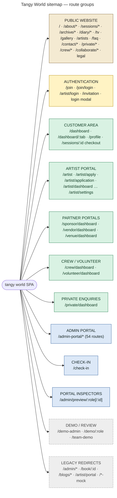
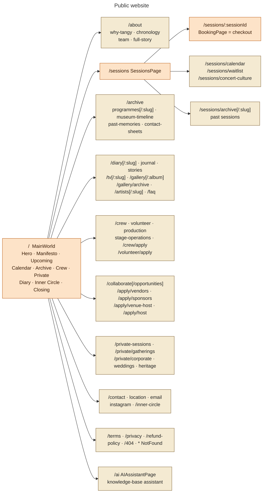
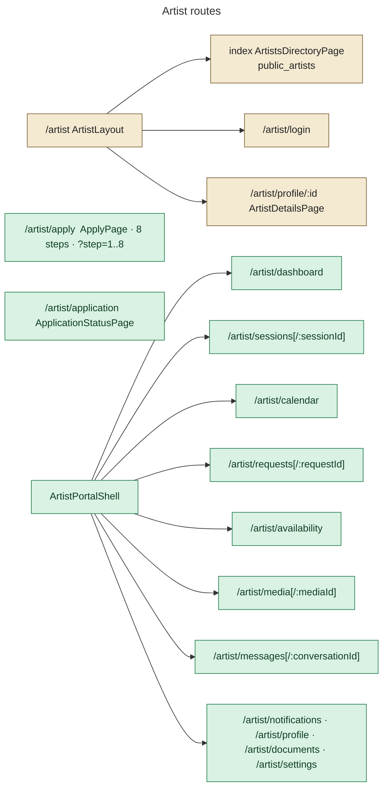
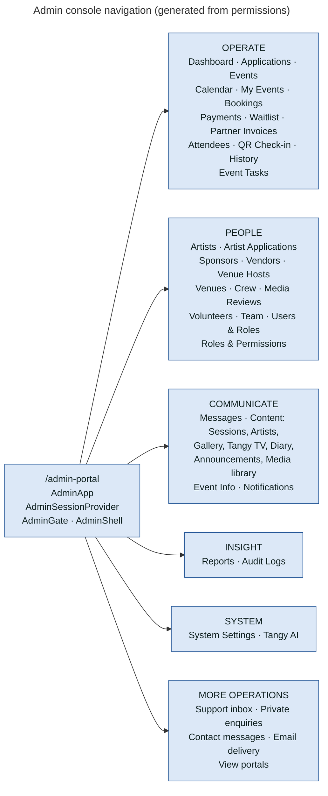

# 03 — Complete Website Map

Routes come from `src/App.jsx` (134 `<Route>` elements) and `src/admin/AdminApp.jsx` (54). `docs/ROUTES.md` is the repository's own generated inventory (`scripts/route-inventory.mjs`). Every page except the homepage is lazy-loaded (`React.lazy` + `Suspense`).

## Top-level hierarchy

## PUBLIC WEBSITE

| URL | Page | Purpose | Access | Data read | Actions |
|---|---|---|---|---|---|
| `/` | `MainWorld` | Scroll experience, entry to everything | Public | `events` (useEvents), published content, announcements | Navigate; open login modal |
| `/sessions` | `SessionsPage` | Upcoming sessions | Public | `events` (status ≠ draft) | Open a session |
| `/sessions/:sessionId` | `BookingPage` | Session details **and** checkout | Public read; booking needs sign-in | `events`, `event_artists`, `public_artists`, `booking_quote()`, `event_availability()`, `my_waitlist()`, Realtime `event_availability_signal` | Pay (Edge Functions), join/leave waitlist |
| `/sessions/calendar` | `SessionCalendarPage` | Calendar of sessions | Public | `events` (useEvents) | — |
| `/sessions/waitlist` | `WaitlistPage` | Sold-out sessions with waitlists | Public; joining needs sign-in | `event_availability()`, `my_waitlist()` | `join_waitlist` / `leave_waitlist` |
| `/sessions/archive[/:slug]` | `PreviousSessionsPage`, `PastSessionPage` | Past sessions with line-up, gallery, diary, TV | Public | `archiveService` reads `events`, `event_artists`, `gallery_albums`, `diary_posts`, `tv_videos`, `programmes` | — |
| `/diary`, `/tv`, `/gallery`, `/artists` (+ detail pages) | content pages | CMS content | Public | `contentService` (published only) + signed URLs for `content-media` | — |
| `/apply/*`, `/crew/apply`, `/volunteer/apply`, `/contact`, `/private-sessions` | forms | Applications and enquiries | Sign-in required (`RequireAuthToApply`, 0025) | own previous submissions | insert `collaborations` / `crew_applications` / `contact_enquiries` / `private_enquiries` |

## AUTHENTICATION

| URL | Page | Purpose | Access | Actions |
|---|---|---|---|---|
| (modal) | `UserLoginModal` | Sign in without leaving the page (e.g. "TO BOOK THIS SESSION") | Public | Email OTP |
| `/join` | `JoinPage` | "How are you joining Tangy?" role cards (`src/config/joinRoles.js`) | Public | Guest signs up by OTP; other cards link to their application |
| `/join/login` | `JoinLoginPage` | Universal sign-in, returns to `?next=` | Public | Email OTP |
| `/artist/login` | artist `LoginPage` | Artist sign-in | Public | Email OTP |
| `/invitation` | `InvitationPage` | Accept a console invitation | Signed-in owner of the invited email | `invitation_preview`, `accept_account_invitation` |
| `/team-demo` | `TeamDemoLoginPage` | One-click demo roles | **DEMO / LOCAL ONLY**: review builds only (`__TANGY_REVIEW_MODE__`) | password sign-in to demo accounts |

## CUSTOMER / USER AREA

| URL | Page | Purpose | Access | Data read | Actions |
|---|---|---|---|---|---|
| `/dashboard[/:tab]` | `DashboardRedirect` → `PatronDashboard` | Bookings, tickets, booking QR, passport, waitlist, settings | `ProtectedRoute` | `bookings` + `tickets` + `events` (own), `waitlist`, `my_waitlist()`, `profiles` | Set password (`auth.updateUser`), leave waitlist |
| `/profile` | `ProfilePage` (passport) | Profile + booking history | `ProtectedRoute` | `profiles`, `bookingService.getMyBookings` | Edit profile fields (identity fields guarded) |

## ARTIST PORTAL

| URL | Purpose | Data read | Actions |
|---|---|---|---|
| `/artist/apply` | Multi-step application (any signed-in person) | `artist_applications` (own) | autosave `update`, upload video to `artist-media/applications/<uid>/`, `submit_artist_application`, `withdraw_artist_application` |
| `/artist/calendar` | Own calendar (sessions, requests, availability) | `artist_calendar()` (shared `useArtistCalendar`) | — |
| `/artist/dashboard` | Overview | `my_booking_requests`, `artist_profile_completion`, `artist_availability_summary` | — |
| `/artist/sessions[/:id]` | Confirmed sessions | `event_artists`, `events`, `event_artist_details` | — |
| `/artist/requests[/:id]` | Booking requests | `my_booking_requests` | `mark_artist_request_viewed`, `respond_to_booking_request` |
| `/artist/availability` | Day-by-day availability | `artist_availability`, `artist_availability_summary` | `set_artist_availability` |
| `/artist/media` | Media library | `artist_media` + signed URLs | upload to `artist-media/<artist id>/` |
| `/artist/documents` | Rider, EPK, tax, identity | `artist_documents` | upload to `artist-documents/<artist id>/` |
| `/artist/messages` | Threads with the team | `my_conversations`, `conversation_messages` | `send_message`, `start_partner_conversation` |
| `/artist/settings` | Notification preferences | `my_notification_preferences` | `set_notification_preference` |

## SPONSOR · VENDOR · VENUE · VOLUNTEER · CREW · PRIVATE

| URL | Component | Access | Data read | Actions |
|---|---|---|---|---|
| `/sponsor/dashboard[/:tab[/:sub]]` | `SponsorDashboard` → `PartnerPortal` (kind sponsor) | `ProtectedRoute`; full portal only when an application is approved | `collaborations`, `sponsor_profiles`, `sponsor_deliverables`, `sponsor_assets`, `my_portal_events`, `partner_invoices` | upload `sponsor-assets`, `submit_requirement`, messages |
| `/vendor/dashboard…` | `VendorDashboard` → `PartnerPortal` (vendor) | same | `collaborations`, `vendor_profiles`, `event_assignments`, invoices | respond to assignments, requirements, documents |
| `/venue/dashboard…` | `VenueDashboard` → `PartnerPortal` (venue) | same | `collaborations`, `venue_profiles`, `events` | requirements, documents, messages |
| `/volunteer/dashboard[/:tab]` | `VolunteerDashboard` → `PartnerPortal` (volunteer) | same | `crew_applications`, `volunteer_profiles`, `event_assignments`, `my_checkin_access` | `request_checkin_access` |
| `/crew/dashboard[/:tab]` | `CrewDashboard` | `ProtectedRoute` | `crew_applications`, `crew_profiles`, `event_assignments`, `event_tasks` | view assignments and tasks |
| `/private/dashboard[/:tab]` | `PrivateDashboard` (`RoleApplicationDashboard`) | `ProtectedRoute` | own `private_enquiries` | messages |

Route-level role checks are intentionally absent here. A *pending* applicant (still `user`) must reach the page to see their status. RLS on the applicant's own rows is the boundary (`App.jsx` comment above these routes).

## ADMIN PORTAL (`/admin-portal/*`)

The route-by-route permission table for the console is in [06-admin-architecture.md](06-admin-architecture.md).

## CHECK-IN

| URL | Component | Access | Data | Actions |
|---|---|---|---|---|
| `/check-in` | `TangyWorldCheckInPage` inside `StaffAuthGate` (permission `checkin.perform`) | Staff/Admin/Super Admin, or a volunteer with live `temporary_access` | `my_checkin_events`, `event_checkin_stats`, `get_checkin_history`, `attendee_tickets` | camera scan (`html5-qrcode`) or manual code → `check_in_ticket` (preview then commit) |
| `/admin/preview/:role[/:id]`, `/admin/preview/artist/:id` | `AdminEntitySelector`, `AdminPortalPreview`, `AdminArtistPreview` | Uses admin data access (RLS) | profiles and partner tables | read-only portal inspection |

## DEMO / REVIEW / LEGACY

| URL | Status |
|---|---|
| `/demo-admin`, `/demo-admin/control-room`, `/demo/:role`, `/demo/artist` | **DEMO / LOCAL ONLY**: `VITE_DEMO_ADMIN_ENABLED` is compiled to `false` in builds unless `TANGY_ALLOW_DEMO_BUILD=1`. In `vite` dev with dev tools the first two redirect to `/admin-portal` |
| `/team-demo` | **DEMO / LOCAL ONLY**: review builds only |
| `/admin/*` → `/admin-portal/*`, `/book/:id` → `/sessions/:id`, `/blogs[/:slug]` → `/diary[/:slug]`, `/artist/portal`, `/artist-mock/portal`, `/admin-mock`, `/crew-mock/dashboard`, `/artist/dashboard/:tab` | **LEGACY** redirects |
