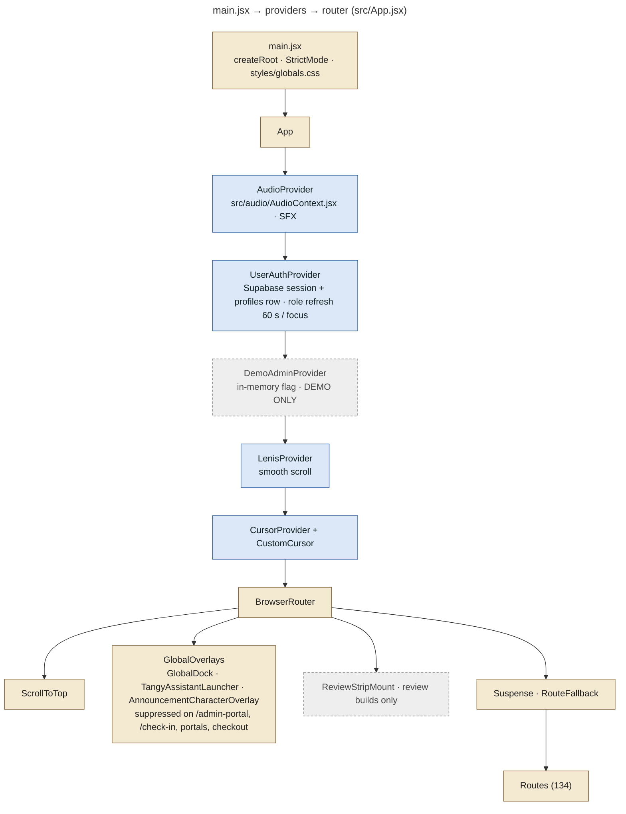
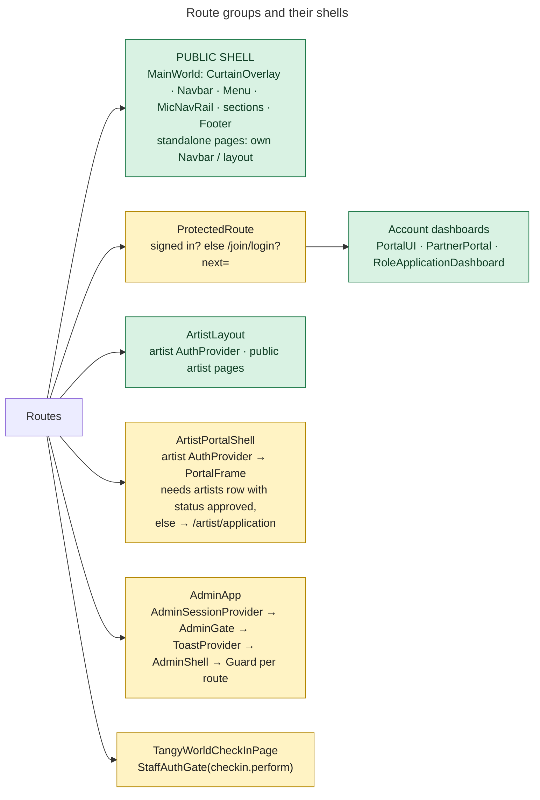
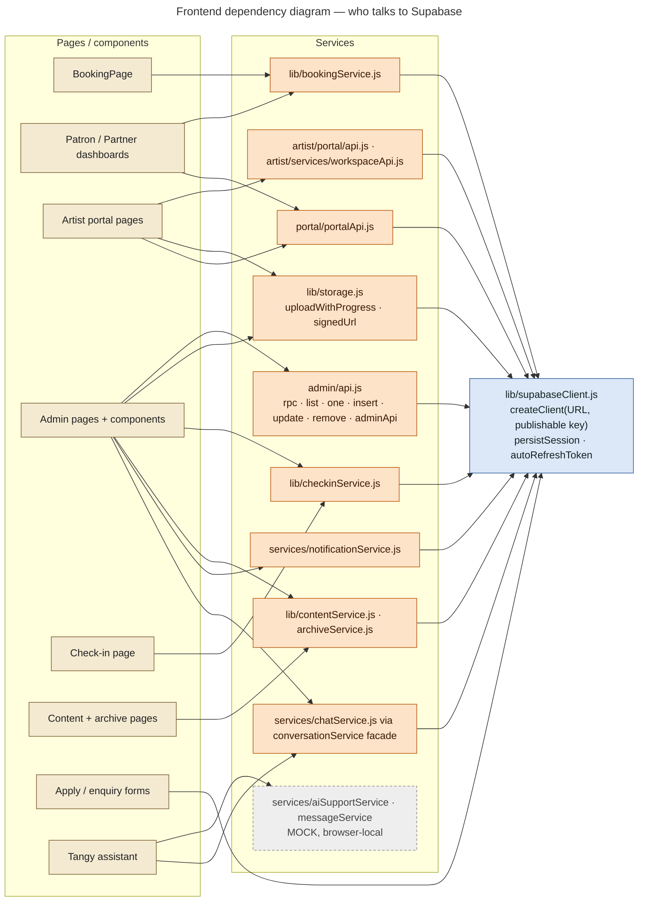
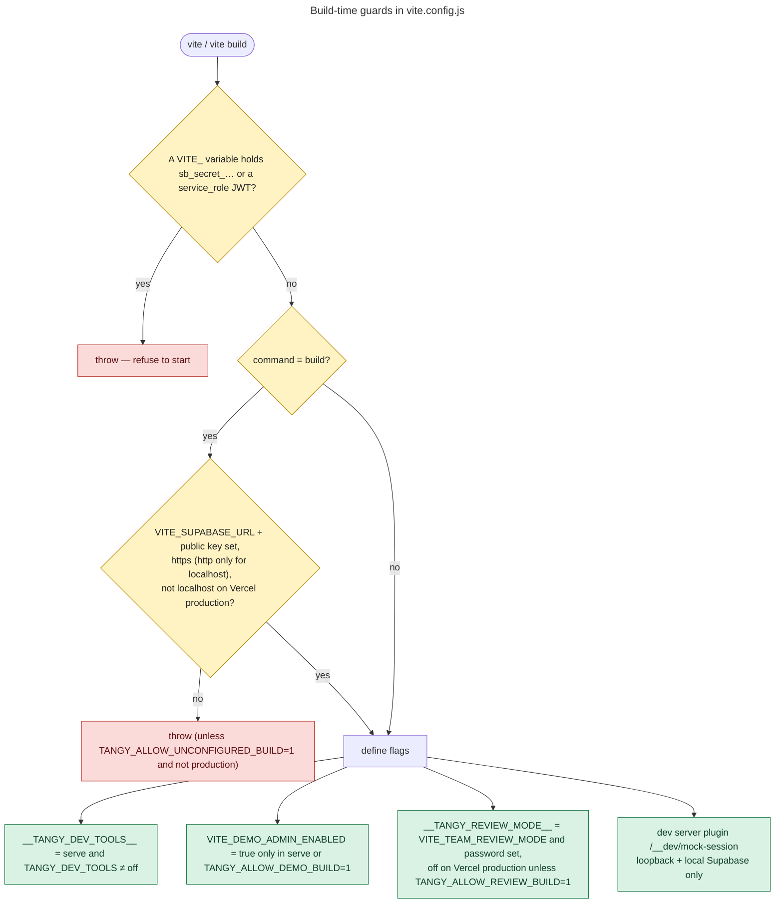

# 04 — Frontend Architecture

**Stack** (`package.json`): React 19, Vite 8, React Router 7, Tailwind 4 (`@tailwindcss/vite`), `@supabase/supabase-js` 2, GSAP 3 + Lenis + Framer Motion (animation), FullCalendar 6 (calendars), `qrcode` (QR images), `html5-qrcode` (camera scanner), `lucide-react` (icons). Lint: Oxlint. There is no TypeScript and no state library (React context + hooks only).

## Boot sequence and provider tree

## Layouts / shells

| Shell | File | What it adds |
|---|---|---|
| Public | `App.jsx` `MainWorld`, `components/layout/*`, `components/sections/*` | Museum modals, curtain intro, navbar, scroll sections |
| Account | `pages/dashboards/*`, `portal/PartnerPortal.jsx`, `pages/dashboards/portal/PortalUI.jsx` | Tabs, application status, partner sections |
| Artist public | `artist/layouts/ArtistLayout.jsx` | Artist navbar, artist `AuthProvider` |
| Artist portal | `artist/portal/ArtistPortalShell.jsx`, `portalNav.js`, `kit.jsx` | Sidebar nav, request badge, approval gate |
| Admin | `admin/AdminShell.jsx`, `AdminGate.jsx`, `AdminSession.jsx`, `ui.jsx`, `rbac.js` | Permission-generated nav, global search (`admin_search`), notification bell, idle sign-out (`auth.admin_idle_timeout_minutes`, default 60) |
| Check-in | `admin/TangyWorldCheckInPage.jsx`, `StaffAuthGate.jsx` | Same sign-in + permission model as the console |

## Contexts and hooks

| Context / hook | File | Purpose |
|---|---|---|
| `UserAuthContext` | `src/context/UserAuthContext.jsx` | `getSession` + `onAuthStateChange` → loads `profiles` row; exposes `user`, `isLoggedIn`, `signIn` (password), `signUp`, `logout`, login modal state; re-reads `role, is_active` every 60 s and on focus |
| artist `AuthContext` | `src/artist/contexts/AuthContext.jsx` | Maps the caller's `artists` row to the portal user; `null` when no artist row |
| `AdminSessionContext` | `src/admin/AdminSession.jsx` | `my_permissions()` + `get_runtime_settings()`, `can()`, dev mock identity (dev only) |
| `DemoAdminContext` | `src/context/DemoAdminContext.jsx` | **DEMO ONLY** in-memory flag, grants nothing (no Supabase session) |
| `AudioContext` | `src/audio/AudioContext.jsx` | Sound effects (`playSFX`) |
| `useEvents` | `src/hooks/useEvents.js` | Public `events` list |
| `useSessionDetail` | `src/hooks/useSessionDetail.js` | Session page: event, line-up, `booking_quote`, `event_availability`, `my_waitlist`, Realtime subscription `availability-<eventId>` on `event_availability_signal` |
| `useContent` | `src/hooks/useContent.js` | CMS reads |
| `useAnnouncementTrigger` | `src/hooks/useAnnouncementTrigger.js` | Picks a public announcement for the character overlay |
| `usePageMeta`, `useReducedMotion`, `useFocusTrap`, `useGSAPContext`, `useReveal`, `useCursor` | `src/hooks/` | Page titles, a11y, animation |
| `useAdminList`, `useAsync` | `src/admin/useAdminList.js`, `src/admin/hooks.js` | Paged admin lists |

## Service / API layer

| Module | Talks to |
|---|---|
| `src/lib/supabaseClient.js` | Creates the only client. Returns `null` when `VITE_SUPABASE_URL` / public key are missing, so the app shows empty or error states instead of crashing |
| `src/lib/bookingService.js` | Edge Functions `razorpay-create-order`, `razorpay-verify-payment`, `send-ticket-email`; table `bookings` (own) |
| `src/lib/checkinService.js` | RPCs `check_in_ticket`, `my_checkin_events`, `event_checkin_stats`, `get_checkin_history`, `booking_checkin_history`; view `attendee_tickets` |
| `src/lib/contentService.js` | `tv_videos`, `diary_posts`, `gallery_albums`, `gallery_photos`, `public_artists`, `event_artists`; storage `content-media` (signed URLs) |
| `src/lib/archiveService.js` | Past `events`, `event_artists`, `programmes`, `programme_events`, content tables |
| `src/lib/storage.js` | Storage REST with the user's JWT (progress events); signed URLs for private buckets |
| `src/admin/api.js` | Generic table helpers + typed `adminApi` RPC wrappers; maps errors to safe messages (`friendlyError`); invokes `admin-invite-user` |
| `src/portal/portalApi.js` | Partner/artist portal RPCs (events, conversations, notifications, requirements, check-in access) + Realtime inserts |
| `src/artist/portal/api.js`, `src/artist/services/workspaceApi.js` | Artist application, availability, booking requests, profile completion, preferences |
| `src/services/chatService.js` (+ `conversationService` facade) | Support conversations, messages, Realtime channels `conversations:inbox`, `messages:<id>` |
| `src/services/notificationService.js` | `application_notifications`; invokes `send-approval-email` |

### Mock services: dead code paths

`src/services/{bookingService,collaborationService,enquiryService,eventService,userService,waitlistService}.js` say *"MOCK service — not connected to Supabase"*. They are only reachable behind `if (isMockAuth)`, and `src/config/auth.js` hard-codes `isMockAuth = false`. In the current build these branches never run (**LEGACY**). `eventService`, `waitlistService` and `assignmentRequestService`/`assignmentService` are not imported by any UI component. The exception is `messageService` + `aiSupportService`, which the public Tangy Assistant **does** use (browser-local transcript, **PARTIALLY IMPLEMENTED**, see 01).

## Build-time switches (`vite.config.js`)

