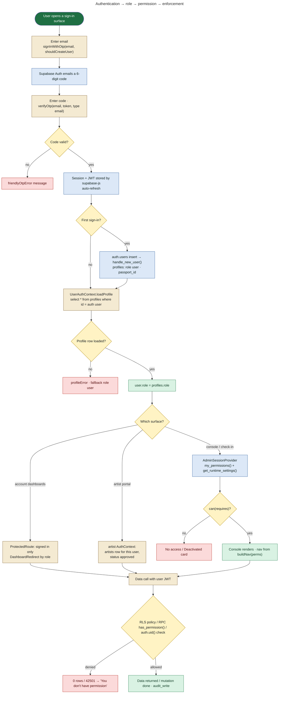
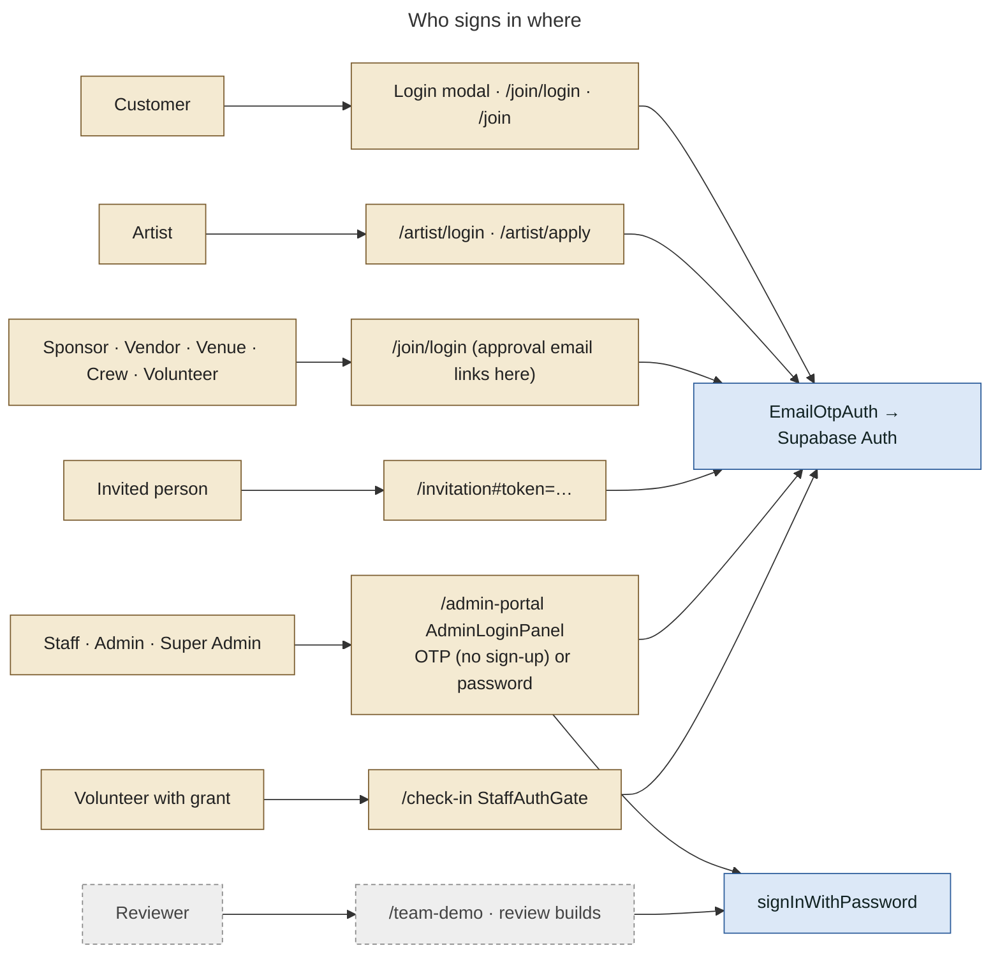
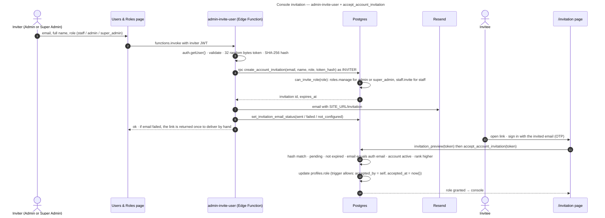
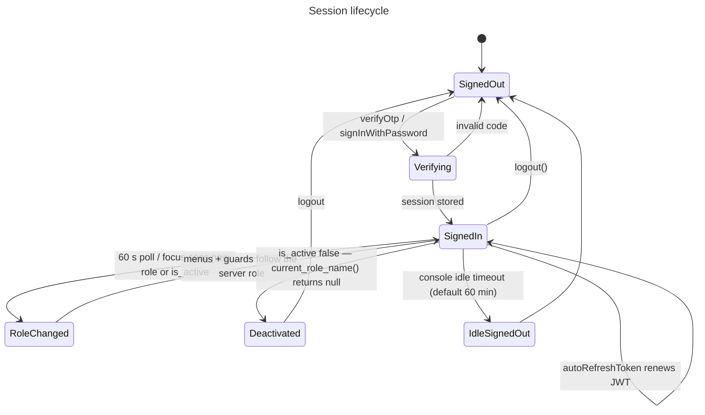

# 05 — Authentication, Role and Permission Resolution

Supabase Auth is the only identity provider. Tangy never generates, stores or checks OTP codes itself. `EmailOtpAuth` calls `supabase.auth.signInWithOtp()` and `verifyOtp()`.

## Implemented auth flows

| Flow | Status | Where |
|---|---|---|
| Email OTP sign-up + sign-in (customers, partners, artists) | **IMPLEMENTED** | `src/components/auth/EmailOtpAuth.jsx` (`shouldCreateUser: allowSignup`, `verifyOtp({type:'email'})`), used by `UserLoginModal`, `/join`, `/join/login`, `/artist/login`, `/artist/apply`, `RequireAuthToApply`, `/invitation` |
| Console sign-in | **IMPLEMENTED** | `AdminLoginPanel` (`AdminGate.jsx`): OTP with `allowSignup=false` (existing accounts only); **password fallback** (`signInWithPassword`) |
| Set / change password | **IMPLEMENTED** | `/profile` and Patron settings: `supabase.auth.updateUser({ password })` |
| Password reset by email (`resetPasswordForEmail`) | **NOT IMPLEMENTED** | no call in `src/` |
| Social / OAuth sign-in | **NOT IMPLEMENTED** | — |
| Session persistence and refresh | **IMPLEMENTED** | `createClient(..., { auth: { persistSession: true, autoRefreshToken: true } })` |
| Role refresh while signed in | **IMPLEMENTED** | `UserAuthContext` re-reads `profiles.role, is_active` every 60 s, on window focus and on tab visibility |
| Console idle sign-out | **IMPLEMENTED** | `AdminShell` `useIdleTimeout`, setting `auth.admin_idle_timeout_minutes` (default 60; 0 disables) |
| Console sign-in audit | **IMPLEMENTED** | `AdminGate` → `log_auth_event('auth.login')` once per browser session |
| Invitation (console accounts) | **IMPLEMENTED** | `admin-invite-user` Edge Function + `create_account_invitation` / `invitation_preview` / `accept_account_invitation` (0030) |
| OTP email template contains `{{ .Token }}` | **PRODUCTION CONFIGURATION** / **DOCUMENTED BUT NOT VERIFIED IN CODE** | `supabase/README.md` §2b: dashboard setting; the repo says it *"could not be verified against a live project"* |
| Team review one-click login | **DEMO / LOCAL ONLY** | `/team-demo`, `signInWithPassword` with `VITE_TEAM_REVIEW_PASSWORD` |
| Dev role switcher | **DEMO / LOCAL ONLY** | `vite` dev server `/__dev/mock-session` (magic-link token for local accounts) |

## Complete authentication flowchart

## Sign-in surfaces

## Invitation flow (console accounts)

## Session and role refresh

**Why the server role always wins:** every RLS policy and RPC reads `profiles.role` through `current_role_name()` / `has_permission()` on each request. When a Super Admin changes someone's role, the database stops honouring the old role immediately. The 60-second client refresh only updates the menus.

## Artist login specifics

The artist portal does **not** gate on `profiles.role`. `ArtistPortalShell` → artist `AuthContext` loads the `artists` row for `auth.uid()`:

- no row → redirect to `/artist/login?next=…`
- status ≠ `approved` → redirect to `/artist/application`
- `approved` → portal

Approval also sets `profiles.role = 'artist'` (`approve_artist_application`), so `/dashboard` redirects artists to `/artist/dashboard`.
