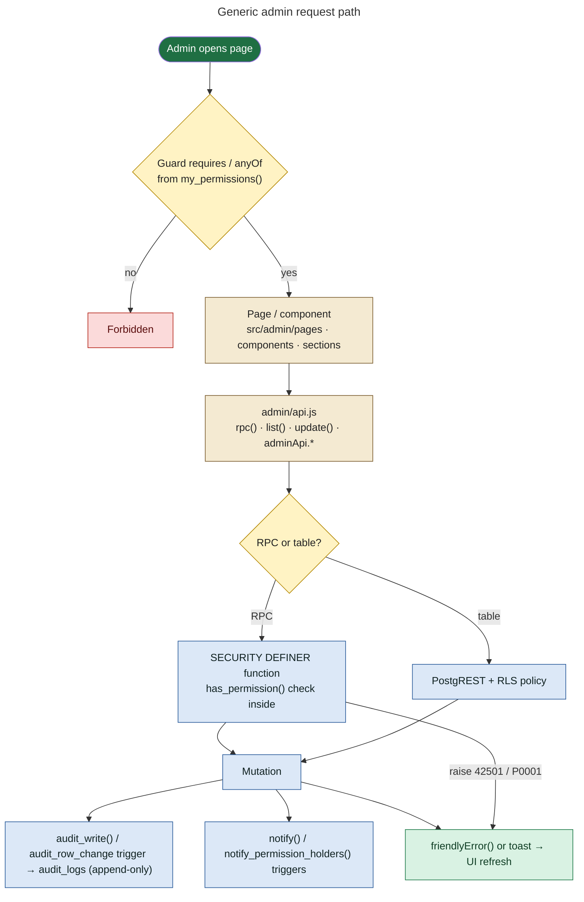
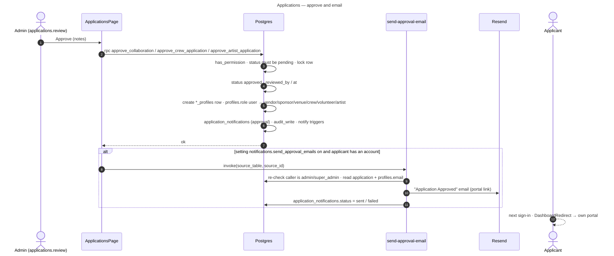
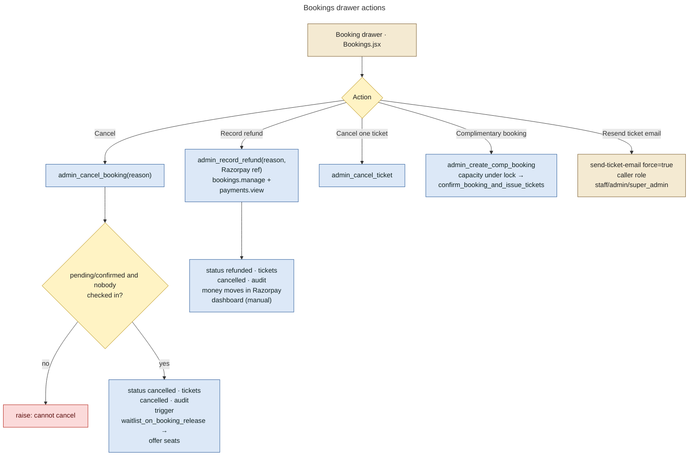
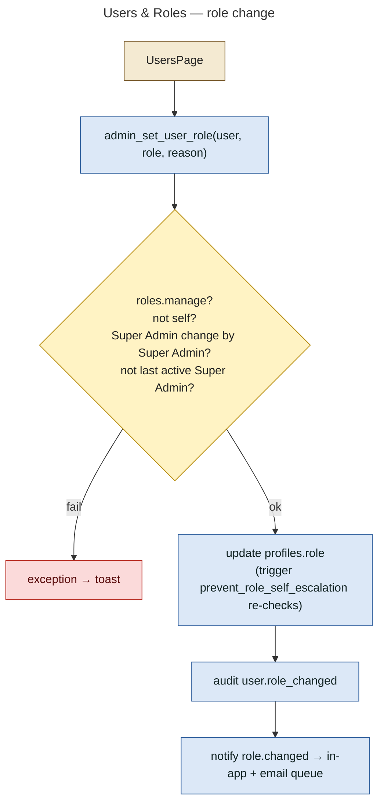
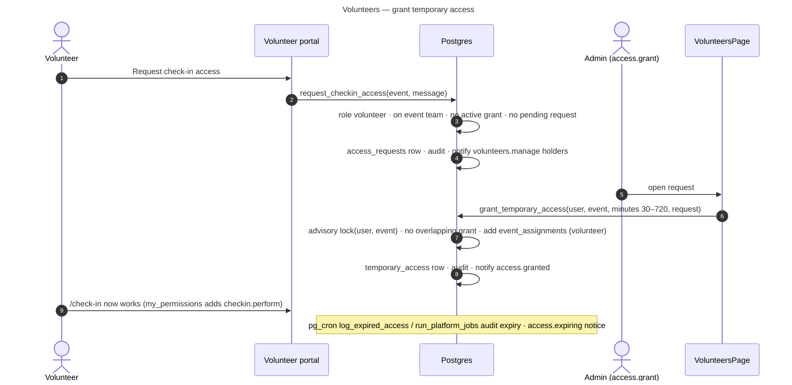

# 06 — Admin Architecture (the "Control Room")

The console lives at `/admin-portal/*`: `src/admin/AdminApp.jsx`, with 54 routes. Old `/admin/*` links redirect here.

## How every admin action is processed

The UI never decides access. `rbac.js` says so: *"Nothing here grants access — it only decides what to render, so a tampered client just sees buttons that fail."* `admin/api.js` `update()` treats "0 rows updated" as forbidden, because RLS turns an unauthorized UPDATE into 0 rows.

## Console map (permission → page → data)

| Section | Route(s) | Permission (route guard) | Frontend | Service → RPC / table | Server checks, mutations, side effects |
|---|---|---|---|---|---|
| Dashboard | `/admin-portal` | dashboard.view | `DashboardPage` | `admin_dashboard_summary`, `staff_dashboard`, `admin_operations_overview`, `artist_day_summary`; reads `bookings`, `event_requirements`, `event_tasks`, `access_requests`, `announcements`, `audit_logs`, `conversations` | Read-only. Kind chosen by `dashboardKind(perms)`: super_admin / admin / staff |
| Global search | header ⌘K | (any console user) | `AdminShell` | `admin_search(p_query)` | Results scoped by permission in SQL |
| Applications | `/applications[/:id]` | applications.view (review: applications.review) | `ApplicationsPage` | view `applications_overview`; `approve_*`/`reject_*` (artists, collaborations, crew_applications); then `send-approval-email` | Pending-only transitions, role provisioning (user→partner), `application_notifications` row, audit, applicant notification |
| Artist applications | `/artists/applications[/:id]` | applications.view | `ArtistApplicationsPage` | `review_artist_application(start_review / request_info / approve / reject)`; signed URL for the video | See [08](08-artist-application.md) |
| Events | `/events`, `/events/new`, `/events/:id[/:tab]` | events.view_all (create: events.manage) | `EventsPage`, `EventDetailPage`, `EventForm`, `EventEditor`, `TicketTypesEditor`, `BookingFormEditor`, `EventOps`, `Team`, `Tasks` | insert/update `events`, `event_ticket_types`; `save_event_lineup`, `update_event_artist`, `remove_event_artist`, `create_artist_request`, `manage_artist_request`, `artist_schedule_check`, `event_health`, `event_command_center`, `review_requirement`, `close_requirement`; `event_requirements`, `event_documents` (+ `event-documents` bucket), `event_assignments`, `event_tasks`, `sponsor_deliverables` | `events_audit`, `events_notify_change`, `events_notify_publish`, `events_prevent_delete_with_bookings`, `events_validate_timezone`, `events_seed_ticket_type`, capacity → waitlist offers. See [09](09-event-lifecycle.md), [10](10-event-artist-workflow.md) |
| Calendar | `/calendar` | events.view_all | `CalendarPage` | `admin_calendar` | Read-only |
| My Events / Event Info | `/my-events[/:id]`, `/event-info` | events.view_assigned | `MyEventsPage`, `StaffEventPage` | `event_assignments`, `events`, `venues`, `announcements`, `event_checkin_stats` | Staff may update own assignment status |
| Bookings | `/bookings[/:bookingId]` | bookings.view_all | `BookingsPage`, `components/Bookings.jsx` | `bookings`, `audit_logs`, `event_ticket_types`; `admin_cancel_booking`, `admin_record_refund`, `admin_cancel_ticket`, `admin_create_comp_booking`; `send-ticket-email` (resend, `force`) | Cancel needs bookings.manage + reason, refuses if anyone checked in; refund needs bookings.manage + payments.view + Razorpay refund reference; comp booking checks capacity under lock and issues tickets; all audited; seat release → waitlist |
| Payments | `/payments`, `/payments/webhooks` | bookings.view_all + payments.view | `PaymentsPage` | `bookings`, `payment_webhook_events` | Read-only mirror of Razorpay state and webhook processing errors |
| Waitlist | `/waitlist` | bookings.view_all | `WaitlistSection` | `waitlist`; `admin_offer_waitlist`, `admin_remove_waitlist_entry` | Manual offer / removal, audited |
| Partner invoices | `/invoices` | payments.view + bookings.manage | `InvoicesPage` | insert/update `partner_invoices` | `partner_invoices_notify`, audit |
| Attendees | `/attendees` | attendees.view_all or attendees.view_assigned | `components/Attendees.jsx` | view `attendee_tickets` (CSV export), `my_checkin_events`, `check_in_ticket` | Contacts only for those allowed to see them |
| QR Check-in | → `/check-in` | checkin.perform | `TangyWorldCheckInPage` | see [14](14-checkin-workflow.md) | |
| Check-in history | `/check-ins` | checkin.history | `CheckinHistory` | `get_checkin_history` | Read-only |
| Event tasks | `/tasks` | tasks.view_own or team.manage | `components/Tasks.jsx` | `event_tasks`, `event_assignments` | `event_tasks_validate`, `guard_event_task_status`, notifications |
| People | `/people/:kind[/:id]`, `/people/artists/:id[/:tab]` | entities.manage | `PeoplePage` (`EntityManager`), `ArtistDetailPage` | `artists`, `venues`, `sponsor_profiles`, `venue_profiles`, `vendor_profiles`, `crew_profiles`, `volunteer_profiles`; `artist_calendar`, `artist_availability_summary`, `start_private_artist_conversation`, `admin_start_partner_conversation` | Private artist thread is Super Admin only |
| Reviews | `/reviews[/:tab]` | entities.manage | `ReviewsPage` | update `artist_media.status` / `sponsor_assets.status`; signed URLs | `guard_artist_media_status`, `stamp_asset_review`, notifications `media.reviewed` / `asset.reviewed` |
| Volunteers | `/volunteers[/:userId]` | volunteers.manage | `VolunteersPage` | `volunteers_overview`, `grant_temporary_access`, `revoke_temporary_access`, `decline_access_request`, `volunteer_access_activity` | access.grant checked in SQL; 30–720 min windows; audited |
| Team | `/team` | team.manage | `TeamPage`, `components/Team.jsx` | `event_assignments`, `event_tasks`, `profiles` | `validate_event_assignment`, notifications |
| Users & Roles | `/users[/:id]` | users.manage or staff.invite | `UsersPage` | `profiles`, `audit_logs`; `admin_set_user_role`, `admin_set_user_active`, `list_account_invitations`, `revoke_account_invitation`, `admin-invite-user` | roles.manage for role changes; last Super Admin protected; `role.changed` notification |
| Roles & Permissions | `/roles` | roles.manage | `RolesPage` | `role_permissions`; `set_role_permission` | Only admin/staff rows editable; audited |
| Messages | `/messages[/:conversationId]` | messages.manage | `MessagesPanel` (portal) | `admin_conversations`, `conversation_messages`, `send_message`, `set_conversation_status`, `set_conversation_meta`, `mark_conversation_read`; Realtime | Private artist threads hidden from non-participants (RLS 0034) |
| Content | `/content[/:section[/:item]]` | content.manage / content.view / content.manage_sessions (+ area rights) | `ContentPage`, `ContentCollections` (TV, Diary, Gallery, Programmes), `Announcements`, `MediaLibrary` | `tv_videos`, `diary_posts`, `gallery_albums`, `gallery_photos`, `programmes`, `programme_events`, `announcements`; `update_session_content`; storage `content-media` | `content_guard_publish` (content.publish), audit triggers. See [19](19-content-architecture.md) |
| Announcements (staff) | `/announcements` | announcements.view | `StaffAnnouncementsPage` | `announcements` | Read |
| Notifications | `/notifications[/settings]` | dashboard.view | `NotificationsPanel` | `my_notifications`, `mark_notifications_read`, `my_notification_preferences`, `set_notification_preference`; `send_custom_notification` (Super Admin) | |
| Reports | `/reports` | reports.view | `ReportsPage` | `report_event_performance`, `report_revenue_by_month`, `report_applications`, `report_staff_activity`, `report_platform_activity` | Read-only aggregates |
| Audit logs | `/audit` | audit.view | `AuditLogsPage` | `audit_logs` | Append-only table (trigger blocks update/delete) |
| Settings | `/settings` | settings.manage | `SettingsPage` | `system_settings`, `role_permissions`; `update_system_setting` | Audited (`settings.updated`) |
| Tangy AI | `/ai` | ai.use | `AiPage` | none | **NOT IMPLEMENTED**: `aiService.js` *"NOT connected to any model yet"* |
| More operations | `/ops/inbox`, `/ops/enquiries`, `/ops/contact`, `/ops/notifications`, `/ops/portals` | operations.manage | `InboxSection`, `EnquiriesSection`, `NotificationsSection`, `PortalsSection` | support `conversations` (chatService), `private_enquiries`, `contact_enquiries`, `email_outbox` + `application_notifications` (delivery log), portal previews | Read / reply |

## Representative flows

### Approve a partner / crew / artist application (generic Applications screen)

### Booking administration

### Users & roles

### Volunteer temporary check-in access

