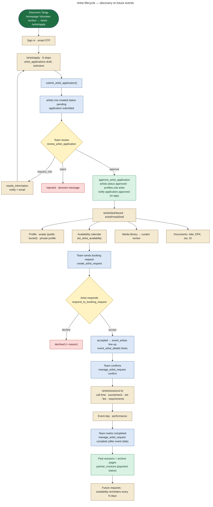
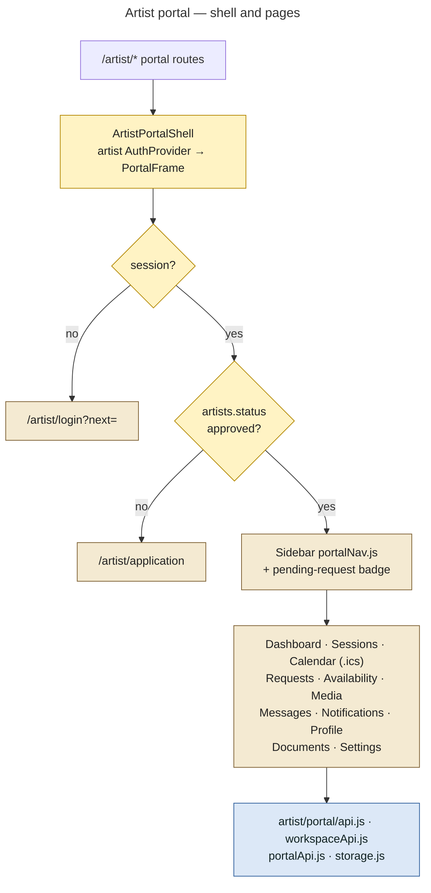

# 07 — Artist Architecture and Lifecycle

Artist features come from migrations `0012` (availability), `0013` (media), `0014` (Spotify), `0020` (private profiles, profile completion, request details), `0022` (storage fixes), `0032`–`0034` (applications, portal, event workflow) and `0036` (documents bucket fix). The repository's own guide is `docs/ARTIST_PORTAL.md`.

## Complete artist lifecycle (as implemented)

## What each stage touches

| Stage | Frontend | RPC / table | Storage | Notifications / email | Admin involvement | Security boundary |
|---|---|---|---|---|---|---|
| Apply (draft) | `artist/portal/pages/ApplyPage.jsx` | insert/update `artist_applications` (`artistApi.startApplication/saveApplication`) | `artist-media/applications/<uid>/…` | — | — | RLS: applicant edits own row only in `draft`/`needs_information`; `guard_artist_application` blocks status/review fields |
| Submit | same | `submit_artist_application()` | — | `application.submitted` to self (in-app); on resubmit `application.resubmitted` to reviewers | — | Server validates required fields, video, consents |
| Review | `admin/pages/ArtistApplicationsPage.jsx` | `review_artist_application(start_review / request_info / approve / reject)`, `application_reviews` (internal notes) | signed URL for video | `application.under_review` (in-app), `application.info_requested` (in-app + email), `application.approved` / `rejected` (in-app, critical) | applications.review | Internal notes separated from applicant-readable rows (0033) |
| Portal access | `ArtistPortalShell` | `artists` (own) | — | — | — | Approved `artists` row required |
| Profile | `artist/pages/ProfilePage.jsx`, `workspaceApi` | `artists`, `artist_private_profiles`, `artist_profile_completion()` | `artist-avatars/<artist id>/…` (public) | — | team can view | self update own row; status changes blocked by `prevent_artist_status_self_escalation` |
| Availability | `artist/portal/pages/AvailabilityPage.jsx` | `set_artist_availability()`, `artist_availability`, `artist_availability_summary()` | — | platform job `send_availability_reminders` (stale after `artists.availability_stale_days`, default 30) | team reads (`events.manage`/`entities.manage`) | Only approved artist; days with a confirmed performance keep their booking (`guard_artist_availability`) |
| Requests | `artist/portal/pages/RequestsPage.jsx` | `my_booking_requests()`, `mark_artist_request_viewed()`, `respond_to_booking_request()` | — | to the artist: `booking.requested`, `booking.confirmed`, `booking.cancelled`; to the requesting admin: `booking.accepted` / `declined` / `expired` | team creates/confirms | Drafts invisible to the artist; per-artist-per-day advisory lock |
| Sessions | `artist/portal/pages/SessionsPage.jsx` | `event_artists`, `events`, `event_artist_details`, `event_requirements` | `event-documents` (audience-scoped) | `schedule.changed`, `event.*_changed`, `event.cancelled`, `event.reminder` | team edits line-up | `event_member_kind()` |
| Media | `artist/pages/MediaPage.jsx` | `artist_media` (status uploaded → under_review → approved/rejected, archived) | `artist-media/<artist id>/…` (private) | `media.submitted`, `media.reviewed` | Reviews page (entities.manage) | `guard_artist_media`: only curators approve/reject |
| Documents | `artist/portal/pages/InboxPages.jsx` (DocumentsPage) | `artist_documents` | `artist-documents/<artist id>/…` (private, 25 MB, pdf/images/docx) | — | team reads | own folder only (0036) |
| Messages | `InboxPages.jsx` (MessagesPage) | `my_conversations`, `conversation_messages`, `send_message`, `start_partner_conversation` | — | `message.new` (email: generic text only) | Messages page; private Super Admin thread | RLS on participants |
| Payment / history | `ArtistEventDrawer` | `partner_invoices` (read) | — | `invoice.issued` / `invoice.paid` | Invoices page | own invoices |

## Portal shell

## Artist approval email: a gap

When an artist is approved from the **Artist Applications** page (`review_artist_application` → `approve_artist_application`), the artist receives an **in-app** notification `application.approved`. Its catalogue entry has `email = false`, and that page does **not** invoke `send-approval-email`. The branded approval email is sent only when an application is approved from the generic **Applications** drawer (`ApplicationsPage`), which calls `send-approval-email` when `notifications.send_approval_emails` is on.

Status: **PARTIALLY IMPLEMENTED** for the artist-specific path. The artist is told in-app and by the dashboard redirect. An `application_notifications` row is created, so a "resend" from the Applications screen can still send it.
