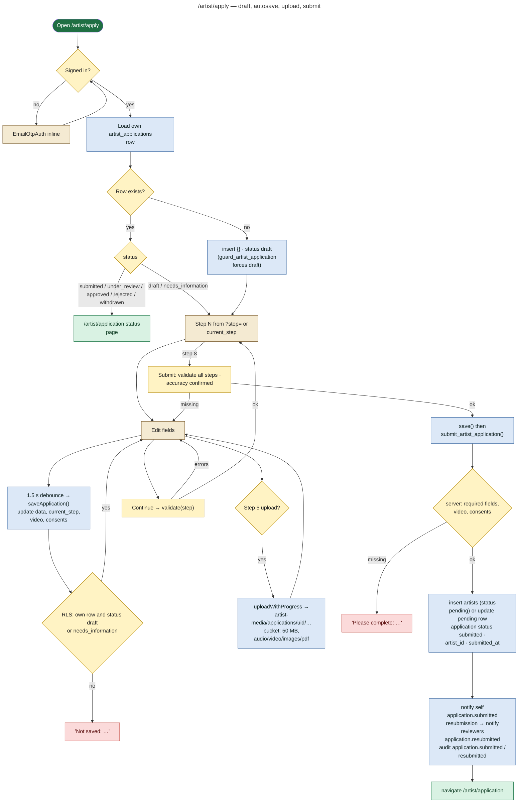
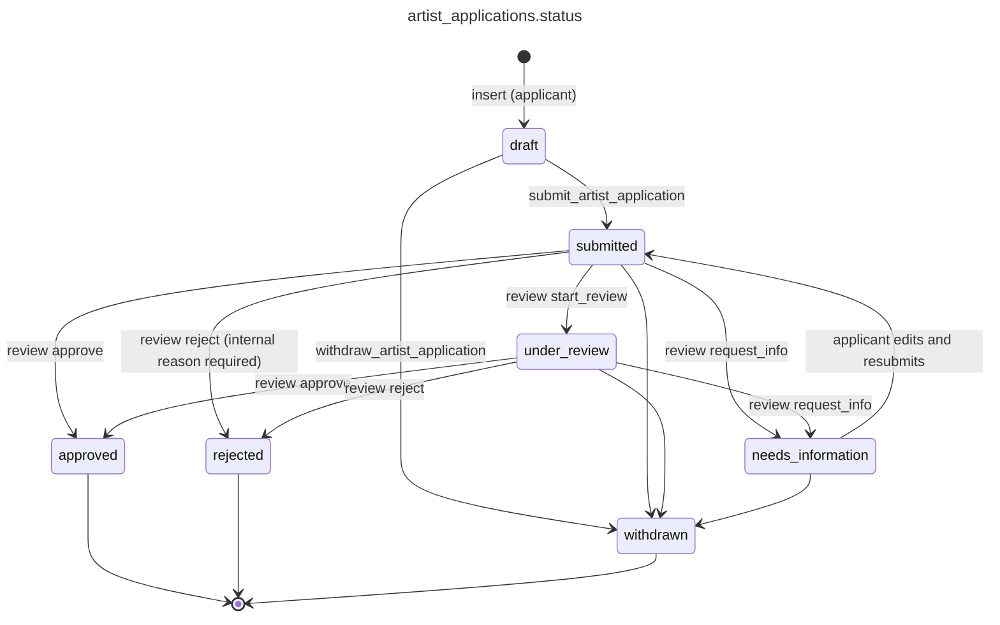
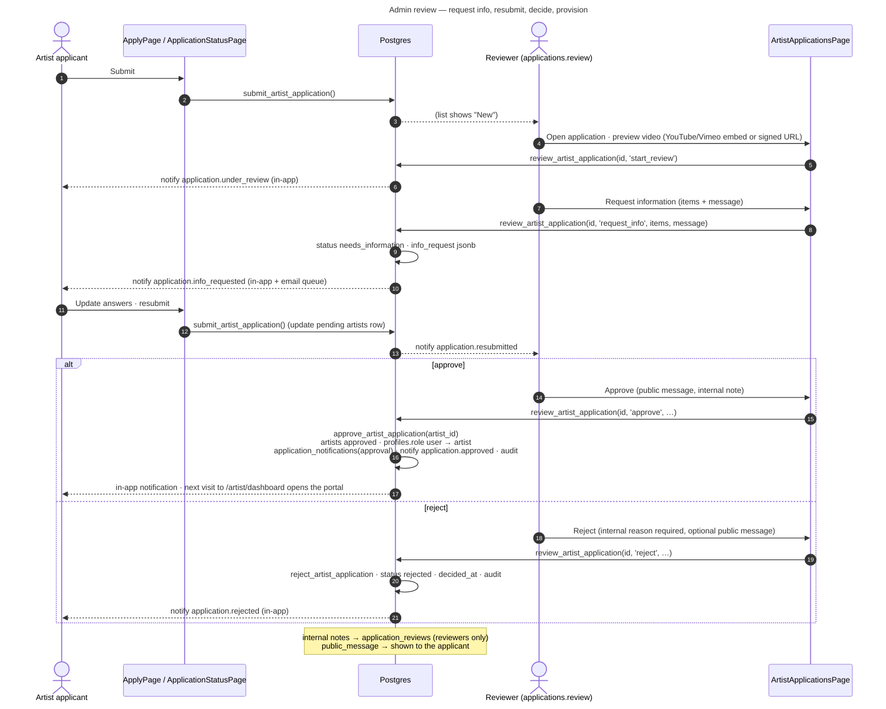

# 08 — Artist Application Workflow (`/artist/apply`)

**Status: IMPLEMENTED** (migrations 0032/0033; `src/artist/portal/pages/ApplyPage.jsx`, `ApplicationStatusPage.jsx`; admin `src/admin/pages/ArtistApplicationsPage.jsx`).

- One row per account in `artist_applications` (`user_id` is unique).
- Answers live in `data jsonb` (< 200 KB), grouped by section: `about`, `artistry`, `experience`, `online`, `media`, `technical`, `availability`.
- The video, the consents and the review state are separate columns.

## Step-by-step

| # | Step (`STEPS`) | Main fields | Browser validation (`validate(step)`) | Server validation on submit |
|---|---|---|---|---|
| 1 | About you | full name\*, stage name\*, email (prefilled), phone, WhatsApp, city\*, country, website | name, stage name, city required; phone pattern | full name, stage name, city |
| 2 | Your artistry | artist type\*, primary genre\*, other genres, sub-genres, instruments, languages, sound/style, short bio\*, long bio, years active, experience level | type, genre, short bio ≥ 40 chars | artist type, primary genre, short bio |
| 3 | Experience | years performing, number of shows, venues, festivals, cultural events, collaborations, performed with Tangy before (+ which event) | — | — |
| 4 | Online presence | Instagram, Spotify, YouTube, SoundCloud, website, other + self-reported audience numbers | https:// links (or @handle for Instagram) | — |
| 5 | Performance media | how the video is shared; primary video\* (upload up to 50 MB or YouTube/Vimeo URL); title, place, date, type, description; optional 2nd video link; media consent\* | video present; only YouTube/Vimeo links; consent | `video_url` or `video_storage_path`; `media_consent`; DB check constraint on `video_url` pattern |
| 6 | Technical & hospitality | format, set duration, technical requirements, own backline, rider notes, travelling from, members, accommodation, travel assistance, food, other | — | — |
| 7 | Availability | typical availability, preferred days, blocked dates, notice period, last-minute, travel radius, cities | — | — |
| 8 | Review | read-only summary with "edit" links; accuracy confirmation\* | accuracy confirmed | `accuracy_confirmed` |

## Draft, autosave and submit flow

## Application state machine

`sync_artist_application_status` keeps the application in step when a decision is made on the `artists` row from the generic Applications screen.

## Admin review flow

## Security boundaries

- **RLS:**
  - The applicant reads their own row, and edits it only while it is `draft` or `needs_information`.
  - Reviewers read with `applications.view`.
- **Trigger `guard_artist_application`:** for API callers it forces `status = draft` on insert and blocks every status and review field. Only the RPCs (which set `tangy.application_rpc = on`) can change them.
- **Uploads:** application uploads go to `artist-media/applications/<uid>/`. Only the applicant and `applications.view` holders can read them (0033 storage policies).
- **Approval email:** see the gap noted in [07](07-artist-architecture.md#artist-approval-email-a-gap). `application.info_requested` **is** emailed (catalogue `email = true`), while `approved` / `rejected` are in-app only on this path.
