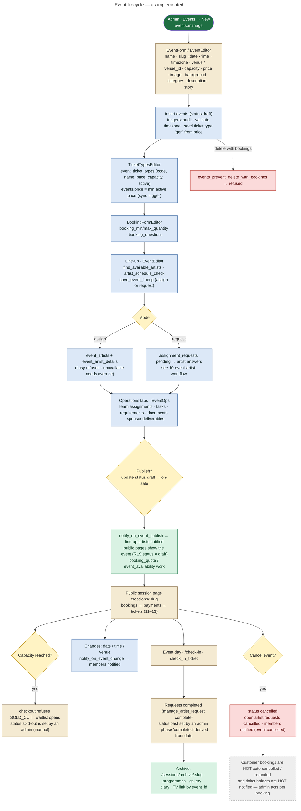
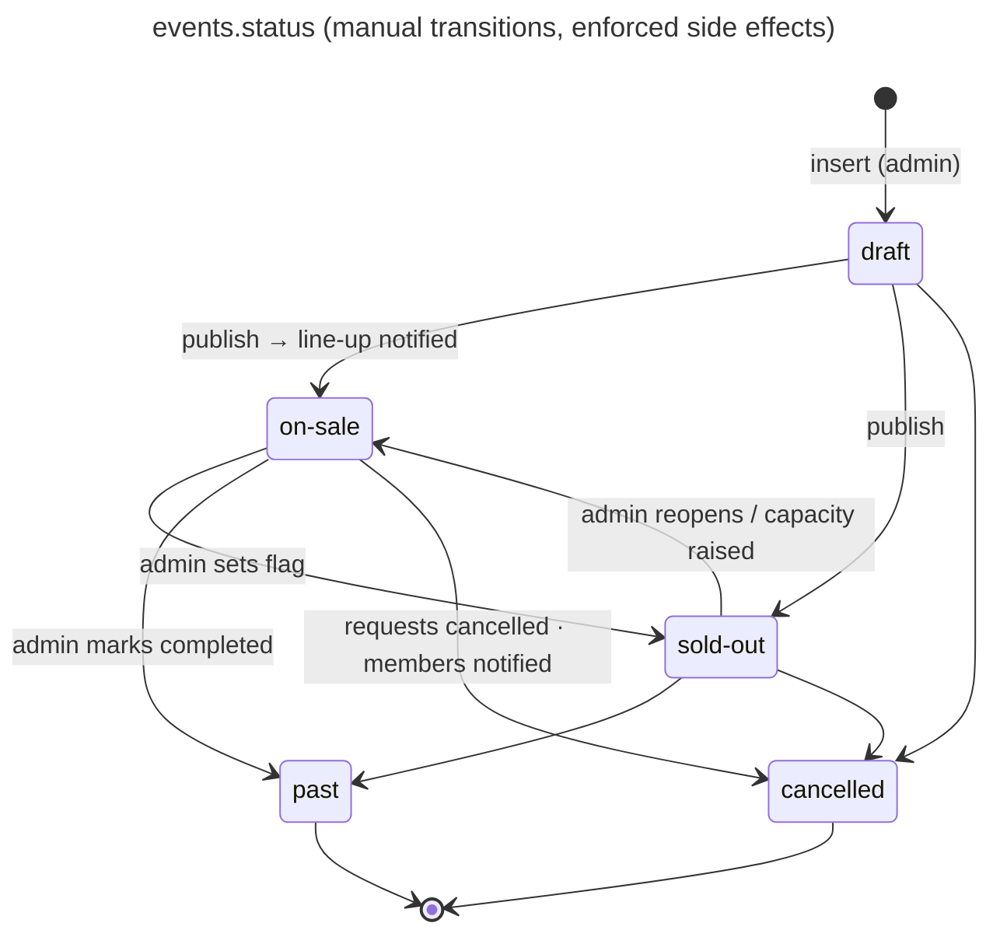

# 09 — Event Lifecycle

An "event" (UI: "session") is a row in `events`. Status values (convention since 0001, listed in `rbac.js`):

| Status | UI label |
|---|---|
| `draft` | Draft |
| `on-sale` | Published · On sale |
| `sold-out` | Published · Sold out |
| `past` | Completed |
| `cancelled` | Cancelled |

The UI's **lifecycle phase** (`eventPhase()` in `rbac.js`) is *derived from the date* and never stored: `draft` / `cancelled` / `upcoming` / `live` (today) / `completed`.

## The real lifecycle

## Stage details

| Stage | Frontend | Database | Side effects | Status |
|---|---|---|---|---|
| Create | `admin/components/EventForm.jsx`, `EventEditor.jsx` | insert `events` (`events.manage` via RLS `is_admin()` / policies) | `events_audit`, `events_validate_timezone`, `events_seed_ticket_type` | **IMPLEMENTED** |
| Venue | `EventForm` | `venues` (+ `venue_profiles` for partner venue hosts); `events.venue_id`, `venue_partner_id` | venue partner becomes an event member | **IMPLEMENTED** |
| Capacity | `EventForm` | `events.capacity` | raising capacity → `events_capacity_to_waitlist` → `offer_waitlist_seats` | **IMPLEMENTED** |
| Tickets | `TicketTypesEditor.jsx` | `event_ticket_types`; preview via `booking_quote` | `event_ticket_types_sync_price`, `ticket_types_availability_signal` | **IMPLEMENTED** |
| Booking form | `BookingFormEditor.jsx` | `events.booking_questions`, `booking_min_quantity`, `booking_max_quantity` | validated in `create_pending_booking` (`booking_answers_error`) | **IMPLEMENTED** |
| Artists / availability | `EventDetailPage` + `ArtistAvailability.jsx` | `find_available_artists`, `artist_schedule_check`, `artist_day_status` | — | **IMPLEMENTED** |
| Line-up | `EventEditor` / `EventDetailPage` | `save_event_lineup`, `update_event_artist`, `remove_event_artist` | `notify_lineup_artist` (only once published), `event_artists_notify(_removed)` | **IMPLEMENTED** |
| Request artist → accept → confirm | `EventDetailPage` | `create_artist_request`, `respond_to_booking_request`, `manage_artist_request` | see [10](10-event-artist-workflow.md) | **IMPLEMENTED** |
| Team / tasks / requirements / documents | `EventOps.jsx`, `Team.jsx`, `Tasks.jsx` | `event_assignments`, `event_tasks`, `event_requirements`, `event_documents` (+ `event-documents` bucket), `sponsor_deliverables` | notify triggers, validation triggers | **IMPLEMENTED** |
| Publish | status select in the editor | `events.status` draft → on-sale | `events_notify_publish`, public visibility via RLS | **IMPLEMENTED** |
| Sold out | status select | `events.status` = sold-out | Capacity enforcement is automatic in `create_pending_booking`; the **status flag** is manual. `event_availability()` reports `sold_out` from either flag or counts | **PARTIALLY IMPLEMENTED** (status not automatic) |
| Session content | Content → Sessions | `update_session_content` (description, story, image_url, tags, featured) | content.manage_sessions + content.edit | **IMPLEMENTED** |
| Event day | `/check-in` | `check_in_ticket`, `event_checkin_stats` | audit per check-in | **IMPLEMENTED** |
| Reminders | — | `send_event_reminders` (platform job) | **members only** (artists, assignees, venue and sponsor partners), N hours before start (`notifications.event_reminder_hours`, default 24). **Ticket buyers do not get reminders**. Customer reminders are **NOT IMPLEMENTED** | **PARTIALLY IMPLEMENTED** |
| Completion | Requests: `manage_artist_request('complete')` only after the event's local date | `assignment_requests.completed_at` | — | **IMPLEMENTED**; `events.status = past` is a manual flag |
| Archive | `/sessions/archive`, `/sessions/archive/:slug`, `/archive/programmes` | `archiveService` reads past events + linked content (`event_id` on `gallery_albums`, `diary_posts`, `tv_videos`; `programme_events`) | — | **IMPLEMENTED** |
| Cancel | status select | `events.status = cancelled` | `notify_on_event_change`: members notified; open requests cancelled. **Bookings untouched** | **PARTIALLY IMPLEMENTED** for customers |
| Delete | Events page | `events_prevent_delete_with_bookings` | refused when bookings exist | **IMPLEMENTED** |

## Event status state diagram

Checkout accepts only `on-sale`. It also accepts `sold-out`, but only for the holder of a live waitlist offer (`razorpay-create-order`).
