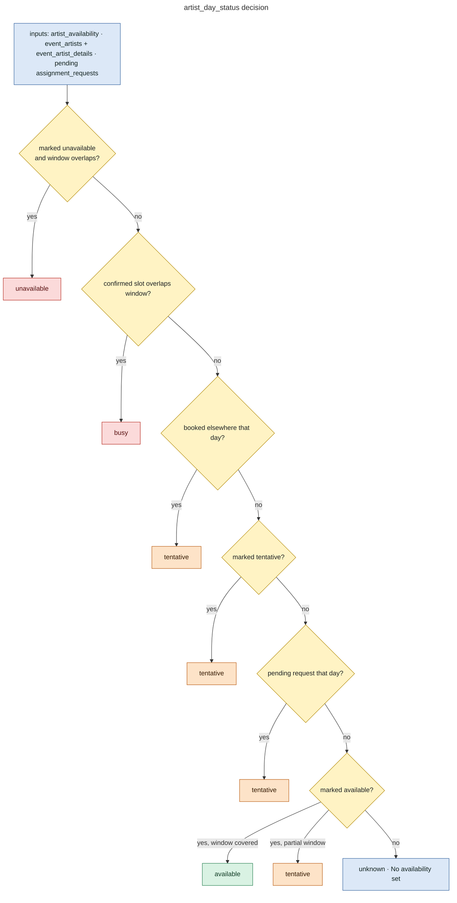
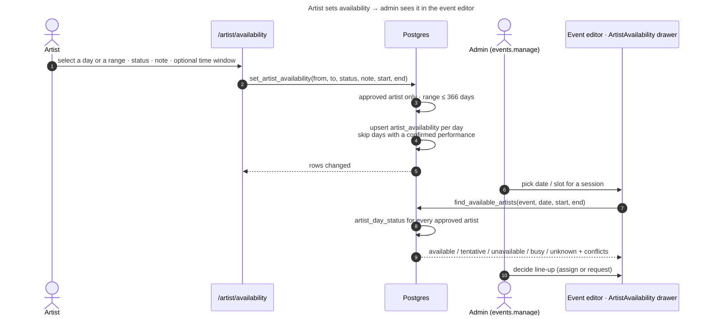
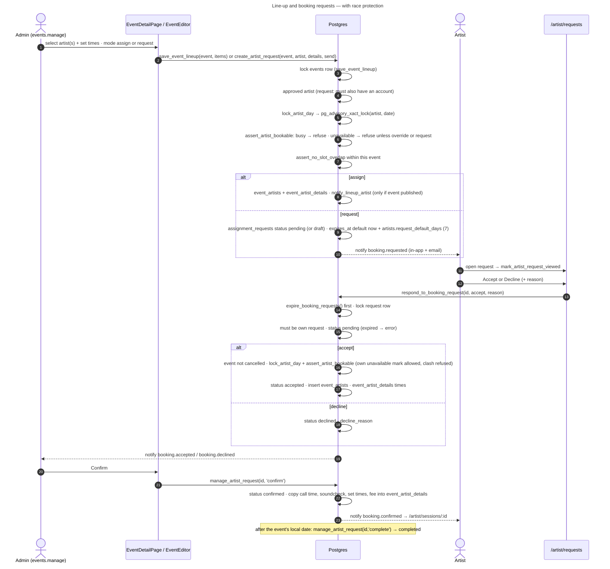
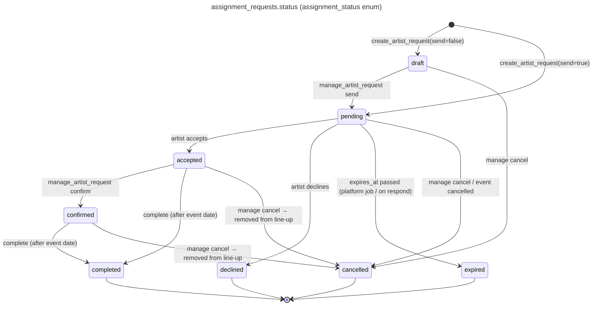

# 10 — Event ↔ Artist Workflow (Availability, Line-up, Booking Requests)

Source: migrations `0033_artist_portal.sql`, `0034_event_artist_workflow.sql` and the repository guide `docs/EVENT_WORKFLOW.md`. **Status: IMPLEMENTED.**

## One source of truth for availability

`artist_day_status(artist, date, start, end, exclude_event)` (0034) is the single function that decides an artist's status for a date and optional time window. It combines three inputs:

- the artist's own calendar (`artist_availability`)
- confirmed line-ups (`event_artists` + `event_artist_details` times)
- pending requests (`assignment_requests` with status `pending`)

| Computed status | Rule (checked in this order) |
|---|---|
| **unavailable** | Artist marked the day unavailable and the time windows overlap (or no window) |
| **busy** | A confirmed line-up slot on that date overlaps the window |
| **tentative** | Booked elsewhere that day (no overlap), *or* marked tentative, *or* a pending request exists, *or* available only for part of the window |
| **available** | Marked available covering the window |
| **unknown** ("No availability set") | Nothing recorded |

A pending request **never counts as a booking** (busy). It only makes the day tentative. The artist stores only `available` / `tentative` / `unavailable` (`set_artist_availability`); `busy` and `unknown` are computed.

The same data feeds:

- `find_available_artists()`: the admin's artist picker for an event date
- `artist_calendar()`: the shared calendar component used by the artist portal, the admin artist page and the event editor drawer
- `artist_availability_summary()`, `admin_calendar()`, `artist_day_summary()`
- `artist_schedule_check()`: pre-send check of other sessions that day

## Artist availability workflow

## Event ↔ artist booking workflow

## Booking request states

## Race-condition protection

| Mechanism | Where | Protects against |
|---|---|---|
| `pg_advisory_xact_lock(hashtextextended('tangy.artist_day:'+artist+':'+date))` (`lock_artist_day`) | `assert_artist_bookable`, used by `save_event_lineup`, `update_event_artist`, `create_artist_request`, `respond_to_booking_request` | Two admins (or an admin and the artist) double-booking the same artist on the same day |
| `select … for update` on `events` | `save_event_lineup` | Concurrent line-up edits on one event |
| `for update` on the request row | `respond_to_booking_request`, `manage_artist_request` | Double answers |
| `assert_no_slot_overlap` | line-up / request | Overlapping sets inside one event |
| `guard_artist_availability` (0020) | `artist_availability` writes | Marking a day with a confirmed performance as unavailable |

## Legacy paths still in the code

- `create_assignment_request` / `respond_to_assignment_request` / `cancel_assignment_request` (0008) via `src/services/assignmentRequestService.js`: **LEGACY**. The service is not imported by any component. `respond_to_assignment_request` is still called *internally* by `respond_to_booking_request`.
- `create_booking_request` (0020) wrapper `adminApi.createBookingRequest`: **LEGACY / unused** by pages. `create_artist_request` (0033/0034) is the current path.
