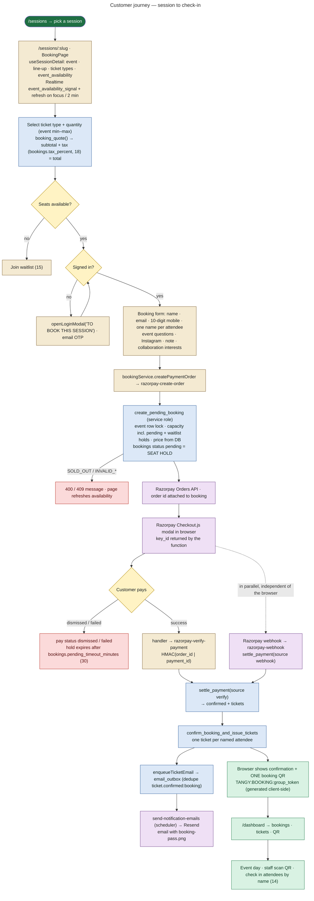

# 11 — Customer Booking Workflow

**Status: IMPLEMENTED in code**, verified locally by `e2e/checkout.mjs`, `e2e/groupcheckin.mjs` and `supabase/tests/pricing_settlement.test.sql`. Live payments need the Razorpay secrets (**PRODUCTION CONFIGURATION, not done**, `docs/OPERATIONS.md` §3).

## Customer journey

## The two payment paths

| | Browser verification path | Webhook path |
|---|---|---|
| Trigger | Razorpay Checkout `handler` callback in `BookingPage` | Razorpay → `POST /functions/v1/razorpay-webhook` |
| Function | `razorpay-verify-payment` (JWT required; caller must own the booking; order id must match) | `razorpay-webhook` (no JWT; `X-Razorpay-Signature` over the raw body) |
| Secret | `RAZORPAY_KEY_SECRET` | `RAZORPAY_WEBHOOK_SECRET` |
| Settles via | `settle_payment(order, payment, amount null, 'verify')` | `settle_payment(order, payment, amount_paise, 'webhook')` (amount checked) |
| Works if the browser closes | No | **Yes** |
| Source of truth | Fast path for the UI | **Final source of truth** (function header: *"this is the source of truth for payment status"*) |

Both paths are **idempotent**:

- `settle_payment` returns `already_confirmed` for a second call.
- `confirm_booking_and_issue_tickets` issues tickets only if none exist.
- The ticket email is queued once per booking (unique `dedupe_key`).

## What gets created

| Step | Rows written |
|---|---|
| Order | `bookings` (status `pending`, `payment_status` default `created`, `registration_code` `TS-XXXXXXXX`, `attendee_names[]`, `booking_answers`, `razorpay_order_id`, `group_token`) |
| Payment | `payment_webhook_events` (webhook path) |
| Settlement | `bookings.status = confirmed`, `payment_status = captured`, `razorpay_payment_id`, `razorpay_signature_verified = true`; `tickets` × quantity (`ticket_number` `TS-…-01`, random 20-byte hex `token`, `attendee_name`) |
| Email | `email_outbox` row (`ticket.confirmed`) → later `bookings.ticket_email_status = sent / failed` |
| Audit | `audit_logs` (`booking.*` system audit via `bookings_system_audit`, `payment.*` on review / late) |
| Availability | `event_availability_signal` version bump (trigger) → Realtime → open session pages refresh |
| Waitlist | If the booking came from an offer: `waitlist.status = converted`, `booking_id` set |

## What the customer sees vs what the admin sees

| | Customer | Admin |
|---|---|---|
| During checkout | Ticket type, live remaining seats, quote incl. tax, form validation, Razorpay modal | — |
| After payment | Confirmation, named attendees, one booking QR, email (when configured) | Bookings list: confirmed, payment captured, ticket email status |
| Payment problem | "We received your payment, but these seats are no longer available…" (409 `review`) | Notification `payment.review` to `payments.view` holders; booking `payment_status = needs_review`; audit `payment.needs_review` |
| Later | `/dashboard` bookings + tickets + QR; passport | Cancel, record refund, cancel ticket, resend email, comp booking |

## Not implemented for customers

- **Self-service cancellation or refund: NOT IMPLEMENTED.** Only `admin_cancel_booking` / `admin_record_refund`. Refunds themselves are issued **manually in the Razorpay dashboard** (webhook mirrors `refund.processed` / `refund.created` amounts).
- **Reminder emails to ticket holders: NOT IMPLEMENTED** (`send_event_reminders` targets event members only).
- **Automatic notification when an event is cancelled: NOT IMPLEMENTED** for ticket holders.
