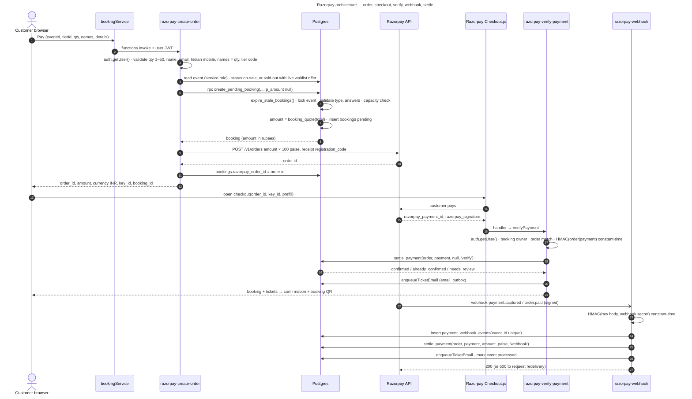
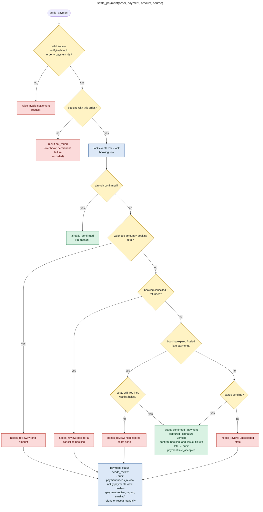

# 12 — Payment Architecture (Razorpay)

**Code: IMPLEMENTED.** **Production: PRODUCTION CONFIGURATION, NOT DONE.** Still to do: Razorpay keys and webhook secret as Edge Function secrets, the webhook URL configured in the Razorpay dashboard, and test-mode verification (`docs/OPERATIONS.md` §3, §3a).

## Components

| Component | File | Notes |
|---|---|---|
| Checkout UI | `src/pages/BookingPage.jsx` | Loads `https://checkout.razorpay.com/v1/checkout.js` on demand; retries with the same details reuse the same order (`orderRef` fingerprint) |
| Client service | `src/lib/bookingService.js` | `createPaymentOrder`, `verifyPayment`, `sendTicketEmail` (all `functions.invoke`) |
| Order creation | `supabase/functions/razorpay-create-order` | JWT check → validation → `create_pending_booking` (service role) → Razorpay Orders API |
| Checkout verification | `supabase/functions/razorpay-verify-payment` | JWT + ownership + HMAC → `settle_payment('verify')` |
| Webhook | `supabase/functions/razorpay-webhook` | HMAC on raw body → dedupe in `payment_webhook_events` → `settle_payment('webhook')` / failure / refund mirror |
| Pricing | `booking_quote()` (0026) | Ticket price × quantity + tax at `bookings.tax_percent` (default 18) |
| Seat hold | `create_pending_booking()` (latest 0027) | Event row lock; capacity = confirmed + pending + live waitlist holds |
| Settlement | `settle_payment()` (latest 0027) | The only place a paid booking is confirmed |
| Hold expiry | `expire_stale_bookings()` (0020) | Pending > `bookings.pending_timeout_minutes` (default 30) → `expired` |
| Crypto | `_shared/crypto.ts` | `hmacSha256Hex`, `timingSafeEqual`, `requireSecret` (≥ 8 chars, never `"undefined"`) |

## End-to-end architecture

`settle_payment` is the **final source of truth**, because the webhook runs whether or not the browser completes. Both paths converge on it, under row locks on the event and the booking.

## settle_payment decision tree

## Special cases (all supported by code)

| Case | What happens | Where |
|---|---|---|
| **Failed payment** | Checkout `payment.failed` → UI error. Webhook `payment.failed` → booking `failed` / `payment_status failed` **only while still pending** (never overwrites confirmed). Seats are released, and the `waitlist_on_booking_release` trigger offers them onwards | `BookingPage`, `razorpay-webhook` |
| **Payment succeeds, browser closes** | The webhook settles and queues the ticket email; the customer sees the booking in `/dashboard` | `razorpay-webhook` |
| **Duplicate webhook** | `payment_webhook_events.event_id` (`<event>:<payment id>`) is unique. A duplicate of a processed event → `200 ok (duplicate)`. A duplicate of a recorded-but-unfinished event is processed now | `razorpay-webhook` |
| **Invalid signature** | `400 Invalid signature`, nothing recorded | `razorpay-webhook`, `razorpay-verify-payment` |
| **Missing secret** | create-order: `503` and the hold is released (`status failed`). verify: `503`. webhook: `503` | functions |
| **Razorpay order API fails** | `502`; the booking is marked `failed` so the seats are freed | `razorpay-create-order` |
| **Late payment** (paid after the 30-min hold expired) | Accepted if seats are still free (audit `payment.late_accepted`), else `needs_review`. A second trigger `flag_late_payment` audits and alerts on any expired → confirmed change | `settle_payment`, `flag_late_payment` |
| **Wrong amount** | Webhook amount (paise) ≠ booking total → `needs_review` | `settle_payment` |
| **Refund** | **Issued manually in the Razorpay dashboard.** Webhook `refund.processed` / `refund.created` mirrors `refunded_amount` and `payment_status` `refunded` / `partially_refunded`. The admin records the refund (`admin_record_refund` with the Razorpay reference), which sets the booking `refunded` and cancels tickets | `razorpay-webhook`, 0017 |
| **Partial refund** | Mirrored as `payment_status = partially_refunded` (amount refunded < total) | `razorpay-webhook` |
| **Retry / redelivery** | A transient DB error returns `500` so Razorpay retries. A permanent failure is stored (`record_webhook_failure` → `processing_error` + `payment.webhook_failed` alert) and acknowledged with `200` | `razorpay-webhook` |
| **Idempotency** | settle (`already_confirmed`), ticket issuance (exists check), ticket email (dedupe key), webhook events (unique id) | — |
| **Hold expiry** | `expire_stale_bookings` (every 5 min via `run_platform_jobs`, and before every new checkout): pending, unpaid, older than 30 min → `expired`, customer notified (`booking_payment.expired`, in-app), audit `booking.expired`, seats → waitlist | 0020 |
| **payment.authorized** | Status mirror only (`payment_status authorized`) | `razorpay-webhook` |
| **Manual capture accounts** | **DOCUMENTED BUT NOT VERIFIED IN CODE.** The code never calls Razorpay's capture API; the runbook requires automatic capture | `docs/OPERATIONS.md` §3a |

## Payment status values

| Column | Values |
|---|---|
| `bookings.status` (enum `booking_status`) | `pending`, `confirmed`, `cancelled`, `refunded`, `expired`, `failed` |
| `bookings.payment_status` | `created`, `authorized`, `captured`, `failed`, `refunded`, `partially_refunded`, `not_required`, `needs_review` (constraint 0026) |
| `bookings.source` | `online` (checkout), `complimentary` (admin comp booking) |
