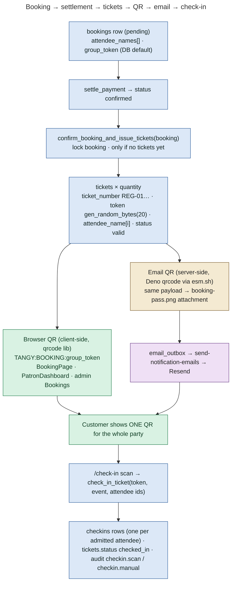
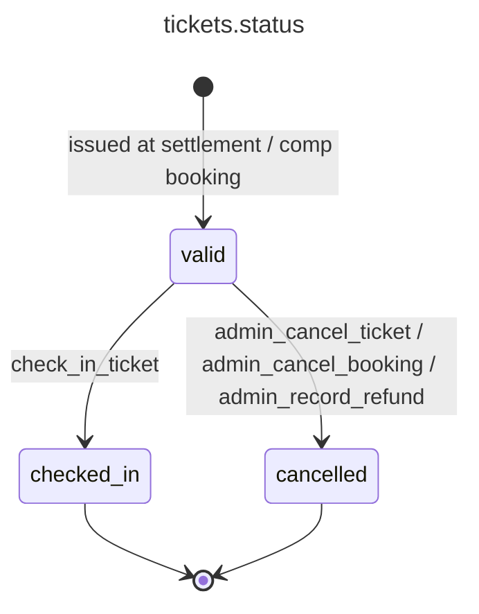

# 13 — Ticket Architecture

**Status: IMPLEMENTED** (0016 tickets, 0017 fixes, 0023 named attendees + group QR).

## Model

- A **booking** holds the buyer, the quantity and the named attendees (`attendee_names[]`, collected *before* payment). It also holds an opaque `group_token`: 20 random bytes, hex, default value set in 0023.
- **Tickets** exist only after settlement: one `tickets` row per attendee. Each has a `ticket_number` (`<registration_code>-01`, `-02`…), its own random 20-byte hex `token`, a tier, an `attendee_name` and `status` `valid` / `checked_in` / `cancelled`.
- **Attendance** is one `checkins` row per ticket (`unique(ticket_id)`). It records who checked the ticket in, when, how (`qr`/`manual`), notes, and a `batch_id` for group check-ins.

## Ticket pipeline

## Where QR codes are generated, and what is inside

| Payload | Generated where | Contains | Used for |
|---|---|---|---|
| `TANGY:BOOKING:<group_token>` | **Client-side** with `src/lib/qr.js` (`qrcode.toDataURL`) in `BookingPage` (after confirmation), `PatronDashboard`, admin `Bookings.jsx`; **server-side** in `_shared/ticketEmail.ts` (email attachment) | Only the opaque booking token: no ids, names or contact details | Group check-in: staff see the attendee list and tick who is present |
| `TANGY:TICKET:<token>` | Still accepted by `check_in_ticket` (issued per ticket since 0016) | Opaque ticket token | Single-attendee check-in (legacy-compatible) |
| Bare token typed by hand | — | Either token | Server resolves which kind it is |

No QR exists before payment is confirmed. `finalizeConfirmedBooking` only renders it from a server-confirmed booking.

## Where ticket data comes from

| Consumer | Source |
|---|---|
| Customer dashboard | `bookings` + embedded `tickets(*)` + `events(…)` (RLS: own rows) via `bookingService.getMyBookings` |
| Confirmation screen | `razorpay-verify-payment` response (`booking`, `tickets`) |
| Ticket email | `buildTicketEmail` reads `tickets`, `events`, `profiles.email` with the service role; the recipient is the **account email**, never the typed attendee email |
| Admin attendees list / CSV | view `attendee_tickets` (ticket + booking + event + check-in + payment status) |
| Scanner | `check_in_ticket` / `booking_attendees_state` responses |

## Ticket states

`admin_cancel_booking` refuses when any ticket on the booking is already `checked_in`.
