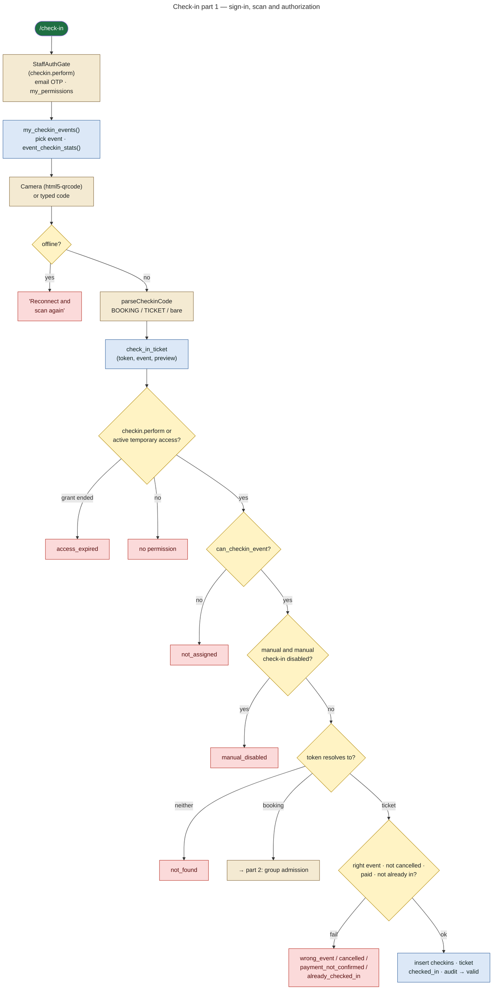
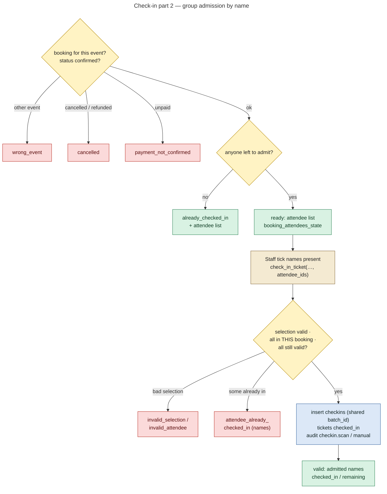

# 14 — Check-in Workflow

**Status: IMPLEMENTED.** `src/admin/TangyWorldCheckInPage.jsx` (route `/check-in`), `src/lib/checkinService.js`, RPC `check_in_ticket` (latest in 0023), `can_checkin_event` / `has_active_access` (0018). Verified locally by `e2e/groupcheckin.mjs`, `e2e/staff.mjs` (mobile QR via a fake camera, `e2e/make-cam.mjs`) and `supabase/tests/named_group_checkin.test.sql`.

## Who can check in

| Who | How the right is granted | Scope |
|---|---|---|
| Super Admin, Admin | `checkin.perform` + `events.view_all` | every event |
| Staff | `checkin.perform` + `is_assigned_to_event(event)` | assigned events only (otherwise `not_assigned`) |
| Volunteer | live `temporary_access` row (`has_active_access`), added to `my_permissions()` as `checkin.perform` | that event, for the granted window (30 min – 12 h) |
| Manual (typed code) | allowed unless setting `checkin.allow_manual` is false | — |

## Check-in flow

The browser never decides validity, counts or writes `checkins`. It only renders the `result` the RPC returns (comment at the top of `checkinService.js`).

## Concurrency

- `check_in_ticket` locks the ticket (`for update`), the booking (`for update`) and exactly the selected attendee tickets (`for update`).
- A forged or foreign attendee id is missing from the locked set, so the whole request is refused.
- `checkins` has `unique(ticket_id)`, so a double scan cannot create two rows.

## Group check-in

One QR per booking (0023):

1. Scanning shows every named attendee with their state.
2. Staff admit the people present now. Each admission is one atomic batch (`batch_id`).
3. Late arrivals are admitted later from the same QR (partial check-in).

`booking_checkin_history` returns the batches for the admin booking drawer.

## History and audit

- `get_checkin_history(event, mine, limit, offset)` feeds `/admin-portal/check-ins` (`checkin.history`).
- Every admission writes `audit_logs` with `via = role` or `via = temporary_access`.
- Expired volunteer grants are logged by `log_expired_access()` (platform job) as `access.expired`.
