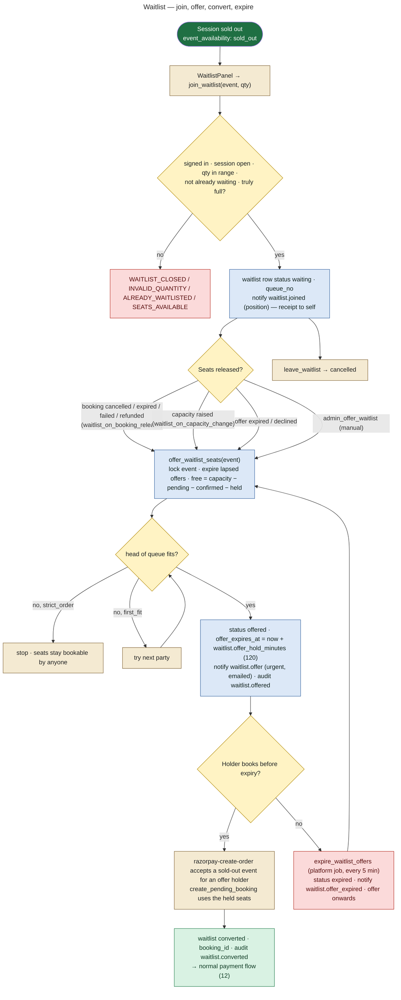
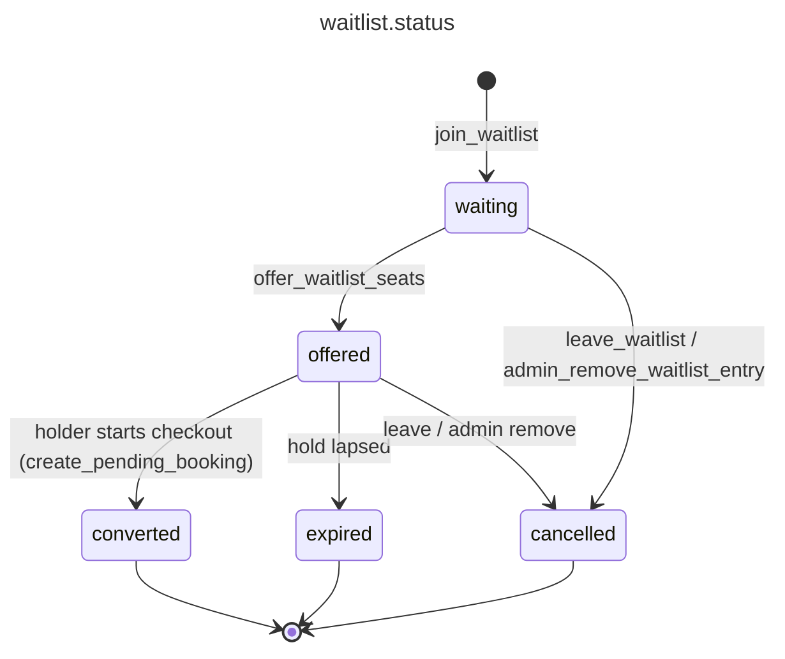

# 15 — Waitlist Workflow

**Status: IMPLEMENTED** (0027 server-authoritative waitlist, 0029 allocation policy). Frontend: `src/components/booking/WaitlistPanel.jsx` (session page), `WaitlistDirectory.jsx` (`/sessions/waitlist`), Patron dashboard waitlist tab, admin `WaitlistSection`. Tests: `supabase/tests/waitlist.test.sql`, `e2e/waitlist.mjs`, `scripts/test-concurrency.sh` (offer race).

## Rules (from the 0027 header)

- Join only when signed in, and only when the session is sold out. If seats are actually free, `join_waitlist` refuses with `SEATS_AVAILABLE` and tells the person to book directly.
- Order is by `queue_no`. Allocation setting `waitlist.allocation`:
  - `strict_order` (default): never skip the head of the queue
  - `first_fit`: offer to the earliest party that fits
- Seats held by live offers count against capacity **everywhere**: `create_pending_booking`, `event_availability`, `settle_payment`. A released seat can only be claimed by the person it was offered to.
- Every offer decision runs under the **event row lock**, the same lock checkout takes, so two people can never be offered the same seat.
- Legacy anonymous rows (no account) are listed for the team but never auto-offered.

## Workflow

## States

## Scheduler behaviour

`run_platform_jobs()` (pg_cron, every 5 minutes) calls `expire_waitlist_offers()`. It expires lapsed offers (`for update skip locked`), notifies the holders, then calls `offer_waitlist_seats()` for every event that still has waiting parties. `offer_waitlist_seats()` also expires lapsed offers for its own event at the start of each pass, so seats flow on even between scheduler runs whenever a booking changes.

## Who sees what

| | Customer | Admin |
|---|---|---|
| Position | `my_waitlist()` (position, offer expiry) on the session page and dashboard | `/admin-portal/waitlist`: queue per event, offer / remove (audited) |
| Notifications | `waitlist.joined`, `waitlist.offer`, `waitlist.offer_expired` (critical in-app + emailed). Conversion is recorded as audit `waitlist.converted` only (no notification is sent for it) | — |
| RLS | `waitlist: self read own` (user_id) and `self read own by verified email` (JWT email, 0035) | `bookings.view_all` / `is_admin()` read |
