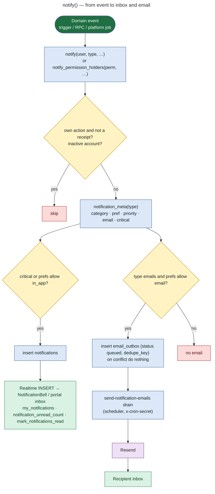

# 16 — Notification Architecture

**Status: IMPLEMENTED** in the database (0018 notifications, 0020 preferences + email outbox, 0021 canonical links, 0025 receipts, 0034 workflow types). In-app delivery uses Supabase Realtime (`notifications` is in the `supabase_realtime` publication). Email delivery needs the email drain and Resend (**PRODUCTION CONFIGURATION**).

## The single entry point: `notify()`

`notify(user, type, title, body, link, event, priority)` (latest in 0025) does the following:

1. Skips notifying a person about their **own** action, except the receipts `application.received` and `waitlist.joined`.
2. Skips inactive accounts.
3. Looks up `notification_meta(type)`, giving `category`, `pref` key, `priority`, `email` flag and `critical` flag (0034 catalogue, 54 types).
4. **In-app:** inserts into `notifications` if the type is `critical` **or** the user's preferences allow `in_app` for that pref key.
5. **Email:** inserts into `email_outbox` if the type's `email` flag is true **and** preferences allow `email` (critical does *not* override an email opt-out). Message text is never emailed (`message.new` gets a generic body). The dedupe key is one email per thread per 15 min for chat, otherwise one per identical notice per hour, with `on conflict (dedupe_key) do nothing`.
6. Links are rewritten to the current console paths (`canonical_console_link`, `/admin/…` → `/admin-portal/…`).

`notify_permission_holders(permission, …)` fans out to every active account whose role has that permission.

## Preferences

- `notification_preferences (user_id, email_enabled, prefs jsonb)`.
- `prefs` per key: `booking_requests`, `schedule_changes`, `event_updates`, `event_reminders`, `requirement_requests`, `requirement_reviews`, `messages`, `announcements`, `document_updates`, `payment_updates`, `tasks`, `access`, `applications`. Each has `in_app` and `email` booleans; the default is allowed.
- UI: `src/portal/NotificationPreferences.jsx` (portals, artist settings, admin notification settings) → `my_notification_preferences()`, `set_notification_preference()`.
- `email_enabled = false` turns off all email for that user.

## Notification triggers (where `notify` is called)

| Source (function / trigger) | Type(s) | Recipient |
|---|---|---|
| `notify_on_application` (applications inserted) | `application.new` | `applications.review` holders |
| `notify_on_application_decision` | `application.approved` / `application.rejected` | applicant |
| `notify_on_enquiry_received` (0025) | `application.received` (receipt) + `enquiry.new` | submitter + `applications.review` holders |
| `submit_artist_application` / `review_artist_application` | `application.submitted`, `.under_review`, `.info_requested`, `.resubmitted` | applicant / reviewers |
| `approve_artist_application` | `application.approved` | artist |
| `notify_on_booking_request` (0034) | `booking.requested`, `.confirmed`, `.cancelled` → artist; `.accepted` / `.declined` / `.expired` → requester | artist / admin |
| `notify_lineup_artist`, `notify_on_event_publish` | `assignment.new` ("You're on the line-up", only once published) | artist |
| `notify_on_event_artist_removed` | `assignment.removed` | artist |
| `notify_on_artist_schedule`, `notify_on_assignment_schedule` | `schedule.changed` | artist / assignee |
| `notify_on_event_change` (0034) | `event.date_changed` / `.time_changed` / `.venue_changed` / `.cancelled` / `.updated` | line-up artists + event members |
| `notify_on_assignment` | `assignment.new` | assignee (vendor, crew, volunteer, staff…) |
| `notify_on_task`, `notify_overdue_tasks` (job) | `task.assigned`, `task.overdue` | assignee; `team.manage` holders |
| `notify_on_requirement` | `requirement.requested` / `.submitted` / `.reviewed` | partner / `events.manage` holders / partner |
| `notify_on_document` | `document.added` | audience of the document |
| `notify_on_media_review` | `media.submitted` / `media.reviewed` | `entities.manage` / artist |
| `notify_on_sponsor_asset` | `asset.submitted` / `asset.reviewed` | `entities.manage` / sponsor |
| `notify_on_invoice` | `invoice.issued` / `invoice.paid` | partner |
| `notify_on_announcement` | `announcement.published` | members targeted by the announcement |
| `on_message_created` | `message.new` | other participants / `messages.manage` holders (support threads) |
| `request_checkin_access`, `grant_temporary_access`, `revoke_temporary_access`, `decline_access_request`, `notify_expiring_access` (job) | `access.requested`, `.granted`, `.revoked`, `.declined`, `.expiring` | admins / volunteer |
| `join_waitlist`, `offer_waitlist_seats`, `expire_waitlist_offers` | `waitlist.joined`, `.offer`, `.offer_expired` | customer |
| `expire_stale_bookings` (job) | `booking_payment.expired` | customer |
| `settle_payment`, `flag_late_payment`, `record_webhook_failure` | `payment.review`, `payment.late`, `payment.webhook_failed` | `payments.view` holders |
| `send_event_reminders` (job) | `event.reminder` | event members (not ticket buyers) |
| `send_availability_reminders` (job) | `availability.reminder` | artists with stale calendars |
| `admin_set_user_role` | `role.changed` | the user |
| `send_custom_notification` (Super Admin) | `admin.message` | one chosen user |

## Where users see notifications

| Surface | Component | Data |
|---|---|---|
| Admin header bell | `src/portal/NotificationBell.jsx` in `AdminShell` | `notification_unread_count`, `my_notifications`, Realtime inserts |
| Admin notifications page | `/admin-portal/notifications[/settings]` | same + preferences |
| Partner portals | `PartnerPortal` notifications tab | `my_notifications`, `mark_notifications_read` |
| Artist portal | `/artist/notifications` | same |
| Email | Resend via the outbox | see [17-email-architecture.md](17-email-architecture.md) |
| Admin delivery log | `/admin-portal/ops/notifications` (`NotificationsSection`) | `email_outbox` (status, attempts, last_error), `application_notifications` |
