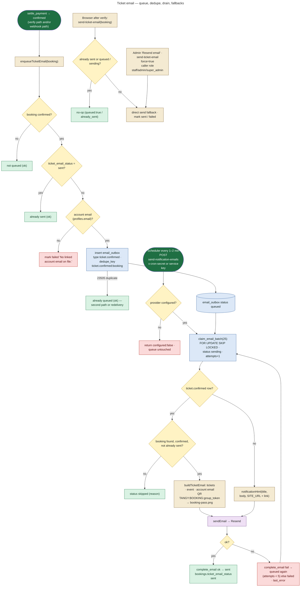
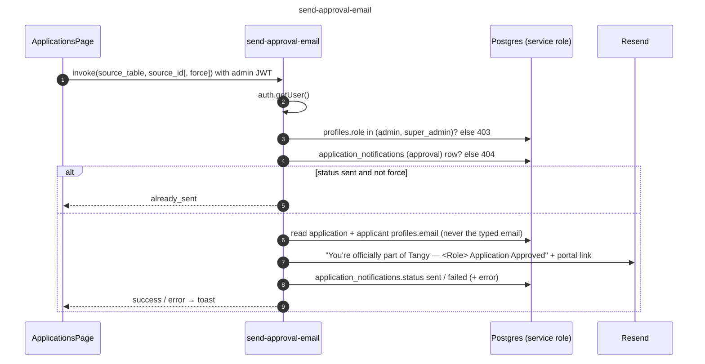

# 17 — Email Architecture

All email leaves through **one module**: `supabase/functions/_shared/email.ts`. It is the only place email secrets are read. Provider is chosen by `EMAIL_PROVIDER`:

| Provider | Behaviour | Environment |
|---|---|---|
| `resend` (default) | `POST https://api.resend.com/emails` with `RESEND_API_KEY`; supports attachments | **production** (needs the key and a verified domain: **PRODUCTION CONFIGURATION, not done**, `docs/OPERATIONS.md` §2) |
| `mailpit` | `POST $MAILPIT_URL/api/v1/send` | **LOCAL ONLY** |
| `log` | Logs recipient + subject only, reports "sent" | development |
| `disabled` / missing key | `notConfigured`: **nothing is sent and nothing is marked failed**; queued emails wait | — |

## The four email paths

| Email | Trigger | Sender | Idempotency |
|---|---|---|---|
| **Ticket confirmation** (with `booking-pass.png` QR) | `settle_payment` confirmed a booking → `enqueueTicketEmail` in `razorpay-verify-payment` **and** `razorpay-webhook` | `email_outbox` row of type `ticket.confirmed` → `send-notification-emails` drain → `sendTicketRow` | unique `dedupe_key = ticket.confirmed:<booking id>`; `bookings.ticket_email_status` (`pending`/`sent`/`failed`) |
| **Notification emails** (54-type catalogue, those with `email = true`) | `notify()` | `email_outbox` → `send-notification-emails` → `notificationHtml` | `dedupe_key` per user + type + link + title hour (15-min bucket for chat) |
| **Application approved** (branded) | Admin approves on the generic Applications screen | browser → `send-approval-email` directly (not queued) | `application_notifications (source_table, source_id, 'approval')` unique row; `status` sent/failed; `force` to resend |
| **Console invitation** | Users & Roles → invite | browser → `admin-invite-user` directly (not queued) | Invitation row; `email_status` sent / failed / not_configured; link returned once if email fails |

## Ticket email: the actual implementation

Since commit `cbd1151` (*"ticket email is queued server-side on settlement, not sent by the browser"*), the ticket email no longer depends on the customer's browser.

### Cases

| Case | Behaviour |
|---|---|
| Browser closed right after paying | Webhook path queues the email; drain sends it |
| Both verify and webhook ran | Same `dedupe_key`: one row, one email |
| Provider not configured | Drain returns `{configured:false}`; rows stay `queued` (not failed) and go out once configured |
| Provider error | Retried by later drain runs, up to 5 attempts, then `failed` with `last_error` (visible in Admin → Email delivery) |
| Stuck `sending` row | Reclaimed after 10 minutes (`claim_email_batch`) |
| Already emailed (admin resend or fallback first) | Drain marks the queued row `skipped` ("Ticket email already sent.") |
| Admin resend | `send-ticket-email` with `force:true` always sends; only `bookings.ticket_email_*` changes, never payment or tickets |
| No account email | `ticket_email_status = failed` with the reason; nothing queued |

## Notification email drain

`send-notification-emails` (`--no-verify-jwt`):

1. Accepts only `Authorization: Bearer <service role key>` or `x-cron-secret: <CRON_SECRET>`. It never accepts an end-user JWT.
2. Claims up to 25 rows.
3. Renders each one: ticket rows through `sendTicketRow`, everything else through `notificationHtml`. The action label comes from `ACTION_LABEL[type]` and the link is `SITE_URL + link`.
4. Calls `complete_email` for each row.

Response: `{claimed, sent, failed, skipped}`.

**Scheduling the drain is PRODUCTION CONFIGURATION.** No migration schedules it. `docs/OPERATIONS.md` §2a Step 5 asks the operator to create a Supabase Cron / external HTTP job every 1–2 minutes. Locally: `scripts/run-jobs.sh emails`.

## Approval email

## What never goes into an email

- message text: `message.new` gets *"You have a new message on Tangy…"*
- payment details or booking answers (`docs/OPERATIONS.md` §2)
- user-typed attendee emails: the recipient is always the **account** email from `profiles`
