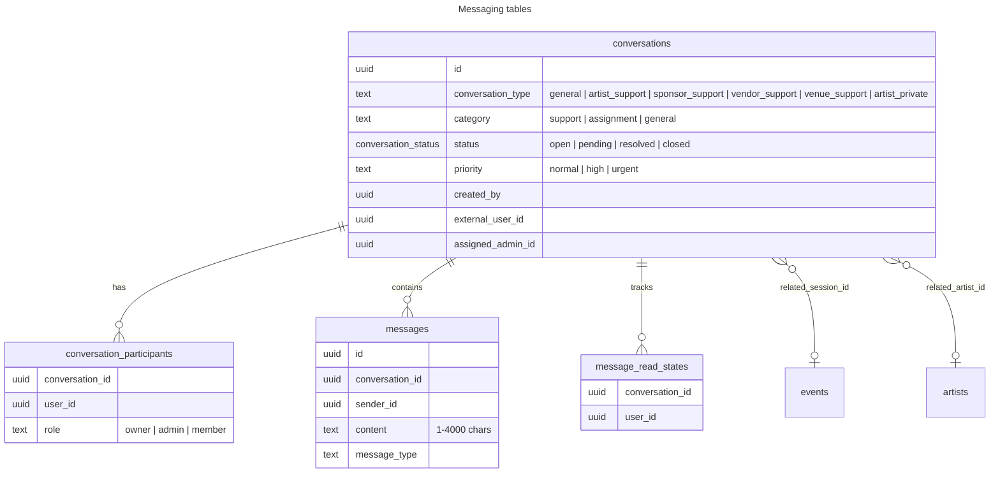
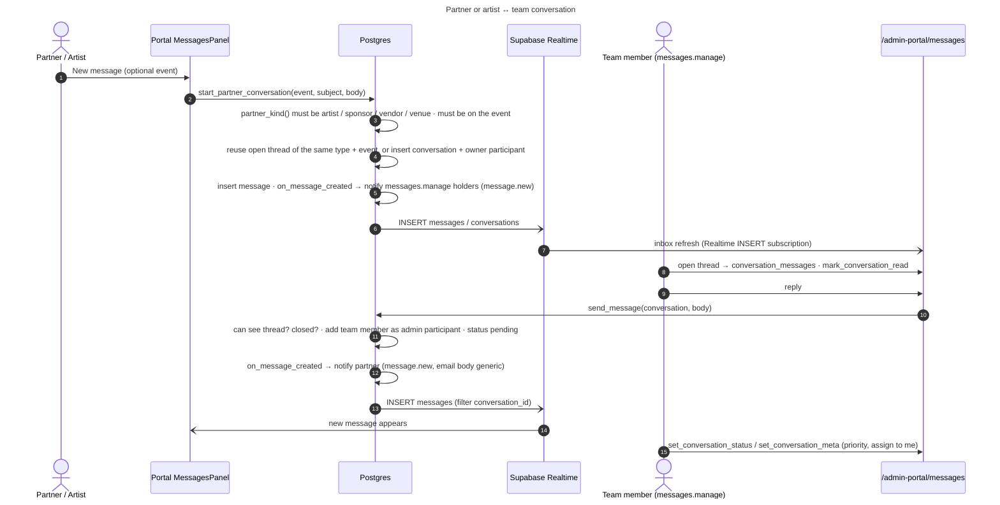
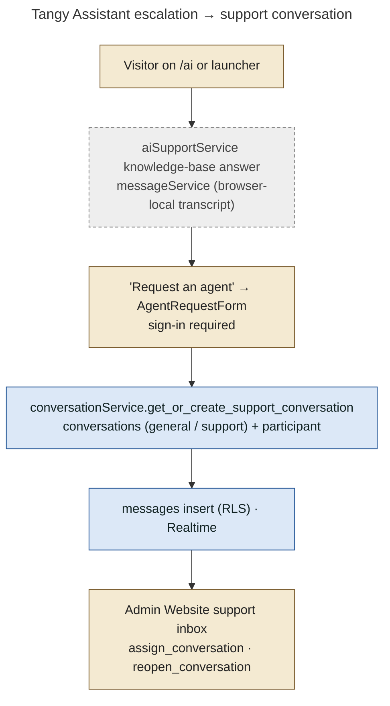

# 18 — Messaging Architecture

**Status: IMPLEMENTED** (0008 base, 0018 partner threads, 0020 priority/meta, 0034 private artist threads and RLS tightening). Tests: `supabase/tests/messaging_security.test.sql`, `e2e/portals.mjs`, `e2e/platform.mjs`.

The repository states plainly: messaging is **not end-to-end encrypted**. Protection is HTTPS, authentication, authorization and RLS (0034 header; the artist messages page says so too).

## Data model

## Conversation types and who can read or write

| Type | Started by | Participants | Who else can read | Notes |
|---|---|---|---|---|
| `general` (category `support`) | Any signed-in user, via **Tangy Assistant → "Request an agent"** (`get_or_create_support_conversation`, 0008) | creator (+ assigned admin) | admin-level (`is_staff_or_admin()` = admin / super_admin) through RLS | Admin "Website support inbox" (`/admin-portal/ops/inbox`, `InboxSection`, `chatService`) |
| `artist_support`, `sponsor_support`, `vendor_support`, `venue_support` | Partner from their portal (`start_partner_conversation`, optionally tied to an event they are part of) or admin (`admin_start_partner_conversation`) | partner owner + admins who reply (auto-added as `admin` participant by `send_message`) | `messages.manage` holders | Admin Messages page (`MessagesPanel`, `admin_conversations`) |
| `artist_private` | **Super Admin only** (`start_private_artist_conversation`, 0034) | that Super Admin + the artist | **nobody else**: not other admins, staff or partners | Excluded from staff/admin read in every policy and function |
| category `assignment` | legacy 0008 assignment requests | — | — | **LEGACY** |

## RLS (final state, 0034)

| Table | Policy | Rule |
|---|---|---|
| conversations | participant or staff read | `is_participant(id) or (is_staff_or_admin() and conversation_type <> 'artist_private')` |
| conversations | creator or staff insert | creator may insert only `general` with no `external_user_id`; admins any non-private type |
| conversations | staff/admin update | admin-level, and for private threads only a participant |
| messages | participant or staff read | `is_participant(conversation_id) or (is_staff_or_admin() and not is_private_conversation(...))` |
| messages | participant or staff insert | `sender_id = auth.uid()` and same visibility rule |
| conversation_participants | — | populated only inside RPCs (0008 comment); `guard_conversation_admin_participant` (0035): only the team joins as `admin` |

## Partner ↔ team flow

## Customer ↔ team (website support)

## Private Super Admin ↔ artist

`start_private_artist_conversation(artist_user, subject, body)`:

- Super Admin only, and only for an artist with a portal account.
- Reuses the open private thread if there is one.
- Both participants are added. The thread is invisible to every other console user (RLS, `is_private_conversation`, `can_manage_conversation` excludes it).

The entry point is the admin `ArtistDetailPage`.

## Notifications and email

`on_message_created` (latest 0034) notifies the other participants, or `messages.manage` holders for partner and support threads, with `message.new`. Notification links go straight to the conversation. Email copies are throttled to one per thread per 15 minutes and never contain the message text.
