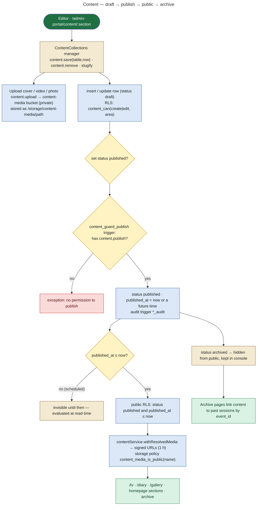
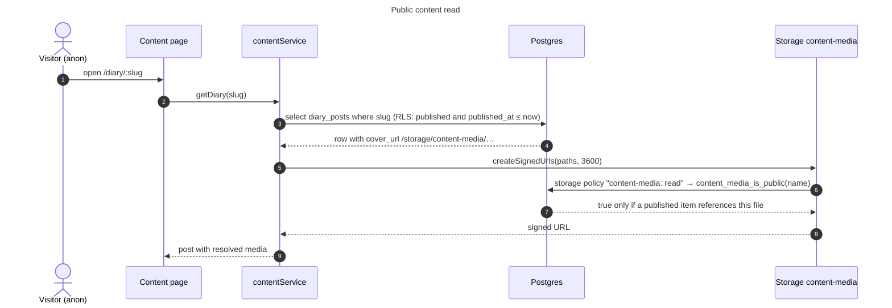

# 19 — Content / CMS Architecture

**Status: IMPLEMENTED.**

| Migration | What it added |
|---|---|
| 0028 | CMS tables + permissions |
| 0029 | private `content-media` + signed URLs |
| 0031 | programmes + session history |
| 0017 / 0018 / 0020 | announcements |

Before 0028, Tangy TV lived in each admin's `localStorage` and the diary, gallery and artists were hard-coded in `src/data/mockData.js` (0028 header).

## Content types

| Type | Table(s) | Statuses | Admin UI | Public UI | Permission |
|---|---|---|---|---|---|
| Tangy TV | `tv_videos` | draft / published / archived (+ `published_at`) | Content → Tangy TV (`TvManager`) | `/tv`, `/tv/:slug`, homepage TV | content.* + content.manage_tv |
| Diary | `diary_posts` | draft / published / archived | Content → Diary (`DiaryManager`) | `/diary`, `/diary/:slug`, Tangy Diary section | content.* + content.manage_diary |
| Gallery | `gallery_albums`, `gallery_photos` | album: draft / published / archived | Content → Gallery (`GalleryManager`) | `/gallery`, `/gallery/:album`, `/gallery/archive` | content.* + content.manage_media |
| Programmes (seasons) | `programmes`, `programme_events` | draft / published / archived | Content → Sessions area (`ProgrammesManager`) | `/archive/programmes[/:slug]` | content.manage_sessions |
| Session copy | `events` (description, story, image_url, tags, featured) | follows event status | Content → Sessions (`update_session_content`) | session pages, archive | content.manage_sessions + content.edit |
| Artist pages | `artists` (public profile fields, slug `artists_assign_slug`) → view `public_artists` | artist `approved` | Content → Artists / People | `/artists`, `/artists/:slug`, `/artist` directory | entities.manage / artist self |
| Media library | storage `content-media` | private; public only if referenced by published content | Content → Media library (`MediaLibrary`) | via signed URLs | content.* + content.manage_media |
| Announcements | `announcements` | draft / scheduled / published / expired / archived; `audience` all / guest / patron / artist / staff; `character`; `publish_at`; `target_team` | Content → Announcements (`Announcements.jsx`, content.manage) | Character pop-up (`AnnouncementCharacterOverlay` via `announcementService`); staff `/admin-portal/announcements`; portal announcements (`portal_announcements`) | content.manage |

## Publishing workflow

**Review step:** there is **no separate review status** for TV, diary, gallery or programmes. "Review" means a holder of `content.view` sees drafts in the console, and publishing needs `content.publish`. Announcements have a `scheduled` status. Artist media and sponsor assets **do** have a review queue (see [20](20-storage-architecture.md) and [06](06-admin-architecture.md) Reviews).

## Scheduled publishing

No job is needed. Visibility is `status = 'published' and published_at <= now()`, evaluated at read time (`docs/OPERATIONS.md` §1).

## Public read path

## Archive

`src/lib/archiveService.js` builds the archive from past `events` (date < today) joined with:

- `event_artists` + `public_artists`
- `gallery_albums`, `diary_posts` and `tv_videos` linked by `event_id`
- `programmes` / `programme_events`

Pages: `/sessions/archive`, `/sessions/archive/:slug`, `/archive/programmes[/:slug]`, plus the static museum pages (`/archive/museum-timeline`, `/archive/past-memories`, `/archive/contact-sheets`).
