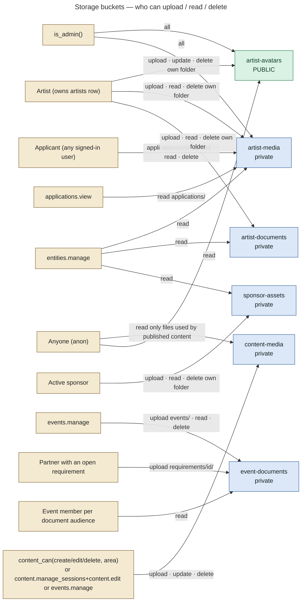
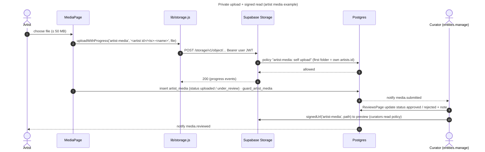

# 20 — Storage Architecture

Six Supabase Storage buckets, all created by migrations. No environment variables are needed (`.env.example`). Client helpers are in `src/lib/storage.js`:

- `uploadWithProgress()` posts to the Storage REST API with the **user's own JWT**, so bucket policies decide.
- `signedUrl()` creates short-lived signed URLs (default 10 min).
- Client size cap: 25 MB by default; artist uploads use 50 MB.

## Buckets at a glance

| Bucket | Public? | Size / types (bucket limits) | Path convention | Created / last changed |
|---|---|---|---|---|
| `artist-avatars` | **public** | 5 MB · jpeg/png/webp/gif/avif | `<artist id>/…` | 0013, 0022, 0029 |
| `artist-media` | private | 50 MB · audio/*, mp4/webm/quicktime, images, pdf | `<artist id>/…` and `applications/<user id>/…` | 0013, 0020, 0022, 0029, 0033 |
| `artist-documents` | private | 25 MB · pdf, jpeg/png/webp, docx | `<artist id>/…` | 0033, 0036 |
| `event-documents` | private | 25 MB · pdf, images, txt/csv, Office docs, zip | `events/…` (team) and `requirements/<requirement id>/…` (partners) | 0020, 0029 |
| `sponsor-assets` | private | 25 MB · images incl. svg, pdf, postscript/illustrator, zip, octet-stream | `<sponsor user id>/…` | 0020, 0029 |
| `content-media` | private since 0029 (was public in 0028) | 50 MB · jpeg/png/webp/gif/avif, mp4/webm | free paths; stored in rows as `/storage/content-media/<path>` | 0028, 0029 |

## Per-bucket access (final policies)

| Bucket | Upload | Read | Delete | Approval dependency | DB relationship |
|---|---|---|---|---|---|
| artist-avatars | the artist whose `artists.id` is the first folder | public; owner via policy (for upsert) | owner; `is_admin()` | none | `artists.avatar_url` |
| artist-media | owner artist (first folder = own `artists.id`); applicant under `applications/<own uid>/` | owner, `is_admin()`, `entities.manage` (curators), `applications.view` (application uploads) | owner / applicant; admin | `artist_media.status` uploaded → under_review → approved / rejected (curators only, `guard_artist_media`) | `artist_media.storage_path`, `artist_applications.video_storage_path` |
| artist-documents | owner artist | owner, `entities.manage` | owner | none | `artist_documents.storage_path` (kind rider / epk / tax / payment / identity / other) |
| event-documents | `events/…` needs `events.manage`; `requirements/<id>/…` needs the requirement's own user while status is `requested` / `changes_requested` (`can_write_event_file`) | `events.manage`, or a non-expired `event_documents` row whose audience matches the caller (`user`, `members`, or a member kind), or the requirement owner (`can_read_event_file`) | `events.manage` | requirement review (`review_requirement`) | `event_documents`, `event_requirements` |
| sponsor-assets | active `sponsor` into `<own uid>/` | owner, `entities.manage` | owner, `entities.manage` | `sponsor_assets.status` submitted → approved / changes_requested (Reviews page) | `sponsor_assets` |
| content-media | content editors by area | editors; **anon only if `content_media_is_public(name)`**: the file is referenced by published TV / diary / gallery / non-draft event | editors (`content_can('delete', …)`) | publish rights (`content.publish`) | `tv_videos`, `diary_posts`, `gallery_albums`, `gallery_photos`, `events.image_url` |

## Upload flows

| Flow | Page | Bucket / path | Notes |
|---|---|---|---|
| Artist media | `src/artist/pages/MediaPage.jsx` | `artist-media/<artist id>/…` | review by curators |
| Artist documents | `src/artist/portal/pages/InboxPages.jsx` (Documents) | `artist-documents/<artist id>/…` | 0036 fixed the ownership check |
| Artist application video | `src/artist/portal/pages/ApplyPage.jsx` | `artist-media/applications/<user id>/…` | reviewers preview with a 15-min signed URL |
| Avatar | `src/artist/pages/ProfilePage.jsx` | `artist-avatars` (public URL) | |
| Sponsor assets | `src/portal/PartnerExtras.jsx` | `sponsor-assets/<uid>/…` | review on the Reviews page |
| Event documents (team) | `src/admin/components/EventOps.jsx` | `event-documents/events/…` | audience-scoped reads |
| Requirement responses (partners) | `src/portal/PortalSections.jsx` | `event-documents/requirements/<id>/…` | only while the requirement is open |
| CMS media | `src/admin/components/MediaLibrary.jsx`, `contentService.upload` | `content-media/…` | 1-hour signed URLs for visitors |

**Documentation drift:** `.env.example` still describes `content-media` as public. Migration 0029 made it private, and `docs/OPERATIONS.md` §5 and `src/lib/storage.js` reflect that.
