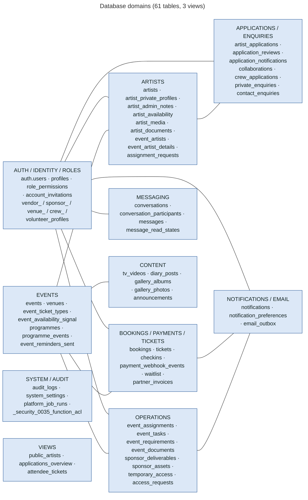
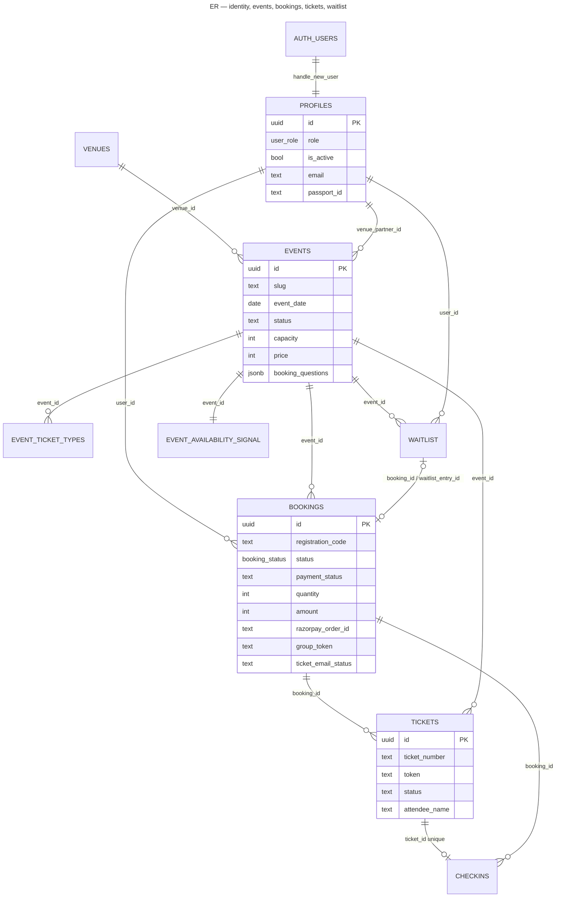
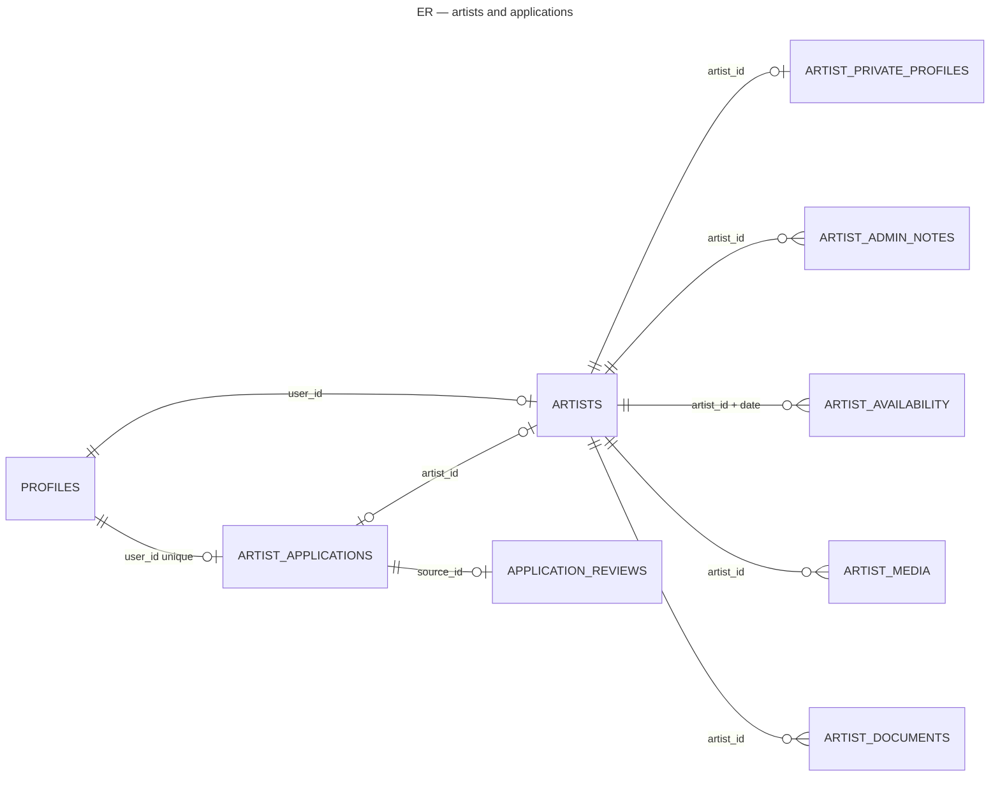
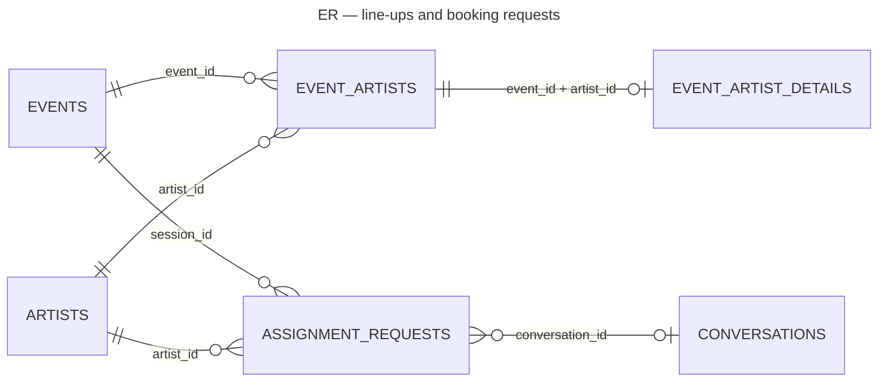
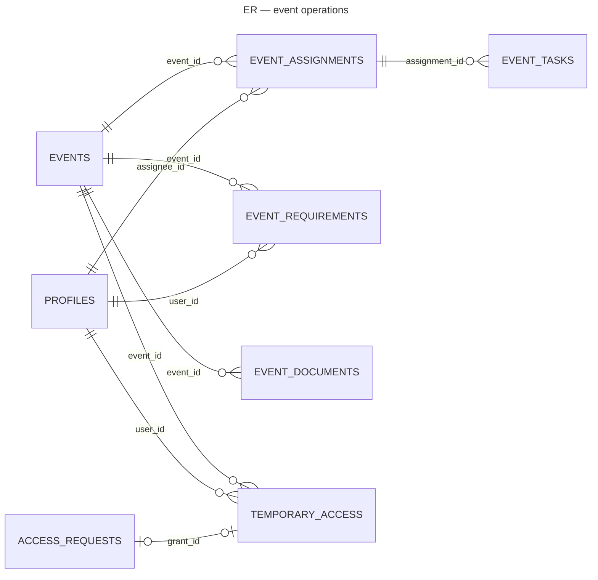
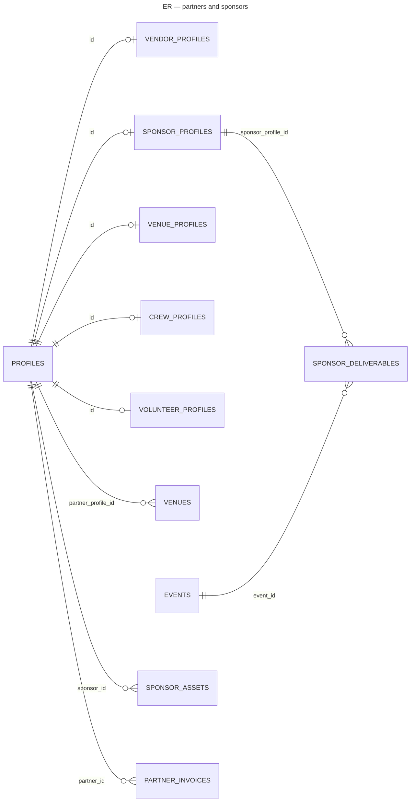

# 21 — Database Architecture

Supabase Postgres, schema `public`, built by 36 ordered migrations (`supabase/migrations/0001`–`0036`). Extensions:

- `pgcrypto`: `gen_random_bytes`, `digest`
- `pg_cron`: when available
- Realtime publication `supabase_realtime`, containing `conversations`, `messages`, `notifications` and `event_availability_signal`

## Domain map

## Core relationships

### Identity, events and bookings

### Artists and line-ups

### Operations and partners

## Table catalogue (important tables)

| Table | Purpose | Who reads (RLS) | Who writes | Important triggers / functions |
|---|---|---|---|---|
| `profiles` | Account, role, active flag, passport | self; `is_admin()` | self (non-identity fields); RPCs | `handle_new_user`, `prevent_role_self_escalation`, `guard_profile_identity`, `sync_profile_email` |
| `role_permissions` | Role → permission matrix | console roles | migrations; `set_role_permission` (Super Admin) | `has_permission`, `my_permissions` |
| `events` | Sessions | public if status ≠ draft; assigned staff; event members; admin | admin (`is_admin()`), `update_session_content` | `events_audit`, `events_notify_change`, `events_notify_publish`, `events_prevent_delete_with_bookings`, `events_seed_ticket_type`, `events_capacity_to_waitlist`, `events_availability_signal`, `events_validate_timezone` |
| `event_ticket_types` | Per-event prices / capacities | public (active, non-draft event); events.manage | events.manage | `sync_event_from_price`, availability signal |
| `bookings` | Seat hold / purchase | self; bookings.view_all | **no client insert**; `create_pending_booking` (service role), admin RPCs, Edge Functions | `bookings_release_to_waitlist`, `bookings_flag_late_payment`, `bookings_system_audit`, `bookings_availability_signal`, `bookings_touch_payment` |
| `tickets` | One per attendee | self; bookings.view_all | `confirm_booking_and_issue_tickets` only | — |
| `checkins` | Attendance | self (own booking); bookings.view_all | `check_in_ticket` only | unique(ticket_id) |
| `waitlist` | Queue + offers | self (user_id / verified JWT email); bookings.view_all; admin | `join_waitlist`, `leave_waitlist`, offer functions | `waitlist_availability_signal` |
| `payment_webhook_events` | Razorpay event log | `is_admin()` | `razorpay-webhook` (service role) | unique `event_id` |
| `artists` | Artist profile / application record | public if approved (view `public_artists`); self; entities.manage / events.view_all | self (profile), `submit_artist_application`, approvals | `prevent_artist_status_self_escalation`, `artists_slug`, `artists_sync_application`, `artists_guard_duplicate` |
| `artist_applications` | 8-step application | self; applications.view | self while draft / needs_information; RPCs | `guard_artist_application` |
| `artist_availability` | Artist calendar | self; events.manage / entities.manage | self; `set_artist_availability` | `guard_artist_availability` |
| `assignment_requests` | Booking requests to artists | artist (non-draft); admin | RPCs | `assignment_requests_notify`, `guard_assignment_request_artist` |
| `event_artists` / `event_artist_details` | Line-up / set details | public line-up via views; members; team | `save_event_lineup`, `update_event_artist`, `respond_to_booking_request`, `manage_artist_request` | notify + audit triggers |
| `collaborations` / `crew_applications` | Partner / crew / volunteer applications | self; admin | self insert (signed in); approvals | duplicate and start guards, receipt and decision notifications, private-notes move |
| `event_assignments`, `event_tasks`, `event_requirements`, `event_documents` | Event operations | assignee / members / team | team; partners respond / submit | validation + notify + audit triggers |
| `temporary_access`, `access_requests` | Volunteer check-in grants | own; volunteers.manage | RPCs | `guard_temporary_access` |
| `notifications` | In-app inbox | own | `notify()` only | Realtime |
| `email_outbox` | Email queue | settings.manage | `notify()`, `enqueueTicketEmail` (service role) | `claim_email_batch`, `complete_email` |
| `conversations`, `messages`, … | Messaging | participants; admin-level except private | RPCs / RLS inserts | `on_message_created`, `guard_conversation_admin_participant` |
| content tables | CMS | public when published and due | content editors | `content_guard_publish`, audit triggers |
| `audit_logs` | Who did what | audit.view | `audit_write()`, `audit_row_change` triggers, system inserts | `audit_logs_append_only` (blocks update / delete) |
| `system_settings` | Runtime settings | console (exposed keys via `get_runtime_settings`) | `update_system_setting` (settings.manage) | audited |
| `platform_job_runs` | Scheduled job log | operations.manage | `run_platform_jobs` | advisory lock |

## Views

| View | Purpose |
|---|---|
| `public_artists` (0020) | Safe public subset of approved artists |
| `applications_overview` (0017/0033) | Union of artist / collaboration / crew applications for the admin list. Review notes come from `application_reviews` (null for applicants) |
| `attendee_tickets` (0016/0024) | Ticket + booking + event + check-in + payment status for attendee lists and CSV |

## Key settings (`system_settings`, seeded by migrations)

| Key | Default | Used by |
|---|---|---|
| `bookings.pending_timeout_minutes` | 30 | `expire_stale_bookings` |
| `bookings.tax_percent` | 18 | `booking_quote` |
| `waitlist.offer_hold_minutes` | 120 | `offer_waitlist_seats` |
| `waitlist.allocation` | strict_order | `offer_waitlist_seats` |
| `notifications.event_reminder_hours` | 24 | `send_event_reminders` |
| `notifications.send_approval_emails` | true | `ApplicationsPage` |
| `auth.admin_idle_timeout_minutes` | 60 | `AdminShell` |
| `checkin.allow_manual` | (true if unset) | `check_in_ticket` |
| `artists.availability_stale_days` | 30 | `send_availability_reminders` |
| `artists.request_default_days` | 7 (fallback) | `create_artist_request` |
