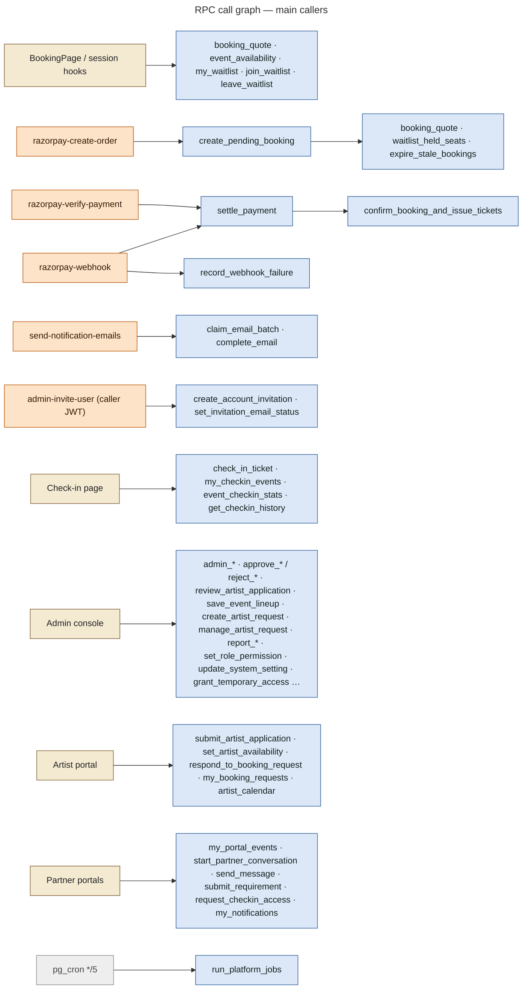

# 22 — Database Function / RPC Map

About 228 SQL functions exist. This map covers the ones **called by the frontend or the Edge Functions**, plus the internal functions those depend on. Every listed RPC is `SECURITY DEFINER` with `set search_path = public` and checks the caller itself, unless noted.

**Grant model:**

- **Service-role only** (`revoke … from public, anon, authenticated; grant … to service_role`): `create_pending_booking`, `confirm_booking_and_issue_tickets`, `settle_payment`, `expire_stale_bookings`, `record_webhook_failure`, `claim_email_batch`, `run_platform_jobs`, and `audit_write` / `notify` / `notify_permission_holders` for direct calls.
- **Callable by anonymous visitors:** `booking_quote`, `event_availability`, `invitation_preview`, `content_media_is_public`.
- Migration 0035 revoked `EXECUTE` from anon/authenticated on every remaining definer function that does not check its caller.

## AUTH / RBAC

| RPC | Caller | Validation | Tables | Returns | Security |
|---|---|---|---|---|---|
| `my_permissions()` | `AdminSession` | — | role_permissions, temporary_access | text[] (role perms + `checkin.perform` while a grant is live) | inactive → no role |
| `get_runtime_settings()` | `AdminSession` | — | system_settings (exposed) | jsonb | console |
| `log_auth_event(action)` | `AdminGate` / `AdminShell` | de-duplicated, console accounts only | audit_logs | void | — |
| `admin_set_user_role(user, role, reason)` | `UsersPage` | roles.manage · not self · Super Admin rules · last Super Admin | profiles, audit_logs | void | notify `role.changed` |
| `admin_set_user_active(user, active, reason)` | `UsersPage` | roles.manage (via trigger) · not self | profiles | void | audited |
| `set_role_permission(role, perm, on)` | `RolesPage` | roles.manage · only admin/staff · not roles.manage | role_permissions | void | audited |
| `create_account_invitation(...)` | `admin-invite-user` (as inviter) | `can_invite_role` · email · rank · hash format | account_invitations | invitation row | audited |
| `invitation_preview(token)` / `accept_account_invitation(token)` | `InvitationPage` | hash match · pending · expiry · email = auth email · active · rank | account_invitations, profiles | preview / role granted | preview is anon-callable |
| `list_account_invitations`, `revoke_account_invitation` | `UsersPage` | invite rights | account_invitations | rows / void | |

## BOOKING / PAYMENT

| RPC | Caller | Validation | Tables | Returns | Security |
|---|---|---|---|---|---|
| `booking_quote(event, type, qty)` | session page, `TicketTypesEditor`, `create_pending_booking` | qty 1–50 · active type · event not draft | event_ticket_types, system_settings | jsonb subtotal / tax / total | anon-callable |
| `event_availability(event)` | session page, waitlist directory | — | events, bookings, event_ticket_types, waitlist | jsonb remaining, sold_out, per type | anon-callable |
| `create_pending_booking(...)` | `razorpay-create-order` | names = qty · event lock · quantity range · ticket type + its capacity · answers (`booking_answers_error`) · instagram / notes / collab interests · capacity incl. pending + waitlist holds | bookings, waitlist (converted), audit_logs | bookings row | **service role only** |
| `settle_payment(order, payment, amount, source)` | `razorpay-verify-payment`, `razorpay-webhook` | see [12](12-payment-architecture.md) decision tree | events, bookings, tickets, audit_logs, notifications | jsonb result | **service role only** |
| `confirm_booking_and_issue_tickets(booking)` | `settle_payment`, `admin_create_comp_booking` | lock booking · idempotent | bookings, tickets | setof tickets | **service role only** (0017 security fix) |
| `record_webhook_failure(event, error)` | `razorpay-webhook` | — | payment_webhook_events, notifications | void | service role |
| `admin_cancel_booking`, `admin_record_refund`, `admin_cancel_ticket`, `admin_create_comp_booking` | `Bookings.jsx` | bookings.manage (+ payments.view for refunds) · reason / reference · state checks | bookings, tickets, audit_logs | void / booking | audited |

## WAITLIST

| RPC | Caller | Validation | Tables | Returns |
|---|---|---|---|---|
| `join_waitlist(event, qty)` | `WaitlistPanel` | signed-in active · event open · qty range · not duplicate · truly full | waitlist, notifications | position |
| `leave_waitlist(event)` | `WaitlistPanel`, dashboard | own entry | waitlist | — |
| `my_waitlist()` | session page, dashboard, directory | own | waitlist | entries + offer expiry |
| `admin_offer_waitlist`, `admin_remove_waitlist_entry` | `WaitlistSection` | bookings.manage-level | waitlist, audit_logs | — |
| `offer_waitlist_seats(event)` / `expire_waitlist_offers()` | triggers / platform job | event lock · allocation policy | waitlist, notifications, audit_logs | count |

## CHECK-IN

| RPC | Caller | Validation | Tables | Returns |
|---|---|---|---|---|
| `check_in_ticket(token, event, method, notes, attendee_ids, preview)` | `checkinService`, `Attendees.jsx` | permission or temporary access · `can_checkin_event` · manual setting · token type · event · status · selection | tickets, bookings, checkins, audit_logs | jsonb result (13 outcomes) |
| `my_checkin_events()` | check-in page | role / assignment / grant | events | events list |
| `event_checkin_stats(event)` | check-in, event pages | permission | tickets, checkins | counts |
| `get_checkin_history(...)`, `booking_checkin_history(booking)` | history pages, booking drawer | checkin.history / bookings access | checkins | rows |
| `request_checkin_access`, `grant_temporary_access`, `revoke_temporary_access`, `decline_access_request`, `my_checkin_access`, `volunteers_overview`, `volunteer_access_activity` | volunteer portal / VolunteersPage | volunteer role · access.grant · durations 30–720 min · advisory lock | access_requests, temporary_access, event_assignments, audit_logs | rows |

## EVENTS / ARTISTS

| RPC | Caller | Validation | Tables | Returns |
|---|---|---|---|---|
| `find_available_artists(event, date, start, end)` | `ArtistAvailability.jsx` | events.manage / entities.manage | artists + `artist_day_status` | artists with status + conflicts |
| `artist_schedule_check(...)` | `EventDetailPage` | events.manage / entities.manage | as above | jsonb |
| `save_event_lineup(event, items)` | `EventEditor`, `EventDetailPage` | events.manage · event lock · approved artist · `assert_artist_bookable` (advisory lock) · `assert_no_slot_overlap` | event_artists, event_artist_details, assignment_requests | jsonb added / requested |
| `update_event_artist`, `remove_event_artist` | `EventDetailPage` | events.manage · same checks | same | — |
| `create_artist_request(event, artist, details, send)` | `EventDetailPage` | events.manage · approved artist with account · bookable · no overlap | assignment_requests, audit_logs | id |
| `manage_artist_request(id, action, reason)` | `EventDetailPage` | events.manage · state machine | assignment_requests, event_artist_details, event_artists | — |
| `respond_to_booking_request(id, accept, reason)` | artist Requests | own request · pending · bookable | assignment_requests, event_artists, event_artist_details | — |
| `my_booking_requests()`, `mark_artist_request_viewed(id)` | artist portal | own, non-draft | assignment_requests | rows |
| `set_artist_availability(...)`, `artist_availability_summary`, `artist_calendar`, `admin_calendar`, `artist_day_summary` | artist portal / admin | approved artist / team | artist_availability (+ line-ups, requests) | rows / jsonb |
| `event_health(event)`, `event_command_center(event)` | `EventDetailPage`, `EventOps` | team | many | jsonb |
| `review_requirement`, `close_requirement`, `submit_requirement` | `EventOps` / portals | events.manage / own requirement | event_requirements | — |
| `update_session_content(event, fields)` | Content → Sessions | content.manage_sessions + content.edit · whitelisted fields | events | events row |

## APPLICATIONS

| RPC | Caller | Validation | Tables | Returns |
|---|---|---|---|---|
| `submit_artist_application()`, `withdraw_artist_application()` | `ApplyPage`, status page | own · status · required fields | artist_applications, artists, notifications, audit_logs | row |
| `review_artist_application(id, action, items, message, internal)` | `ArtistApplicationsPage` | applications.review · state machine · reason for reject | artist_applications, artists, profiles, application_reviews | row |
| `approve_artist_application`, `approve_collaboration`, `approve_crew_application` (+ `reject_*`) | `ApplicationsPage` (and the RPC above) | applications.review · pending only | application tables, *_profiles, profiles.role, application_notifications, event_assignments (volunteer), audit_logs | void |

## MESSAGING / NOTIFICATIONS

| RPC | Caller | Validation | Tables |
|---|---|---|---|
| `get_or_create_support_conversation`, `assign_conversation`, `reopen_conversation` | `chatService` | signed in / admin | conversations, participants |
| `start_partner_conversation`, `admin_start_partner_conversation`, `start_private_artist_conversation` | portals / admin | partner kind + event membership / messages.manage / Super Admin | conversations, participants, messages |
| `my_conversations`, `admin_conversations`, `conversation_messages`, `send_message`, `mark_conversation_read`, `set_conversation_status`, `set_conversation_meta` | `portalApi`, `MessagesPanel` | participant / messages.manage · private excluded · length 1–4000 · closed check | conversations, messages, read states |
| `my_notifications`, `notification_unread_count`, `mark_notifications_read`, `my_notification_preferences`, `set_notification_preference`, `portal_announcements` | bell, portals | own | notifications, notification_preferences, announcements |
| `send_custom_notification(user, …)` | `CustomNotification.jsx` | Super Admin | notifications, email_outbox |
| `claim_email_batch(limit)`, `complete_email(id, ok, error)` | `send-notification-emails` | service role | email_outbox |

## REPORTS / OPERATIONS

| RPC | Caller | Notes |
|---|---|---|
| `admin_dashboard_summary`, `staff_dashboard`, `admin_operations_overview`, `admin_search` | Dashboard, header search | permission-scoped aggregates |
| `report_event_performance`, `report_revenue_by_month`, `report_applications`, `report_staff_activity`, `report_platform_activity` | `ReportsPage`, `EventDetailPage` | reports.view |
| `update_system_setting(key, value)` | `SettingsPage` | settings.manage · audited |
| `run_platform_jobs(source)` | pg_cron / `scripts/run-jobs.sh` | service role · advisory lock · run log |
