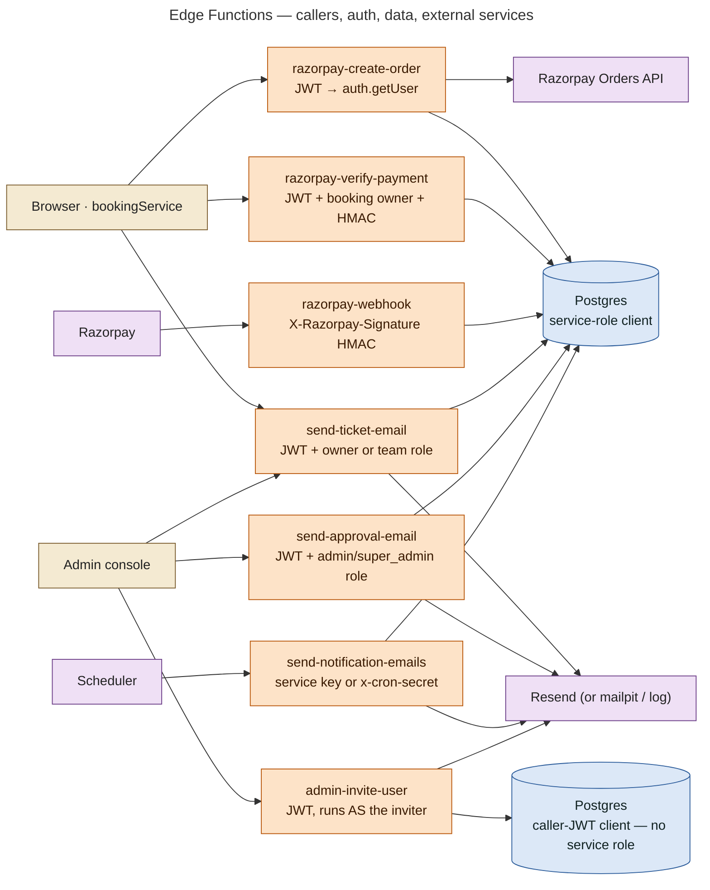

# 23 — Edge Function Architecture

Seven Deno functions in `supabase/functions/`, plus shared modules in `_shared/`:

| Shared module | Purpose |
|---|---|
| `cors.ts` | origin allow-list |
| `crypto.ts` | HMAC-SHA256, constant-time compare, `requireSecret` |
| `email.ts` | provider module: resend / mailpit / log / disabled |
| `ticketEmail.ts` | build, queue and mark the ticket email; QR via `esm.sh/qrcode` |

Each function imports `@supabase/supabase-js@2` from `https://esm.sh`.

**Deployment is PRODUCTION CONFIGURATION, not done.** There is no `supabase/config.toml`. Deploy flags are documented in `docs/OPERATIONS.md` §3a:

- `razorpay-webhook` and `send-notification-emails` deploy with `--no-verify-jwt`.
- The other five keep the gateway JWT check.

## Master diagram

## Function by function

### `razorpay-create-order`

| | |
|---|---|
| Caller | Browser (`bookingService.createPaymentOrder`) |
| Auth | Gateway JWT check + `authClient.auth.getUser()` → 401 *Sign in required.* |
| Input | `eventId, quantity, tierId, attendeeName, attendeeEmail, attendeePhone, attendeeNames[], details{answers, instagram, note, collabInterests, collabNote}` |
| Validation | qty integer 1–50; name 1–120; email regex; Indian mobile `^[6-9]\d{9}$` after stripping +91/0; names = qty, each 1–120; tier `^[a-z][a-z0-9_]{0,31}$`; details is an object; event exists; status `on-sale`, or `sold-out` with a live waitlist offer; event min/max quantity |
| Database calls | service role: read `events`, read `waitlist`; `rpc create_pending_booking`; update `bookings.razorpay_order_id`; on failure update `bookings.status = failed` |
| External | `POST https://api.razorpay.com/v1/orders` (Basic auth key id : secret), amount in paise, receipt = registration code |
| Output | `{order_id, amount, currency 'INR', key_id, booking_id}` |
| Failure | 400 validation / `INVALID_*`; 404 event; 409 not on sale / `SOLD_OUT`; 503 Razorpay not configured (hold released); 502 order API failed (hold released); 500 otherwise |

### `razorpay-verify-payment`

| | |
|---|---|
| Caller | Browser after the Razorpay Checkout success callback |
| Auth | JWT + `getUser`; booking must belong to the caller (403); order id must match (400) |
| Input | `booking_id, razorpay_order_id, razorpay_payment_id, razorpay_signature` |
| Logic | Already confirmed and verified → return the tickets (idempotent, re-queues the email). Otherwise `requireSecret('RAZORPAY_KEY_SECRET')` (503 if missing) → `HMAC_SHA256(order_id + "|" + payment_id)` → `timingSafeEqual` (400 on mismatch) → `rpc settle_payment(source 'verify')` → `enqueueTicketEmail` |
| Output | `{success, booking, tickets}`; 409 `{review:true}` when `needs_review` |
| Failure | 500 *"Could not confirm booking — contact support with your payment ID"* if settlement errors |

### `razorpay-webhook`

| | |
|---|---|
| Caller | Razorpay servers (no CORS, no JWT; `--no-verify-jwt`) |
| Auth | `RAZORPAY_WEBHOOK_SECRET` (503 if missing); HMAC of the **raw body** vs `X-Razorpay-Signature` (400 on mismatch) |
| Events handled | `payment.captured` / `order.paid` → `settle_payment(source 'webhook', amount)` + `enqueueTicketEmail`; `payment.authorized` → mirror; `payment.failed` → pending booking `failed`; `refund.processed` / `refund.created` → `refunded_amount`, `payment_status` |
| Idempotency | `payment_webhook_events.event_id = "<event>:<payment id>"` unique; duplicate of a processed event → `200 ok (duplicate)`; recorded but unfinished → processed now |
| Failure | Retryable DB errors → `500` (Razorpay redelivers); permanent (`not_found`) → `record_webhook_failure` + `200`; no stable id → `200` skip |
| Repo caveat | The header says: verify event names and payload fields against a live Razorpay payload before going live. **DOCUMENTED BUT NOT VERIFIED IN CODE** |

### `send-ticket-email`

| | |
|---|---|
| Caller | Browser after a verified payment (best effort); admin "Resend email" (`force: true`) |
| Auth | JWT; caller is the booking owner, or `profiles.role` in `staff, admin, super_admin` (role-string check, not `has_permission`) |
| Logic | Booking must be confirmed (409). Without `force`: already sent → `already_sent`; already queued / sending / sent in the outbox → `queued` (no second copy). Otherwise build and send directly, then mark `ticket_email_status` |
| External | Resend; `esm.sh/qrcode` for the QR attachment |

### `send-notification-emails`

| | |
|---|---|
| Caller | Scheduler (Supabase Cron HTTP / external) every 1–2 min: **PRODUCTION CONFIGURATION**; locally `scripts/run-jobs.sh emails` |
| Auth | `Authorization: Bearer <service role key>` or `x-cron-secret: CRON_SECRET`; anything else 403 |
| Logic | Provider not configured → `{configured:false}` and the queue is untouched. Otherwise `claim_email_batch(25)` → per row: ticket rows rendered from the booking (`sendTicketRow`), others with `notificationHtml` → `complete_email` |
| Output | `{claimed, sent, failed, skipped}` |

### `send-approval-email`

| | |
|---|---|
| Caller | `ApplicationsPage` via `notificationService.sendApprovalEmail` |
| Auth | JWT + caller `profiles.role` in `admin, super_admin` (403) |
| Input | `source_table` (`collaborations`, `crew_applications`, `artists`), `source_id`, optional `force` |
| Logic | Requires the `application_notifications` approval row (404 otherwise); skips if already sent unless forced; recipient = applicant's account email; portal link per role |
| Output / state | `application_notifications.status` sent / failed |

### `admin-invite-user`

| | |
|---|---|
| Caller | `UsersPage` → `adminApi.inviteUser` |
| Auth | JWT; **all DB work runs under the inviter's JWT** (no service role); `SITE_URL` required (503) |
| Logic | Validate; random 32-byte token → SHA-256 hash → `create_account_invitation` (the DB decides who may invite which role, 42501 → 403); email the `SITE_URL/invitation#token=…` link; `set_invitation_email_status` |
| Output | `{ok, invitation_id, expires_at, existing_account, email_status}` + `invite_url` once if email failed |

## Shared CORS behaviour (`_shared/cors.ts`)

- The response echoes **the request's own origin only if it is on the allow-list**: `ALLOWED_ORIGINS`, else `SITE_URL`. It is never `*`.
- With neither set, only `http://localhost:*` / `http://127.0.0.1:*` are allowed, so a deployment that forgot `SITE_URL` **fails closed**.
- Methods `POST, OPTIONS`; `Vary: Origin`.
- Applied to the browser-called functions. The webhook and email drain don't need it.
