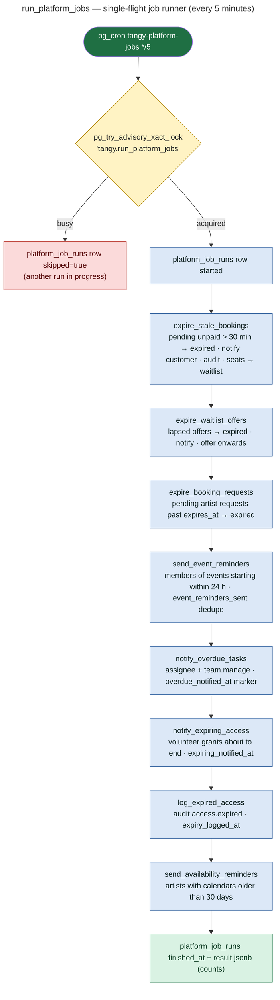
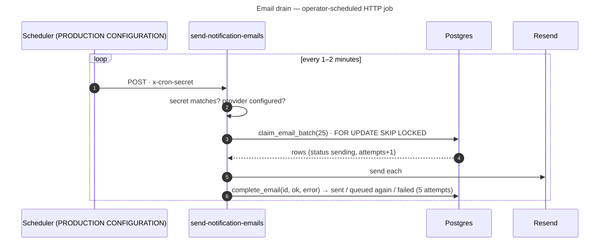

# 24 — Scheduled Job Architecture

## Schedulers in the repository

| Scheduler | What | Cadence | Defined where | Status |
|---|---|---|---|---|
| pg_cron job `tangy-platform-jobs` | `select public.run_platform_jobs()` | `*/5 * * * *` (every 5 min) | 0020: `create extension if not exists pg_cron; cron.schedule(...)` inside a `do` block that only runs if `pg_cron` is available, otherwise it raises a notice to schedule externally | **IMPLEMENTED** (auto-created when the extension exists). Production confirmation is an operator step (`docs/OPERATIONS.md` §2a Step 1) |
| pg_cron job `tangy-log-expired-access` | `select public.log_expired_access()` | `*/5 * * * *` | 0018, only if `pg_cron` was **already installed** at that point | **Conditional.** The same work also runs inside `run_platform_jobs`, so it is redundant when present |
| Email drain | `POST /functions/v1/send-notification-emails` with `x-cron-secret` | every 1–2 min (runbook) | **Not in code**: Supabase Cron HTTP job or an external scheduler | **PRODUCTION CONFIGURATION, not done** |
| Opportunistic runs | `expire_stale_bookings()` | before every checkout | `create_pending_booking` | **IMPLEMENTED** |
| | `expire_booking_requests()` | before every artist response | `respond_to_booking_request` | **IMPLEMENTED** |
| | `offer_waitlist_seats()` | on every seat release / capacity change | triggers | **IMPLEMENTED** |
| Local manual run | `scripts/run-jobs.sh [emails]` | on demand | script | **DEMO / LOCAL ONLY** |

## run_platform_jobs()

| Job | Tables affected | Notifications | Email | Audit / log |
|---|---|---|---|---|
| `expire_stale_bookings` | bookings → expired | `booking_payment.expired` | no (catalogue email = false) | `booking.expired` |
| `expire_waitlist_offers` | waitlist → expired, new offers | `waitlist.offer_expired`, `waitlist.offer` | yes | `waitlist.offered` |
| `expire_booking_requests` | assignment_requests → expired | `booking.expired` to the requester (trigger) | no | — |
| `send_event_reminders` | event_reminders_sent | `event.reminder` | yes | — |
| `notify_overdue_tasks` | event_tasks.overdue_notified_at | `task.overdue` | no | — |
| `notify_expiring_access` | temporary_access.expiring_notified_at | `access.expiring` | no | — |
| `log_expired_access` | temporary_access.expiry_logged_at | — | — | `access.expired` |
| `send_availability_reminders` | none (dedupe = an `availability.reminder` notification in the last N days) | `availability.reminder` | no | — |
| every run | platform_job_runs | — | — | run log readable with `operations.manage` |

Every job is **idempotent**: it touches only eligible rows and stamps markers, uses `for update skip locked` where rows are claimed, and the runner holds a transaction-scoped advisory lock. Tests: `supabase/tests/media_realtime_jobs.test.sql` (run once, run twice, expired and already-processed records) and `scripts/test-concurrency.sh` (overlapping runs).

## Email drain

