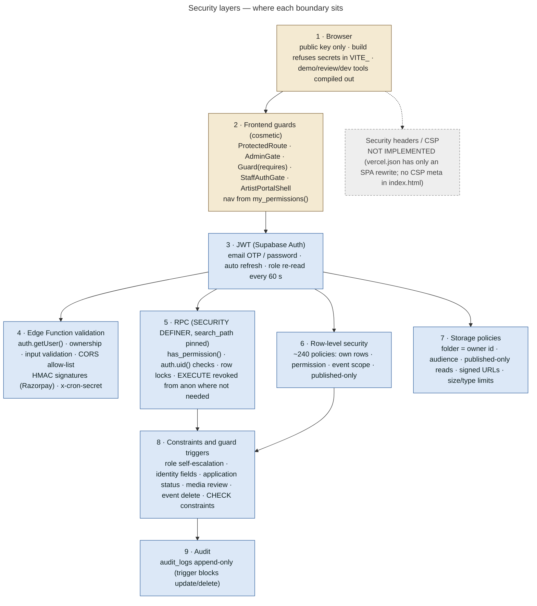

# 25 — Security Architecture

## Layered model

The rule stated across the code: **hiding a button is not security; the database refuses the data.** (`AdminApp.jsx` Guard comment, `rbac.js`, `0002_rls.sql` header.)

## Keys and secrets

| Item | Where it lives | Who can see it | Enforcement |
|---|---|---|---|
| Supabase **publishable / anon key** | `VITE_SUPABASE_PUBLISHABLE_KEY` (or `VITE_SUPABASE_ANON_KEY`) → browser bundle | public by design | RLS makes it safe |
| Supabase **service-role / secret key** | injected into Edge Functions as `SUPABASE_SERVICE_ROLE_KEY`; local dev server only (`SUPABASE_SERVICE_ROLE_KEY`, never `VITE_`) | server only | `vite.config.js` `assertNoSecretInBrowserEnv` refuses `sb_secret_…`, a service_role JWT, or a value equal to the service key in any `VITE_` var |
| `RAZORPAY_KEY_ID` | Edge Function secret; returned to the browser in the order response (public id) | public | — |
| `RAZORPAY_KEY_SECRET` | Edge Function secret | server | `requireSecret` (never the literal `"undefined"`) |
| `RAZORPAY_WEBHOOK_SECRET` | Edge Function secret (different from the key secret) | server | 503 without it |
| `RESEND_API_KEY`, `EMAIL_FROM`, `EMAIL_REPLY_TO` | Edge Function secrets | server | only read in `_shared/email.ts` |
| `CRON_SECRET` | Edge Function secret + scheduler | server | header `x-cron-secret` |
| `SITE_URL`, `ALLOWED_ORIGINS` | Edge Function secrets | — | CORS allow-list + email links |
| `VITE_TEAM_REVIEW_PASSWORD` | review deployment env | **ships in that bundle**: demo accounts only | refused on Vercel production unless `TANGY_ALLOW_REVIEW_BUILD=1` |
| `.env`, `.env.local`, `.env.*.local`, `.env.review.local` | developer machines | gitignored | — |

No secret value appears in the repository. Production secrets are **not yet set** (`docs/OPERATIONS.md`).

## Role security

- `profiles.role` changes only through the paths below, all policed by `prevent_role_self_escalation` (0030):
  - approvals (user → partner/artist, `applications.review`)
  - `admin_set_user_role` (`roles.manage`)
  - accepting an invitation for your own email
  - SQL / service role (bootstrap)
- Nobody changes their own role or active flag. Only a Super Admin grants or removes Super Admin. The last active Super Admin cannot be demoted.
- A deactivated account resolves to **no role** (`current_role_name()` requires `is_active`), so every permission check fails immediately.
- `is_staff_or_admin()` now means **admin-level only** (0017 security fix 2). Staff get narrow, event-scoped access.
- `guard_profile_identity` (0035): users cannot change their own `email`, `passport_id`, `member_since` or `created_at`. The account email is the recipient of tickets and approvals, and authorizes waitlist reads.
- Internal review notes moved off applicant-readable rows into `application_reviews` (0033).
- `artist_availability` is no longer publicly readable (0033).

## Payment security

- **Prices** come only from the database (`booking_quote`); the client can choose a ticket type and quantity, never a price.
- **Overselling** is prevented by the event row lock + capacity check in `create_pending_booking` (service role only).
- **Confirmation** happens only after HMAC-SHA256 verification, with constant-time comparison, of either:
  - the checkout signature `order_id|payment_id` with the key secret, or
  - the webhook raw body with the webhook secret.
- `confirm_booking_and_issue_tickets` was callable by any signed-in user before 0017. That would have issued tickets without payment. It is now service-role only.
- **Admin booking edits** go only through audited RPCs. No direct status flips are possible (0017 security fix 4).

## Storage security

Private by default, with ownership by path, audience-scoped reads, published-only anonymous reads and short-lived signed URLs. See [20](20-storage-architecture.md). The bucket size and type limits were added in 0029.

## Function privileges (0035 §7)

PostgreSQL grants `EXECUTE` to `PUBLIC` on new functions by default, and Supabase adds anon/authenticated. Migration 0035 found **151 `SECURITY DEFINER` functions callable without signing in**. It revoked them, except:

- functions that check the caller themselves
- intentionally public ones: `event_availability`, `booking_quote`, `invitation_preview`
- RLS helpers that policies evaluate

A preflight (`supabase/preflight/0035_phase1_security_gaps_preflight.sql`) and a test (`phase1_security_gaps.test.sql`) cover this.

## CORS

Browser-called Edge Functions echo only an allow-listed origin and never `*`. They fail closed when `SITE_URL` / `ALLOWED_ORIGINS` are missing (loopback only). Every one of them also requires a JWT, so CORS is defence in depth.

## Other controls

| Control | Where |
|---|---|
| Console idle sign-out (default 60 min) | `AdminShell` |
| Console sign-in audit | `log_auth_event` |
| Append-only audit log | `audit_logs_append_only` trigger |
| Safe error messages (no SQL / RLS internals) | `admin/api.js friendlyError`, `UserAuthContext.friendlySignInError`, Edge Functions return fixed messages |
| Messaging privacy | RLS; private Super Admin ↔ artist threads; no message text in emails; **not E2EE** (stated) |
| Enquiries / applications require an account; choosing a path never grants a role | 0025 |
| Duplicate application guards | `guard_duplicate_application`, `*_guard_duplicate` triggers |
| Demo admin mode grants nothing (no Supabase session) | `DemoAdminContext.jsx` |
| Dev mock-session middleware: loopback only + local Supabase only | `vite.config.js devMockSession` |

## Gaps

| Item | Status |
|---|---|
| CSP / security headers (HSTS, X-Frame-Options, …) | **NOT IMPLEMENTED** in the repo (`vercel.json` contains only a rewrite) |
| Rate limiting for OTP / checkout beyond Supabase defaults | **NOT DETERMINABLE FROM REPOSITORY** (Supabase Auth project settings) |
| Payment capture mode (must be automatic) | **DOCUMENTED BUT NOT VERIFIED IN CODE** |
| OTP email template contains the code | **PRODUCTION CONFIGURATION** |
| `send-ticket-email` / `send-approval-email` authorize by `profiles.role` string rather than `has_permission()` | Inconsistent with the permission model elsewhere (an edited permission matrix does not affect these two checks) |
