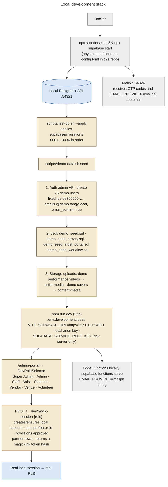
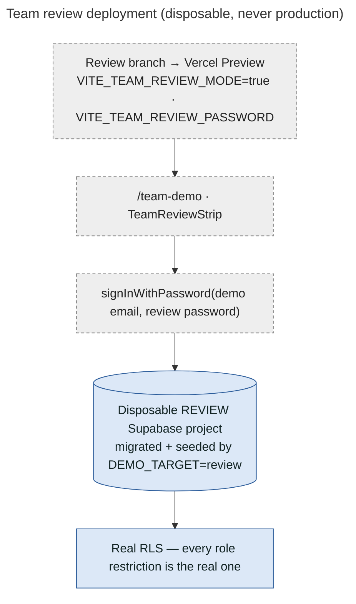

# 26 — Local / Demo Architecture

> Everything in this document is **LOCAL ONLY / DEMO ONLY / NOT PRODUCTION**, except where a "review" deployment is named. Review deployments use a disposable hosted Supabase project, also never production.

## Four separate "demo" mechanisms

| Mechanism | What it is | Real Supabase session? | Gate |
|---|---|---|---|
| **Local stack + demo dataset** | Docker Supabase, every migration, `scripts/demo-data.sh seed`, Mailpit for OTP codes | yes (local) | script refuses non-localhost URLs |
| **Dev role switcher** | `npm run dev` → `/admin-portal` opens `DevRoleSelector`; signs into local accounts via the dev-server middleware `/__dev/mock-session`, or uses mock identities | yes with a local stack; mock otherwise | `__TANGY_DEV_TOOLS__` true only for `vite` serve; middleware only for loopback + localhost Supabase |
| **Demo Admin mode** | `/demo-admin`, `/demo-admin/control-room`, `/demo/:role`: role dashboards rendered with bundled demo data (`src/pages/demoAdmin/*`) | **no** (an in-memory flag; grants nothing, RLS blocks everything) | `VITE_DEMO_ADMIN_ENABLED`, compiled to false in builds unless `TANGY_ALLOW_DEMO_BUILD=1` |
| **Team review mode** | `/team-demo`: one-click password sign-in to 9 demo accounts in a hosted **review** project | yes (review project) | `VITE_TEAM_REVIEW_MODE` + `VITE_TEAM_REVIEW_PASSWORD`; refused on Vercel production unless `TANGY_ALLOW_REVIEW_BUILD=1` |

## Local stack

## How demo data is generated and removed

| Step | Command / file | What it does |
|---|---|---|
| Guard | `scripts/demo-data.sh` | Refuses unless `SUPABASE_URL` is `http://127.0.0.1:*` / `http://localhost:*`; `DEMO_TARGET=review` requires `.env.review.local` and an `https://<ref>.supabase.co` URL |
| Accounts | Auth admin API `POST /auth/v1/admin/users` | 76 accounts with deterministic ids and `@demo.tangy.local` emails (422 = already exists) |
| Data | `supabase/demo/demo_seed*.sql` | 35 sessions (26 past, 2022–2026), 27 artists, 8 programmes, 22 albums / 88 photos, 15 TV records, 21 diary posts, 12 announcements, partners, 15 volunteers, 40 bookings, 129 tickets, 15 waitlist entries, 12 artist applications in every state, 16 booking requests (`docs/OPERATIONS.md` §8) |
| Media | Storage REST uploads | demo videos and covers from `public/media/demo` and two real empty-venue photos |
| Identify | — | every record has a `de300000-…` id, `@demo.tangy.local` email, "(demo)" names, example.com links |
| Remove | `scripts/demo-data.sh remove` | `demo_remove.sql` + deletes the demo storage objects + deletes every demo auth user |
| Status | `scripts/demo-data.sh status` | counts what's loaded |
| Review project | `DEMO_TARGET=review scripts/demo-data.sh migrate · seed · review-logins` | applies migrations to the review project, loads the same data, sets the shared review password on the 9 Team Demo accounts |

## Demo accounts (from the seed note and `src/config/teamReview.js`)

| Role | Email |
|---|---|
| Super Admin | `director@demo.tangy.local` |
| Admin / Manager | `ops@demo.tangy.local` |
| Staff | `desk@demo.tangy.local` |
| Artist | `ananya.rao@demo.tangy.local` |
| Sponsor | `saffron.tea@demo.tangy.local` |
| Vendor | `kulhad.chai@demo.tangy.local` |
| Venue host | `farah@demo.tangy.local` |
| Volunteer (live check-in access) | `aisha@demo.tangy.local` |
| Customer (holds a waitlist offer) | `meera.kulkarni@demo.tangy.local` |

Locally, sign in with the email; the one-time code arrives in Mailpit (`http://127.0.0.1:54324`).

## Team review deployment

## Test tooling (local only)

| Tool | Purpose |
|---|---|
| `scripts/test-db.sh` | runs `supabase/tests/*.test.sql` (20 suites), each in a rolled-back transaction |
| `scripts/test-fresh-db.sh` | migrations on an empty database |
| `scripts/test-production-bootstrap.sh` | validates the production bootstrap package (checksums, 35 files, inventory, all suites) |
| `scripts/test-migration-safety-0035.sh` | 0035 preflight + safety |
| `scripts/test-concurrency.sh` | last-seat race, offer race, overlapping job runs across two sessions |
| `scripts/test-edge-functions.mjs`, `test-edge-shared.mjs`, `test-ticket-email.mjs`, `test-email-config.mjs` | Edge Function / email behaviour |
| `e2e/*.mjs` (Playwright, `e2e/run.sh`) | browser suites: OTP login, RBAC for three console roles, direct API authorization attempts, checkout, group check-in, waitlist, portals, artist portal, invitations, routing sweep, responsive / mobile; QR via a fake camera (`make-cam.mjs`) |
| `scripts/route-inventory.mjs` | generates `docs/ROUTES.md` |
