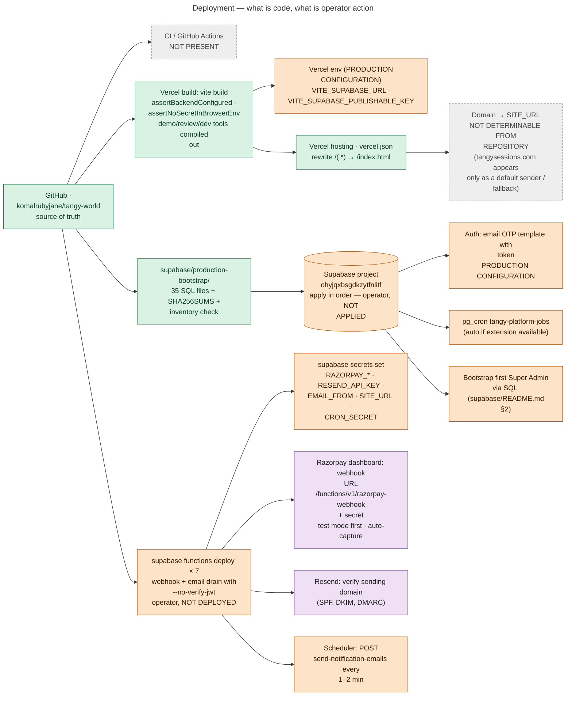

# 27 — Deployment Architecture

The repository proves the **frontend build is designed for Vercel**:

- `vercel.json` SPA rewrite
- `vite.config.js` reads `VERCEL_ENV`
- commit history: *"Fix Vercel 404s on direct route navigation"* (16 Aug), *"build on Vercel's Linux — lowercase archive folder, lockfile for npm 10"* (2 Oct)

The **backend deployment is not done**. `docs/OPERATIONS.md` §3a: *"Nothing here has been deployed yet: the repository has no `supabase/config.toml`, no linked project ref, no CI and no deploy script, so every step below is an operator action."* `supabase/production-bootstrap/README.md`: *"Nothing here has been applied to production."*

## Deployment model

## Hosting references, labelled

| Reference | Evidence | Label |
|---|---|---|
| Vercel | `vercel.json`; `VERCEL_ENV` checks in `vite.config.js`; deploy-fix commits; review deploys as "Vercel Preview" (`docs/EVENT_WORKFLOW.md`) | **CURRENT** (frontend hosting target) |
| Vercel Preview + disposable review Supabase project | `teamReview.js`, `docs/EVENT_WORKFLOW.md` "Team review deployment" | **PREVIEW** |
| Supabase hosted project `ohyjqxbsgdkzytfnlitf` | `docs/OPERATIONS.md` §2a/§3a, webhook URL | **CURRENT target, NOT APPLIED** |
| Local Supabase (Docker) | `supabase/README.md`, `e2e/README.md`, scripts | **LOCAL** |
| `tangy-world.html` (legacy static page at the repo root) | `App.jsx` comment: it collides with a `/tangy-world` route in dev | **LEGACY** |
| Azure, Netlify, Cloudflare, GitHub Pages | not found | **NOT USED** |

## Ordered production checklist (from the runbooks)

1. Apply `supabase/production-bootstrap/*` in order to the empty project; verify with `checks/production_inventory.readonly.sql` (`scripts/test-production-bootstrap.sh` validates the package locally).
2. Create the first Super Admin by SQL (`supabase/README.md` §2). Invite the rest through the console.
3. Configure the Auth email OTP template (`{{ .Token }}`).
4. Confirm `pg_cron` / `tangy-platform-jobs` exists, or schedule `run_platform_jobs()` externally every 5 min.
5. Set Edge Function secrets; deploy the 7 functions with the documented JWT flags.
6. Razorpay: webhook URL + secret (`payment.captured`, `order.paid`, `payment.failed`, `payment.authorized`, `refund.processed`, `refund.created`), auto-capture, test keys first.
7. Resend: verify the domain; set `EMAIL_FROM`; schedule the email drain.
8. Vercel: set `VITE_SUPABASE_URL` + `VITE_SUPABASE_PUBLISHABLE_KEY`; deploy; set `SITE_URL` to the canonical origin.
9. Verify in test mode: a booking, the ticket email, an approval email, the email delivery log, the webhook log.

None of these steps can be confirmed as done from the repository.
