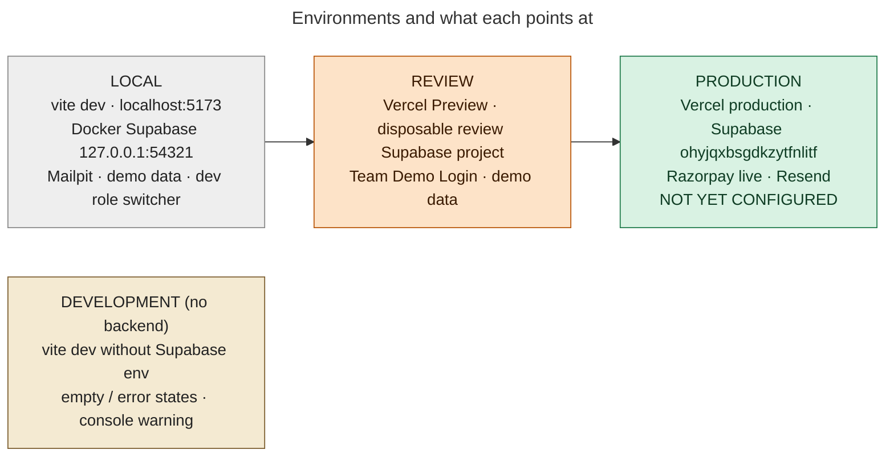

# 28 — Environment Architecture

## Environments

## Per-environment matrix

| | LOCAL | DEVELOPMENT (no backend) | REVIEW | PRODUCTION |
|---|---|---|---|---|
| Frontend URL | `http://localhost:<vite port>` | same | Vercel Preview URL (not in repo) | canonical origin: **NOT DETERMINABLE FROM REPOSITORY** |
| Supabase project | local stack (`npx supabase start`) | none (`supabase` client is `null`) | disposable hosted review project (`.env.review.local`, gitignored) | `ohyjqxbsgdkzytfnlitf` (runbooks) |
| Database | migrations via `scripts/test-db.sh --apply`; demo seed | — | `DEMO_TARGET=review scripts/demo-data.sh migrate` + `seed` | `supabase/production-bootstrap/` (no demo seed); **not applied** |
| Edge Functions | `supabase functions serve` (+ `--env-file`) | — | deployed to the review project (operator) | to deploy (§3a) |
| Razorpay mode | none locally (E2E sends HMAC-signed fake webhooks with `RAZORPAY_WEBHOOK_SECRET_LOCAL`) | — | test keys (if configured) | test first, then live (`rzp_live_…`) |
| Email provider | `mailpit` or `log` | — | project's own email / Resend | `resend` (needs `RESEND_API_KEY`, verified domain) |
| Auth email (OTP) | Mailpit inbox | — | project email | Supabase Auth email with the token template |
| Demo / dev tools | dev role switcher (`__TANGY_DEV_TOOLS__`), demo admin possible | dev switcher with mock identities | Team Demo Login (`__TANGY_REVIEW_MODE__`) | **all compiled out** |
| Scheduler | `scripts/run-jobs.sh [emails]` | — | pg_cron if available | pg_cron + email drain scheduler |

## Environment variables by consumer

| Variable | Consumer | Local | Review | Production |
|---|---|---|---|---|
| `VITE_SUPABASE_URL` | browser bundle | `http://127.0.0.1:54321` | review project https URL | production https URL (Vercel) |
| `VITE_SUPABASE_PUBLISHABLE_KEY` / `VITE_SUPABASE_ANON_KEY` | browser | local anon key | review publishable key | production publishable key |
| `SUPABASE_SERVICE_ROLE_KEY` | **Vite dev server only** (`/__dev/mock-session`) | local service key | — | — (never in Vercel) |
| `VITE_DEMO_ADMIN_ENABLED` | build flag | optional | unset | unset (forced false) |
| `VITE_TEAM_REVIEW_MODE`, `VITE_TEAM_REVIEW_PASSWORD` | build flags | — | set | unset (refused on production unless `TANGY_ALLOW_REVIEW_BUILD=1`) |
| `TANGY_DEV_TOOLS`, `TANGY_ALLOW_UNCONFIGURED_BUILD`, `TANGY_ALLOW_DEMO_BUILD`, `TANGY_ALLOW_REVIEW_BUILD` | `vite.config.js` | dev overrides | — | unset |
| `VITE_RAZORPAY_KEY_ID` | listed in `.env.example`, **not read by the app** | — | — | — |
| `RAZORPAY_KEY_ID`, `RAZORPAY_KEY_SECRET`, `RAZORPAY_WEBHOOK_SECRET` | Edge Functions | local test values | review | production secrets |
| `EMAIL_PROVIDER`, `RESEND_API_KEY`, `EMAIL_FROM` (`RESEND_FROM_EMAIL`), `EMAIL_REPLY_TO`, `MAILPIT_URL` | `_shared/email.ts` | mailpit / log | resend | resend |
| `SITE_URL`, `ALLOWED_ORIGINS` | CORS + email links + invites | unset → loopback CORS | review URL | canonical origin |
| `CRON_SECRET` | `send-notification-emails` | local value | review | production |
| `SUPABASE_URL`, `SUPABASE_ANON_KEY`, `SUPABASE_SERVICE_ROLE_KEY` (functions) | Edge Functions | injected | injected | injected |
| `SUPABASE_DB_URL`, `SUPABASE_SECRET_KEY`, `TEAM_REVIEW_PASSWORD` | `scripts/demo-data.sh` (`.env.review.local`) | — | set | **never** |

Secret values are intentionally absent from this document and from the repository.
