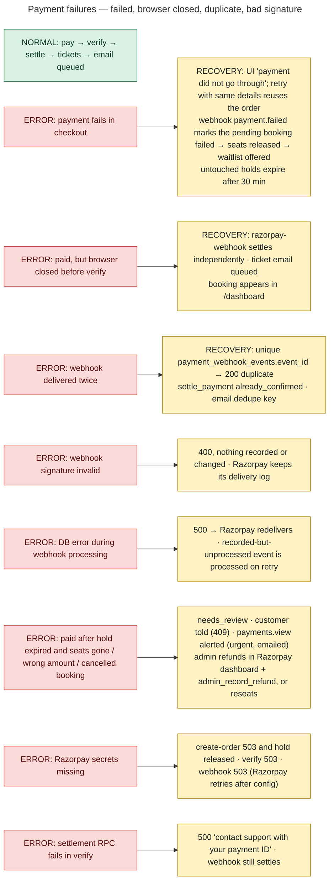
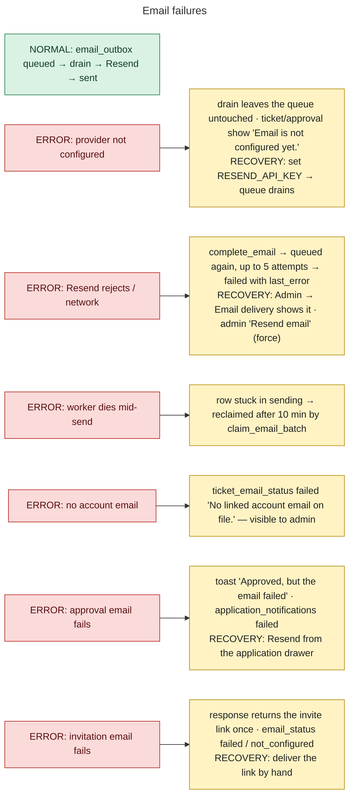
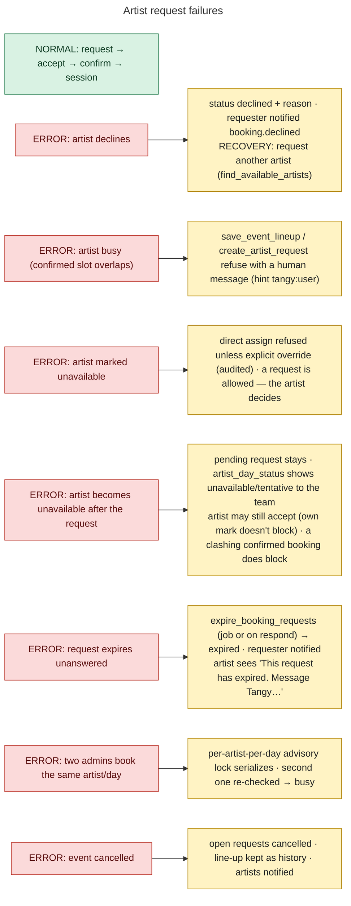

# 29 — Failure and Recovery Flows

Each flow shows the **normal path**, the **error path** and the **recovery path** as implemented.

## Payments

## Email

## Artist workflow

## Waitlist, uploads, authorization, sessions, roles, jobs

| Failure | Error path | Recovery path |
|---|---|---|
| **Waitlist offer expires** | hold lapses (default 120 min) | `expire_waitlist_offers` → `expired`, holder notified, seats offered to the next party; the person can rejoin |
| **Two people race for the last seat** | concurrent checkouts | event row lock in `create_pending_booking`; the loser gets `SOLD_OUT` (409) and the page refreshes availability (tested by `scripts/test-concurrency.sh`) |
| **Upload rejected** | storage policy, size or type limit | `uploadWithProgress` maps to *"You don't have permission to upload here." / "That file is too large." / "A file with that name already exists."*; client caps 25 MB (50 MB for artist media / video) |
| **Media rejected by curator** | `artist_media.status = rejected` + note | artist notified (`media.reviewed`); can resubmit (`rejected → under_review` allowed by `guard_artist_media`) |
| **Unauthorized admin action** | route guard → Forbidden; RPC raises 42501 / exception; RLS update → 0 rows | `friendlyError` → *"You don't have permission to do that."*; nothing changes; no partial write |
| **Direct API attack** (forged REST / RPC call) | RLS + definer checks + revoked EXECUTE | denied (e2e suites include direct API authorization attempts) |
| **Session expires** | JWT refresh fails / signed out elsewhere | `onAuthStateChange` → `user = null` → `ProtectedRoute` redirects to `/join/login?next=…`; Edge Functions answer 401 *"Sign in required."*; console idle timeout signs out with a reason on the login card |
| **Role changes while signed in** | server stops honouring the old role immediately | client re-reads `role, is_active` every 60 s / on focus → menus, guards and dashboard follow; `role.changed` notification |
| **Account deactivated** | `current_role_name()` → null | console shows *"Account deactivated"*; every RPC / RLS check fails |
| **Volunteer access ends mid-shift** | `check_in_ticket` → `access_expired` | `access.expiring` warning beforehand; admin grants a new window |
| **Scheduled job step errors** | `run_platform_jobs()` runs as one transaction: an error aborts the run and its log row | next 5-minute run retries (all steps idempotent); checkout calls `expire_stale_bookings` itself; pg_cron's own run history records the failure (platform feature) |
| **Overlapping job runs** | two schedulers fire | advisory lock: the second is recorded as `skipped` |
| **Supabase not configured in a build** | — | `vite build` fails (cannot ship a bundle with no backend); in dev the app shows empty / error states |
| **Profile row missing after sign-in** | `profiles` select fails | `profileError` shown; user treated as `user`; console explains *"profile could not be loaded"* |
| **Booking form invalid** | client + Edge Function + `create_pending_booking` validation | specific 400 messages (`INVALID_DETAILS`, `INVALID_QUANTITY`, `INVALID_TICKET_TYPE`, `INVALID_ATTENDEE_NAMES`) |
