# 30 — Data Flow Diagrams

Each diagram shows where a piece of data **originates**, where it is **stored** and where it **ends up**.

## 1. Authentication data

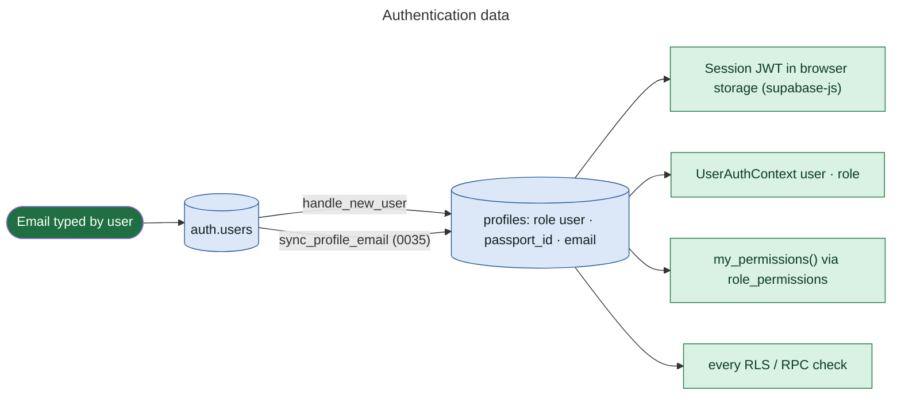

## 2. Event data

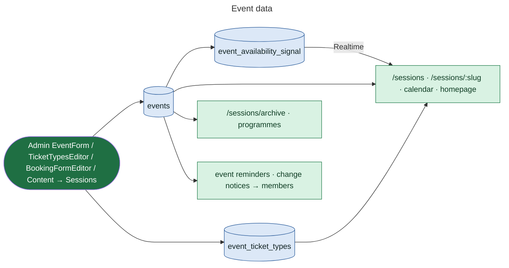

## 3. Artist data

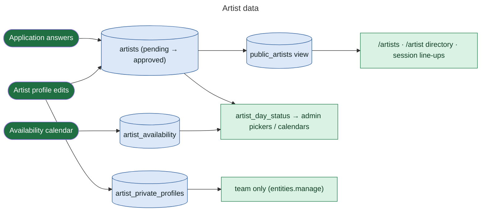

## 4. Application data

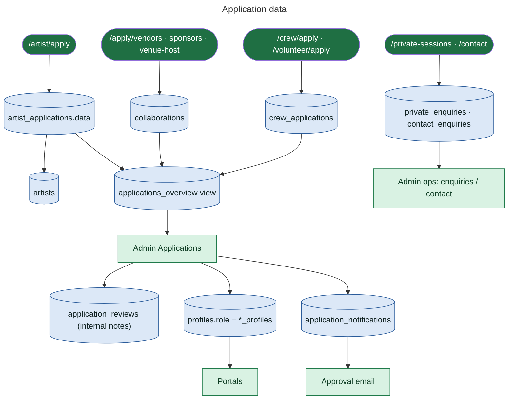

## 5. Booking data

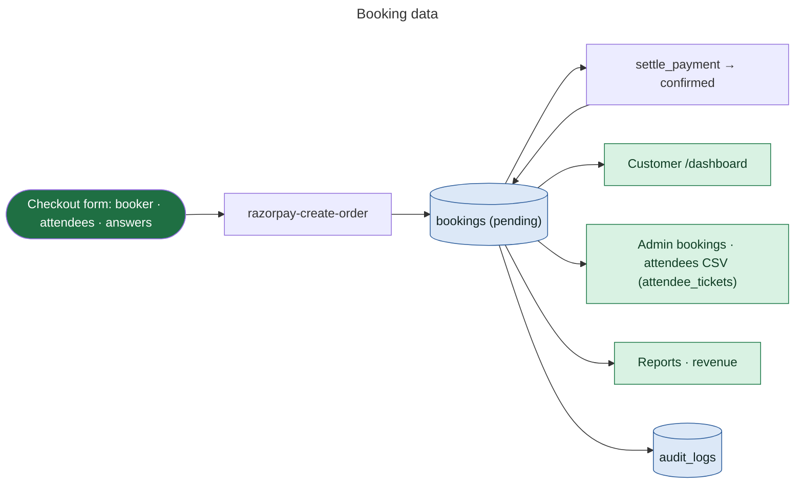

## 6. Payment data

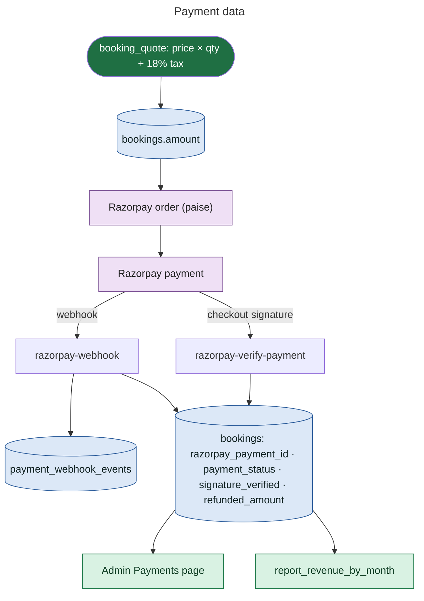

## 7. Ticket data

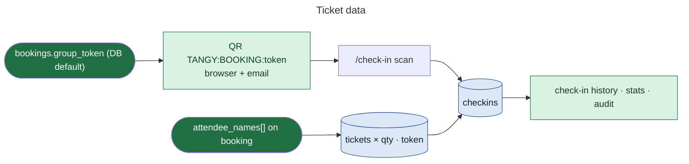

## 8. Waitlist data

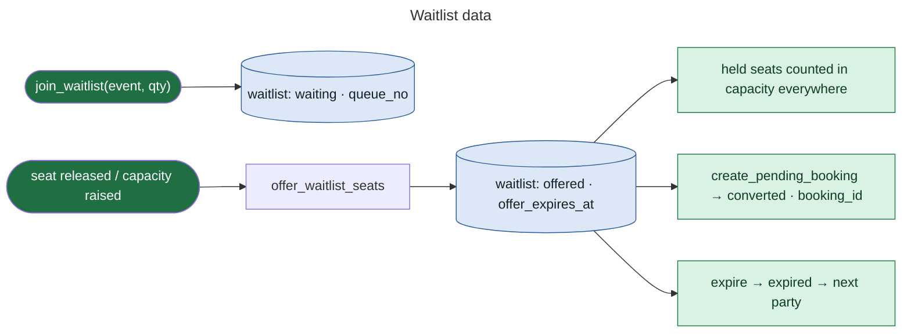

## 9. Notification data

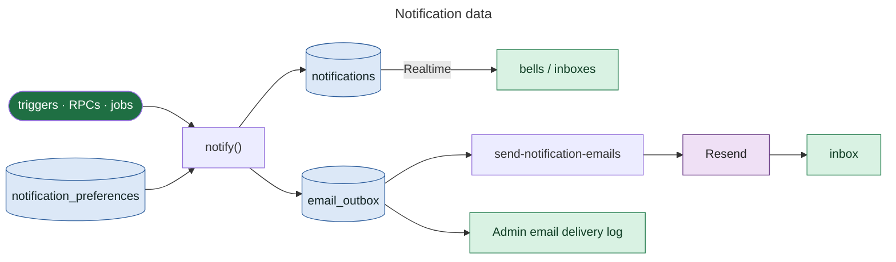

## 10. Messaging data

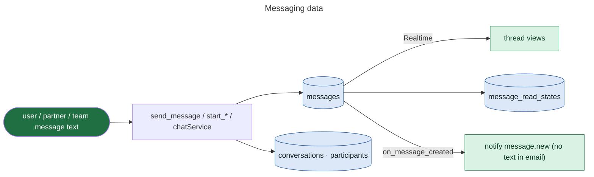

## 11. Content data

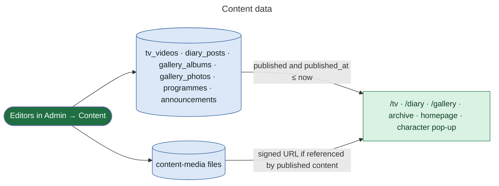

## 12. Storage data

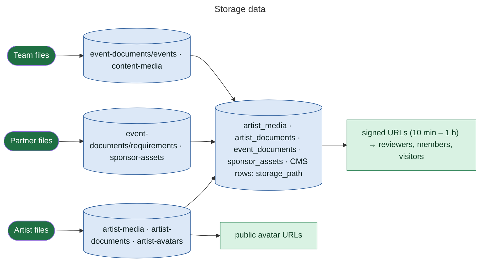
