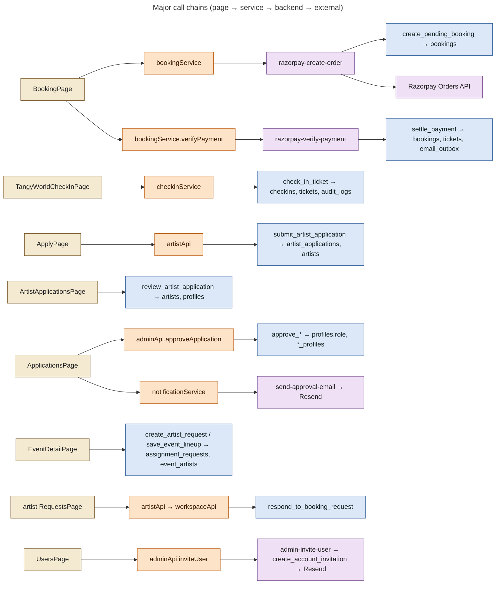

# 31 — "Who Calls What" Map

Generated from actual imports and call sites:

- `supabase.from()`, `.rpc()`, `functions.invoke()`, `storage.from()`, `.channel()`
- the admin helpers `list/one/insert/update/remove/useAdminList`
- `uploadWithProgress` / `signedUrl`

Part A is the curated end-to-end chain for the major journeys. Part B (appendix) is the raw per-file inventory.

## Part A — end-to-end chains

| Page | Component | Service | Supabase query / RPC | Edge Function | Tables | External | Result |
|---|---|---|---|---|---|---|---|
| `/sessions/:id` `BookingPage` | `useSessionDetail`, `WaitlistPanel` | — | `events`, `event_artists`, `public_artists`, `booking_quote`, `event_availability`, `my_waitlist`, channel `availability-<id>` | — | events, event_ticket_types, bookings, waitlist | — | Live price and seats |
| same | pay button | `bookingService.createPaymentOrder` | (`create_pending_booking` inside function) | `razorpay-create-order` | bookings | Razorpay Orders API | Pending booking + order |
| same | Razorpay handler | `bookingService.verifyPayment` | (`settle_payment`, `enqueueTicketEmail` inside) | `razorpay-verify-payment` | bookings, tickets, email_outbox, audit_logs | — | Confirmed booking + tickets |
| same | confirmation | `bookingService.sendTicketEmail` | — | `send-ticket-email` | bookings, email_outbox | Resend (fallback only) | No-op if queued |
| (Razorpay servers) | — | — | `payment_webhook_events`, `settle_payment`, `record_webhook_failure` | `razorpay-webhook` | bookings, tickets, payment_webhook_events, email_outbox | Razorpay | Source-of-truth settlement |
| `/sessions/:id`, `/sessions/waitlist` | `WaitlistPanel`, `WaitlistDirectory` | — | `join_waitlist`, `leave_waitlist`, `event_availability`, `my_waitlist` | — | waitlist | — | Queue position |
| `/dashboard` | `PatronDashboard` | `bookingService.getMyBookings` | `bookings(*, events, tickets)`, `my_waitlist`, `profiles`, `waitlist` | — | bookings, tickets, events, waitlist | — | Bookings, QR, passport |
| `/check-in` | `TangyWorldCheckInPage` | `checkinService` | `check_in_ticket`, `my_checkin_events`, `event_checkin_stats`, `get_checkin_history`, `attendee_tickets` | — | tickets, bookings, checkins, audit_logs | camera (`html5-qrcode`) | Admit by name |
| `/artist/apply` | `ApplyPage` | `artistApi` | `artist_applications` insert/update, `submit_artist_application`, `withdraw_artist_application` | — | artist_applications, artists | — | Application submitted |
| same | `MediaStep` | `uploadWithProgress` | storage `artist-media/applications/<uid>/` | — | storage.objects | — | Video uploaded |
| `/artist/requests` | `RequestsPage` | `artistApi` → `workspaceApi` | `my_booking_requests`, `mark_artist_request_viewed`, `respond_to_booking_request` | — | assignment_requests, event_artists, event_artist_details | — | Accept / decline |
| `/artist/availability` | `AvailabilityPage` | `artistApi` | `set_artist_availability`, `artist_availability_summary`, `artist_availability` | — | artist_availability | — | Calendar saved |
| `/artist/media` | `MediaPage` | `uploadWithProgress`, `signedUrl` | `artist_media`, storage `artist-media` | — | artist_media | — | Media for review |
| `/artist/documents` | `DocumentsPage` | `artistApi`, `uploadWithProgress` | `artist_documents`, storage `artist-documents` | — | artist_documents | — | Private docs |
| `/artist/profile` | `ProfilePage` | artist `authService` / `workspaceApi` | `artists`, `artist_private_profiles`, `artist_profile_completion`, storage `artist-avatars` | — | artists | — | Profile |
| `/apply/vendors · sponsors · venue-host` | `*ApplyPage` | — (direct client) | insert `collaborations` | — | collaborations | — | Pending application |
| `/crew/apply`, `/volunteer/apply` | `CrewApplicationForm`, `VolunteerApplyPage` | — | insert `crew_applications`; `events` | — | crew_applications | — | Pending application |
| `/private-sessions`, `/contact` | `PrivateEnquiryForm`, `ContactEnquiryForm` | — | insert `private_enquiries` / `contact_enquiries` | — | enquiries | — | Receipt notification |
| Partner portals | `PartnerPortal`, `PortalSections`, `PartnerExtras`, `MessagesPanel` | `portalApi` | `my_portal_events`, `submit_requirement`, `start_partner_conversation`, `send_message`, `my_notifications`, `request_checkin_access`, `event_requirements`, `event_documents`, `sponsor_assets`, `partner_invoices` | — | many | — | Partner workspace |
| `/admin-portal/applications` | `ApplicationsPage` | `adminApi`, `notificationService` | `applications_overview`, `approve_*`/`reject_*`, `application_notifications` | `send-approval-email` | applications, profiles | Resend | Decision + email |
| `/admin-portal/artists/applications/:id` | `ArtistApplicationsPage` | direct `supabase.rpc` | `review_artist_application`, `artist_applications`, `application_reviews` | — | artist_applications, artists, profiles | — | Review step |
| `/admin-portal/events/:id` | `EventDetailPage`, `EventEditor`, `EventOps`, `TicketTypesEditor` | `adminApi`, direct | `save_event_lineup`, `create_artist_request`, `manage_artist_request`, `update_event_artist`, `remove_event_artist`, `artist_schedule_check`, `event_health`, `event_command_center`, `review_requirement`, `close_requirement`, `booking_quote` | — | events, event_artists, assignment_requests, event_requirements, event_documents, event_ticket_types | — | Event operations |
| `/admin-portal/bookings` | `BookingsPage`, `Bookings.jsx` | `adminApi`, `bookingService`, `checkinService` | `admin_cancel_booking`, `admin_record_refund`, `admin_cancel_ticket`, `admin_create_comp_booking`, `booking_checkin_history` | `send-ticket-email` (force) | bookings, tickets, audit_logs | Resend | Booking admin |
| `/admin-portal/users` | `UsersPage` | `adminApi` | `admin_set_user_role`, `admin_set_user_active`, `list_account_invitations`, `revoke_account_invitation` | `admin-invite-user` | profiles, account_invitations | Resend | Roles / invites |
| `/admin-portal/volunteers` | `VolunteersPage` | direct | `volunteers_overview`, `grant_temporary_access`, `revoke_temporary_access`, `decline_access_request`, `volunteer_access_activity` | — | temporary_access, access_requests | — | Access windows |
| `/admin-portal/content/*` | `ContentPage`, `ContentCollections`, `MediaLibrary`, `Announcements` | `contentService` | CMS tables, `update_session_content`, storage `content-media` | — | CMS tables | — | Publish content |
| `/admin-portal/messages` | `MessagesPanel` | `portalApi` | `admin_conversations`, `conversation_messages`, `send_message`, `set_conversation_status`, `set_conversation_meta` | — | conversations, messages | — | Replies |
| Header | `AdminShell` | `adminApi` | `admin_search`, `log_auth_event`, `applications_overview` (badge), `conversations` (badge) | — | — | — | Search / badges |
| Assistant | `TangyAssistant`, `AgentRequestForm` | `messageService` (mock), `aiSupportService` (mock), `conversationService` | `get_or_create_support_conversation`, `messages` | — | conversations, messages | — | Agent handoff |

## Part B — appendix: per-file Supabase access (generated)

Files under `src/` that call Supabase directly or through the admin helpers. Files that only call other services are omitted. The mock services (`src/services/{bookingService,collaborationService,enquiryService,eventService,userService,waitlistService,messageService,aiSupportService}.js`) make no Supabase calls.

| Source file | RPCs | Tables / views | Edge Functions | Storage | Realtime |
|---|---|---|---|---|---|
| `src/admin/AdminShell.jsx` | — | `applications_overview`, `conversations` | — | — | — |
| `src/admin/api.js` | `admin_cancel_booking`, `admin_cancel_ticket`, `admin_create_comp_booking`, `admin_dashboard_summary`, `admin_operations_overview`, `admin_record_refund`, `admin_search`, `admin_set_user_active`, `admin_set_user_role`, `check_in_ticket`, `create_booking_request`, `event_checkin_stats`, `event_health`, `get_checkin_history`, `get_runtime_settings`, `list_account_invitations`, `log_auth_event`, `my_checkin_events`, `my_permissions`, `report_applications`, `report_event_performance`, `report_revenue_by_month`, `report_staff_activity`, `revoke_account_invitation`, `staff_dashboard`, `update_system_setting` | — | `admin-invite-user` | — | — |
| `src/admin/components/Announcements.jsx` | — | `announcements` | — | — | — |
| `src/admin/components/ArtistAvailability.jsx` | `find_available_artists` | — | — | — | — |
| `src/admin/components/Attendees.jsx` | — | `attendee_tickets` | — | — | — |
| `src/admin/components/BookingFormEditor.jsx` | — | `events` | — | — | — |
| `src/admin/components/Bookings.jsx` | — | `audit_logs`, `bookings`, `event_ticket_types`, `events` | — | — | — |
| `src/admin/components/ContentCollections.jsx` | — | `events`, `gallery_photos`, `programme_events` | — | — | — |
| `src/admin/components/CustomNotification.jsx` | `send_custom_notification` | — | — | — | — |
| `src/admin/components/EventEditor.jsx` | `save_event_lineup` | `event_artists`, `events` | — | — | — |
| `src/admin/components/EventForm.jsx` | — | `events`, `venue_profiles`, `venues` | — | — | — |
| `src/admin/components/EventOps.jsx` | `close_requirement`, `event_command_center`, `review_requirement` | `audit_logs`, `event_artist_details`, `event_artists`, `event_assignments`, `event_documents`, `event_requirements`, `profiles` | — | `event-documents` | — |
| `src/admin/components/MediaLibrary.jsx` | — | — | — | `content-media` | — |
| `src/admin/components/Tasks.jsx` | — | `event_assignments`, `event_tasks` | — | — | — |
| `src/admin/components/Team.jsx` | — | `event_assignments`, `event_tasks`, `profiles` | — | — | — |
| `src/admin/components/TicketTypesEditor.jsx` | `booking_quote` | `event_ticket_types` | — | — | — |
| `src/admin/pages/ApplicationsPage.jsx` | — | `application_notifications`, `applications_overview`, `bookings`, `profiles` | — | — | — |
| `src/admin/pages/ArtistApplicationsPage.jsx` | `review_artist_application` | `application_reviews`, `artist_applications` | — | `artist-media` | — |
| `src/admin/pages/ArtistDetailPage.jsx` | `admin_start_partner_conversation`, `artist_availability_summary`, `artist_calendar`, `start_private_artist_conversation` | `artist_applications`, `artist_media`, `artists`, `assignment_requests`, `conversations`, `event_artists` | — | — | — |
| `src/admin/pages/BookingsPage.jsx` | — | `bookings`, `payment_webhook_events` | — | — | — |
| `src/admin/pages/CalendarPage.jsx` | `admin_calendar` | — | — | — | — |
| `src/admin/pages/ContentPage.jsx` | `update_session_content` | `artists`, `events` | — | — | — |
| `src/admin/pages/DashboardPage.jsx` | `artist_day_summary` | `access_requests`, `announcements`, `audit_logs`, `bookings`, `conversations`, `event_requirements`, `event_tasks` | — | — | — |
| `src/admin/pages/EventDetailPage.jsx` | `artist_schedule_check`, `create_artist_request`, `manage_artist_request`, `remove_event_artist`, `save_event_lineup`, `update_event_artist` | `artists`, `assignment_requests`, `bookings`, `event_artist_details`, `event_artists`, `events`, `sponsor_deliverables`, `sponsor_profiles`, `tickets`, `venue_profiles`, `venues` | — | — | — |
| `src/admin/pages/InvoicesPage.jsx` | — | `partner_invoices`, `profiles` | — | — | — |
| `src/admin/pages/MyEventsPage.jsx` | — | `event_assignments` | — | — | — |
| `src/admin/pages/PeoplePage.jsx` | — | `event_artists`, `event_assignments`, `events`, `sponsor_deliverables` | — | — | — |
| `src/admin/pages/ReportsPage.jsx` | `report_platform_activity` | — | — | — | — |
| `src/admin/pages/RolesPage.jsx` | `set_role_permission` | `role_permissions` | — | — | — |
| `src/admin/pages/SettingsPage.jsx` | — | `role_permissions`, `system_settings` | — | — | — |
| `src/admin/pages/StaffAnnouncementsPage.jsx` | — | `announcements` | — | — | — |
| `src/admin/pages/StaffEventPage.jsx` | — | `announcements`, `event_assignments`, `events`, `venues` | — | — | — |
| `src/admin/pages/TeamPage.jsx` | — | `event_assignments`, `events`, `profiles` | — | — | — |
| `src/admin/pages/UsersPage.jsx` | — | `audit_logs`, `profiles` | — | — | — |
| `src/admin/pages/VolunteersPage.jsx` | `decline_access_request`, `grant_temporary_access`, `revoke_temporary_access`, `volunteer_access_activity`, `volunteers_overview` | `event_assignments`, `events`, `profiles` | — | — | — |
| `src/admin/sections/EnquiriesSection.jsx` | — | `contact_enquiries`, `private_enquiries` | — | — | — |
| `src/admin/sections/NotificationsSection.jsx` | — | `application_notifications`, `email_outbox` | — | — | — |
| `src/admin/sections/WaitlistSection.jsx` | `admin_offer_waitlist`, `admin_remove_waitlist_entry` | `waitlist` | — | — | — |
| `src/artist/components/ArtistEventDrawer.jsx` | — | `partner_invoices` | — | — | — |
| `src/artist/pages/ArtistDetailsPage.jsx` | — | `event_artists`, `public_artists` | — | — | — |
| `src/artist/pages/ArtistsDirectoryPage.jsx` | — | `public_artists` | — | — | — |
| `src/artist/pages/MediaPage.jsx` | — | — | — | `artist-media` | — |
| `src/artist/pages/ProfilePage.jsx` | — | `artists` | — | `artist-avatars` | — |
| `src/artist/portal/api.js` | `artist_availability_summary`, `mark_artist_request_viewed`, `set_artist_availability`, `submit_artist_application`, `withdraw_artist_application` | `artist_applications`, `artist_availability`, `artist_documents` | — | — | — |
| `src/artist/portal/pages/ApplyPage.jsx` | — | — | — | `artist-media` | — |
| `src/artist/portal/pages/InboxPages.jsx` | — | — | — | `artist-documents` | — |
| `src/artist/services/authService.js` | — | `artists` | — | — | — |
| `src/artist/services/workspaceApi.js` | `artist_profile_completion`, `my_booking_requests`, `my_notification_preferences`, `respond_to_booking_request`, `set_notification_preference` | `artist_availability`, `artist_media`, `artist_private_profiles`, `artists` | — | — | — |
| `src/components/archive/ArchiveIndex.jsx` | — | `diary_posts`, `events`, `gallery_albums`, `programmes`, `public_artists`, `tv_videos` | — | — | — |
| `src/components/booking/WaitlistDirectory.jsx` | `event_availability`, `my_waitlist` | — | — | — | — |
| `src/components/booking/WaitlistPanel.jsx` | `join_waitlist`, `leave_waitlist` | — | — | — | — |
| `src/components/calendar/calendarData.js` | `artist_calendar` | — | — | — | — |
| `src/components/contact/ContactEnquiryForm.jsx` | — | `contact_enquiries` | — | — | — |
| `src/components/crew/CrewApplicationForm.jsx` | — | `crew_applications` | — | — | — |
| `src/components/museum/UserLoginModal.jsx` | — | `checkins` | — | — | — |
| `src/components/private/PrivateEnquiryForm.jsx` | — | `private_enquiries` | — | — | — |
| `src/context/UserAuthContext.jsx` | — | `profiles` | — | — | — |
| `src/hooks/useEvents.js` | — | `events` | — | — | — |
| `src/hooks/useSessionDetail.js` | `booking_quote`, `event_availability`, `my_waitlist` | `event_artists`, `events`, `public_artists` | — | — | `availability-${eventId}` |
| `src/lib/archiveService.js` | — | `diary_posts`, `event_artists`, `events`, `gallery_albums`, `programme_events`, `programmes`, `public_artists`, `tv_videos` | — | — | — |
| `src/lib/bookingService.js` | — | `bookings` | `razorpay-create-order`, `razorpay-verify-payment`, `send-ticket-email` | — | — |
| `src/lib/checkinService.js` | `booking_checkin_history`, `check_in_ticket`, `event_checkin_stats`, `get_checkin_history`, `my_checkin_events` | `attendee_tickets` | — | — | — |
| `src/lib/contentService.js` | — | `diary_posts`, `event_artists`, `gallery_albums`, `gallery_photos`, `public_artists`, `tv_videos` | — | `content-media` | — |
| `src/pages/InvitationPage.jsx` | `accept_account_invitation`, `invitation_preview` | — | — | — | — |
| `src/pages/ProfilePage.jsx` | — | `profiles` | — | — | — |
| `src/pages/SponsorApplyPage.jsx` | — | `collaborations` | — | — | — |
| `src/pages/VendorApplyPage.jsx` | — | `collaborations` | — | — | — |
| `src/pages/VenueHostApplyPage.jsx` | — | `collaborations` | — | — | — |
| `src/pages/admin/AdminArtistPreview.jsx` | — | `artist_availability`, `artist_media`, `artists`, `assignment_requests`, `event_artists` | — | — | — |
| `src/pages/admin/AdminEntitySelector.jsx` | — | `artists`, `crew_profiles`, `profiles`, `sponsor_profiles`, `vendor_profiles`, `venue_profiles`, `volunteer_profiles` | — | — | — |
| `src/pages/admin/AdminPortalPreview.jsx` | — | `profiles` | — | — | — |
| `src/pages/dashboards/CrewDashboard.jsx` | — | `crew_applications`, `crew_profiles`, `event_assignments`, `event_tasks` | — | — | — |
| `src/pages/dashboards/PatronDashboard.jsx` | `my_waitlist` | `profiles`, `waitlist` | — | — | — |
| `src/pages/dashboards/SponsorDashboard.jsx` | — | `collaborations`, `sponsor_deliverables`, `sponsor_profiles` | — | — | — |
| `src/pages/dashboards/VendorDashboard.jsx` | — | `collaborations`, `event_assignments`, `vendor_profiles` | — | — | — |
| `src/pages/dashboards/VenueDashboard.jsx` | — | `collaborations`, `events`, `venue_profiles` | — | — | — |
| `src/pages/dashboards/VolunteerDashboard.jsx` | — | `crew_applications`, `event_assignments`, `volunteer_profiles` | — | — | — |
| `src/pages/subsections/VolunteerApplyPage.jsx` | — | `crew_applications`, `events` | — | — | — |
| `src/portal/MessagesPanel.jsx` | — | `profiles` | — | — | — |
| `src/portal/NotificationPreferences.jsx` | `my_notification_preferences`, `set_notification_preference` | — | — | — | — |
| `src/portal/PartnerExtras.jsx` | — | `event_tasks`, `partner_invoices`, `sponsor_assets`, `sponsor_deliverables` | — | `sponsor-assets` | — |
| `src/portal/PortalSections.jsx` | — | `event_assignments` | — | `event-documents` | — |
| `src/portal/portalApi.js` | `admin_conversations`, `admin_start_partner_conversation`, `conversation_messages`, `mark_conversation_read`, `mark_notifications_read`, `my_checkin_access`, `my_conversations`, `my_notifications`, `my_portal_events`, `notification_unread_count`, `portal_announcements`, `request_checkin_access`, `send_message`, `set_conversation_meta`, `set_conversation_status`, `start_partner_conversation`, `submit_requirement` | `event_documents`, `event_requirements` | — | — | — |
| `src/services/announcementService.js` | — | `announcements` | — | — | — |
| `src/services/assignmentRequestService.js` | `cancel_assignment_request`, `create_assignment_request`, `respond_to_assignment_request` | `artists`, `assignment_requests`, `events` | — | — | — |
| `src/services/chatService.js` | `assign_conversation`, `get_or_create_support_conversation`, `reopen_conversation` | `artists`, `conversations`, `message_read_states`, `messages`, `profiles` | — | — | `conversations:inbox`, `messages:${conversationId}` |
| `src/services/notificationService.js` | — | `application_notifications` | `send-approval-email` | — | — |
