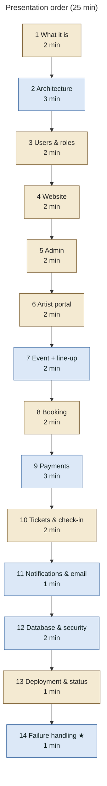

# 34 — How I Should Present This System

A recommended **25-minute** order; trim to 15 by skipping the starred (★) items. Each step names the document and the diagram to put on screen.

| # | Topic | Show | Key message |
|---|---|---|---|
| 1 | What Tangy World is | [01](01-system-overview.md) three-layers diagram | One app: public experience, operations console, partner portals, on one database |
| 2 | High-level architecture | [01](01-system-overview.md) system context | React SPA (Vercel) → Supabase (Auth, Postgres + RLS, Storage, Realtime, Edge Functions) → Razorpay, Resend |
| 3 | Users | [02](02-user-roles.md) "How each role is obtained" | 10 roles; nobody grants themselves a role; approvals and invitations provision access; permissions live in a table |
| 4 | Website | [03](03-website-map.md) sitemap | The session page is the checkout; the content is CMS-driven; the archive is built from past sessions |
| 5 | Admin | [06](06-admin-architecture.md) generic request path | Navigation is generated from permissions; the database re-checks every action; everything is audited |
| 6 | Artist portal | [07](07-artist-architecture.md) lifecycle + [08](08-artist-application.md) state machine | 8-step autosaved application → review loop → portal |
| 7 | Event workflow | [09](09-event-lifecycle.md) + [10](10-event-artist-workflow.md) availability decision | One function decides availability; advisory locks stop double-booking |
| 8 | Booking workflow | [11](11-booking-workflow.md) journey | Seat hold under an event row lock; price from the database |
| 9 | Payment workflow | [12](12-payment-architecture.md) sequence + `settle_payment` tree | Two paths (browser + webhook), HMAC-verified, converge on one idempotent settlement; webhook = source of truth |
| 10 | Ticket / check-in | [13](13-ticket-workflow.md) + [14](14-checkin-workflow.md) | One opaque QR per booking; admit people by name; volunteers get time-boxed access |
| 11 | Notifications / email | [16](16-notification-architecture.md) | `notify()` → in-app + email outbox → drain → Resend; preferences; nothing sensitive in email |
| 12 | Database & security | [21](21-database-architecture.md) domain map + [25](25-security-architecture.md) layers | ~240 RLS policies, definer functions with pinned search_path, revoked EXECUTE, append-only audit |
| 13 | Deployment | [27](27-deployment-architecture.md) | Built for Vercel + Supabase; backend deployment is an operator checklist not yet done |
| 14 ★ | Failure handling | [29](29-failure-recovery.md) payments diagram | Every critical failure has a recovery path |

## Ten-minute version

1. **(1 min)** What it is: the poster-style site, the console, the portals.
2. **(2 min)** Architecture diagram; the rule *"the database decides"*.
3. **(2 min)** Booking + payment sequence, with the webhook as the source of truth.
4. **(1 min)** Check-in by group QR.
5. **(2 min)** Artist application → line-up with availability and locks.
6. **(1 min)** Security layers.
7. **(1 min)** Honest status and gaps (below).

## Questions to prepare for

| Likely question | Answer (where to point) |
|---|---|
| How do you stop overselling? | Event row lock + capacity check in `create_pending_booking`; waitlist holds counted ([12](12-payment-architecture.md)) |
| What if the browser closes after paying? | The Razorpay webhook settles and queues the email ([12](12-payment-architecture.md)) |
| Can a user make themselves admin? | No: the `prevent_role_self_escalation` trigger; roles change only through audited RPCs ([02](02-user-roles.md), [25](25-security-architecture.md)) |
| How does staff access stay limited? | Event-scoped functions; `is_staff_or_admin()` is admin-only since 0017 ([25](25-security-architecture.md)) |
| Is chat encrypted? | Not end-to-end; protected by HTTPS, auth and RLS; private Super Admin ↔ artist threads ([18](18-messaging-architecture.md)) |
| Is it live? | Code complete and tested locally; production configuration pending ([27](27-deployment-architecture.md)) |

## Gaps to mention honestly

- Backend not deployed; production secrets, the email drain scheduler and the OTP template are pending.
- No customer reminder emails; no automatic customer notification or refund when an event is cancelled; refunds are manual in Razorpay.
- `sold-out` / `past` event statuses are set manually (capacity itself is enforced automatically).
- Artist approval from the Artist Applications page sends no branded email (in-app only).
- No CSP / security headers in `vercel.json`.
- The Tangy AI assistant is a knowledge-base lookup, not a model.
